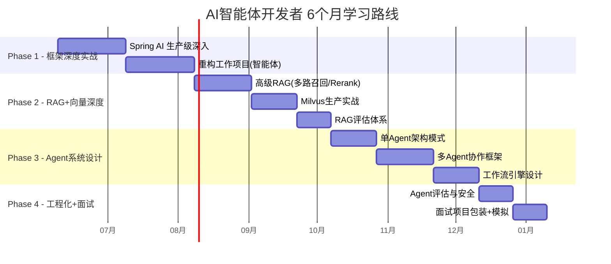
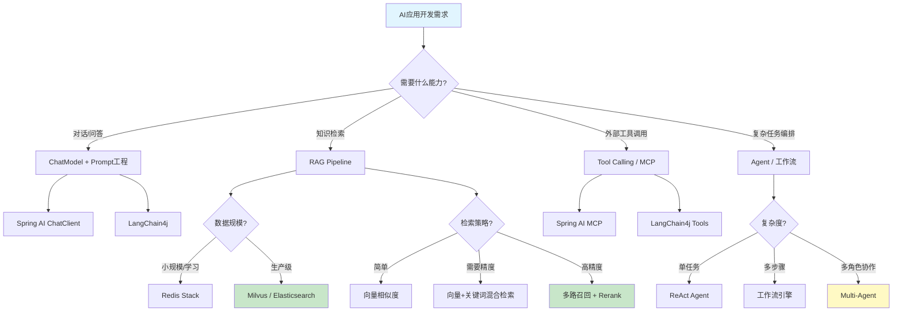
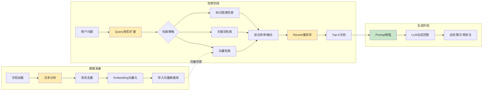
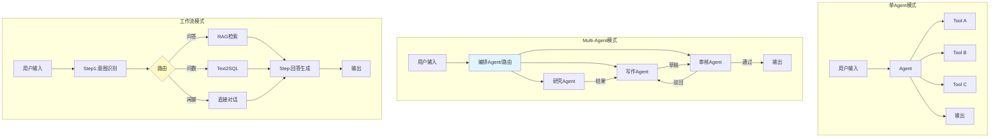
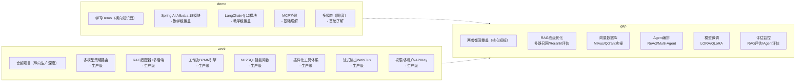
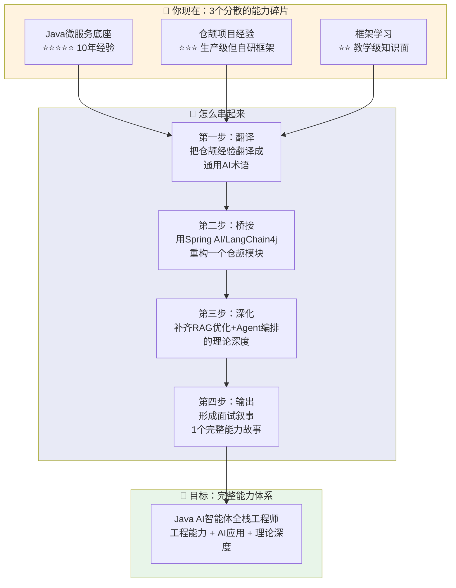
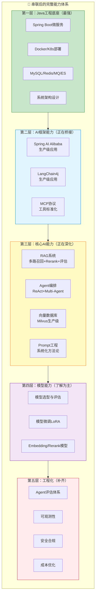
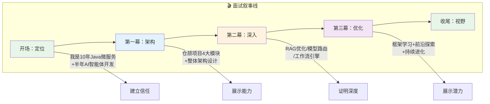
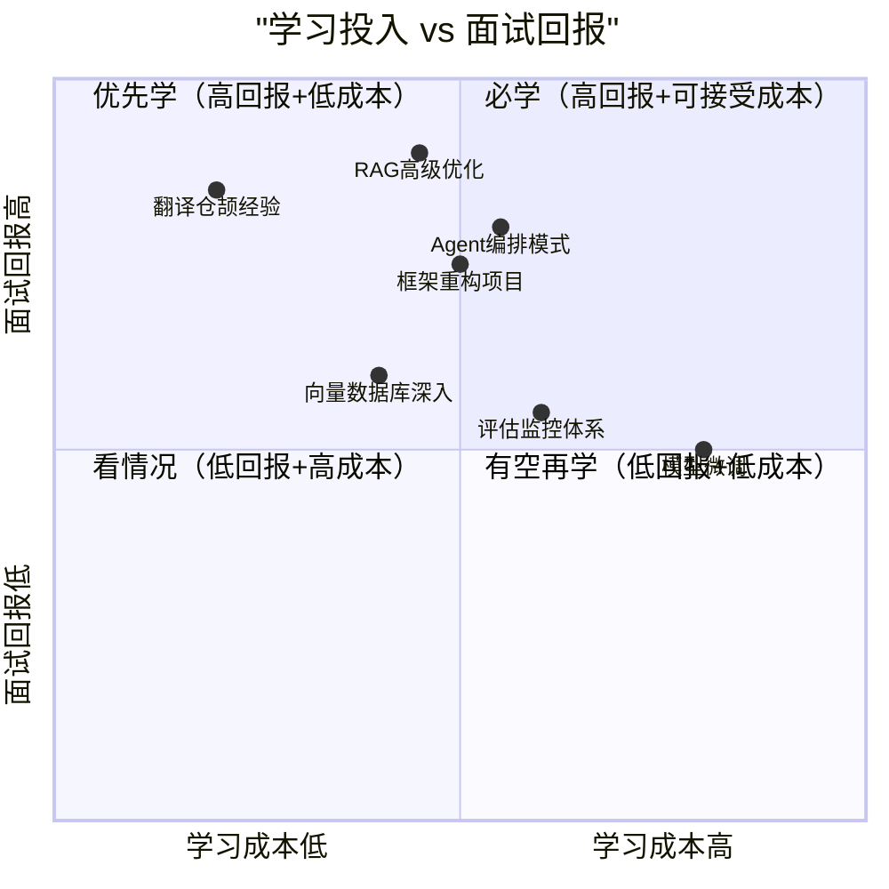

# AI智能体开发者 — 技能全景图与学习路线

# 图1、你现在在哪里

## Java底座 ⭐⭐⭐⭐⭐
- Spring Boot/Cloud
- 微服务架构
- MySQL/Redis/MQ/ES
- Docker/K8s

## AI应用框架 ⭐⭐（教学级demo）
### Spring AI Alibaba
- ChatModel/ChatClient ✅
- Prompt/PromptTemplate ✅
- 结构化输出 ✅
- 对话记忆 ✅
- RAG基础 ✅
- MCP协议 ✅
- 多模态 ✅

### LangChain4j
- 基础链路 ✅
- RAG基础 ✅
- Tool Calling ✅
- 知识图谱 ❌
- 多Agent ❌

## RAG体系 ⭐（调用方，非优化方）
### 了解链路但不深入
- 文档加载/分块 ⚪ 了解
- Embedding向量化 ⚪ 了解
- 向量检索 ⚪ 了解
- Prompt增强 ⚪ 了解

### 高级RAG ❌
- 多路召回
- Rerank重排序
- 知识图谱融合
- 推理增强RAG
- 评估体系

## 向量数据库 ⭐（云API调用）
- Redis Stack ✅ 接触过
- Milvus ❌ 未直接操作
- Qdrant ❌ 未直接操作
- 分块策略 ❌
- 索引优化 ❌

## 模型层 ⭐（对接接口，非设计者）
- API对接 ✅ 按文档调用
- 多模型路由 ⚪ 了解架构，不是设计者
- 模型选型 ❌
- 微调 ❌
- 评估 ❌

## SSE流式输出 ⭐⭐⭐⭐（生产级）
- SSE流式推送 ✅
- chunk逐块解析 ✅
- 流式与下游节点冲突处理 ✅

## Camunda工作流 ⭐⭐⭐⭐（生产级）
- 自定义节点开发 ✅
- 流程变量赋值 ✅
- 节点间数据流转 ✅
- 异常和超时处理 ✅

## 算法接口对接 ⭐⭐⭐⭐（生产级）
- 按文档调用NL2SQL接口 ✅
- CURL+Postman问题定位 ✅
- 跨团队协作Debug ✅

## Agent架构 ⭐⭐（Camunda BPMN经验）
- 单Agent ❌ 不懂ReAct
- 多Agent协作 ❌
- 工作流引擎 ✅ Camunda BPMN
- 任务分解 ❌

## 工程化 ⭐⭐
- Agent评估 ❌
- 安全合规 ⚪ 了解（JWT/限流/脱敏）
- 成本控制 ❌
- 可观测性 ❌

---

# 图2：学习路线图（未来6个月）

---

# 图3：技术栈选型决策树

---

# 图4：RAG 知识体系全景（面试核心）

---

# 图5：Agent 架构模式（面试高频）

---

# 图6：仓颉项目 vs 学习demo — 深度对比（2026-06-06新增）

---

# 图7：串联路径 — 从3个分散状态到1个完整能力体系

---

# 图8：串联后的完整技术栈（目标架构）

---

# 图9：面试叙事地图 — 怎么讲你的故事

---

# 图10：学习优先级矩阵（投入 vs 回报）

