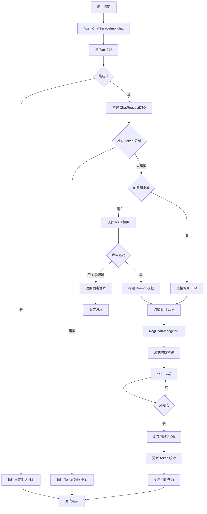

# 10. 对话消息处理流程

## 一、核心流程图




---

## 二、核心数据表

### **1. agent_chat_message** (对话消息表)

| 字段              | 类型        | 说明                                                         |
| ----------------- | ----------- | ------------------------------------------------------------ |
| id                | varchar(32) | 消息 ID（主键）                                              |
| session_id        | varchar(32) | 会话 ID                                                      |
| app_id            | varchar(32) | 应用 ID                                                      |
| parent_id         | varchar(32) | 父消息 ID（追问场景）                                        |
| role              | varchar(10) | 角色：user=用户，assistant=助手，system=系统                 |
| content           | text        | 消息内容                                                     |
| thinking_content  | text        | 思考过程内容（深度思考模式）                                 |
| thinking_enabled  | varchar(1)  | 是否启用思考：1=是，0=否                                     |
| thinking_time     | double      | 思考耗时（毫秒）                                             |
| status            | varchar(10) | 状态：COMPLETED=完成，ERROR=错误                             |
| biz_type          | varchar(20) | 业务类型：chat=知识问答，nl2sql=智能问数，workflow=工作流，chatflow=对话流 |
| is_retry          | varchar(1)  | 是否重试：0=否，1=是                                         |
| is_available      | varchar(1)  | 是否可见：0=否，1=是                                         |
| prompt_tokens     | int         | 输入 Token 数                                                |
| completion_tokens | int         | 输出 Token 数                                                |
| total_tokens      | int         | 总 Token 数                                                  |
| repos             | jsonb       | 引用的知识库列表（JSON 格式）                                |
| config_references | jsonb       | 配置引用（JSON 格式）                                        |
| temp_files        | jsonb       | 临时文件（JSON 格式）                                        |
| process           | text        | 处理过程（智能问数 6 阶段记录）                              |
| delete_flag       | varchar(1)  | 删除标志：0=未删除，1=已删除                                 |

**repos 结构示例**：
```json
[
  {
    "source": "技术文档.pdf",
    "filePath": "/files/技术文档.pdf",
    "code": "FILE_001",
    "score": 0.85,
    "pageContent": "RAG 检索到的内容片段..."
  }
]
```


---

### **2. agent_chat_session** (会话表)

| 字段                | 类型        | 说明                             |
| ------------------- | ----------- | -------------------------------- |
| id                  | varchar(32) | 会话 ID（主键）                  |
| app_id              | varchar(32) | 应用 ID                          |
| user_id             | varchar(32) | 用户 ID                          |
| title               | varchar     | 会话标题                         |
| session_type        | varchar(32) | 会话类型：chat/workflow/chatflow |
| terminal            | varchar(20) | 终端：web/mobile/api             |
| variable            | text        | 会话变量（JSON 格式）            |
| channel_source_name | varchar     | 渠道来源名称                     |
| delete_flag         | varchar(1)  | 删除标志：0=未删除，1=已删除     |

---

### **3. agent_chat_message_feedback** (消息反馈表)

| 字段                 | 类型        | 说明                      |
| -------------------- | ----------- | ------------------------- |
| id                   | varchar(32) | 反馈 ID（主键）           |
| session_id           | varchar(32) | 会话 ID                   |
| message_id           | varchar(32) | 消息 ID                   |
| feedback_type        | varchar(10) | 反馈类型：good=赞，bad=踩 |
| feedback_tags        | varchar     | 反馈标签（逗号分隔）      |
| feedback_description | text        | 反馈内容描述              |

---

## 三、核心代码流程

### **1️⃣ 聊天入口**

**位置**: [`AgentChatServiceImpl.chat()`](file:///D:/工作资料/code/仓颉智能体/nlp-agent/agent-builder/agent-build-core/src/main/java/com/yundingtech/agent/build/modules/agent/service/impl/AgentChatServiceImpl.java#L99-L214)

```java
@Override
public Flux<String> chat(ArrangeChatQO qo) {
    // ========== 1. 初始化上下文 ==========
    UserInfo userInfo = UserUtil.getUserByHeader();
    
    ChatProcessingContextV1 chatProcessingContext = JsonUtil.getJsonToBean(qo, ChatProcessingContextV1.class);
    chatProcessingContext.setAppId(qo.getAppId());
    chatProcessingContext.setBizType(qo.getBizType());
    
    // 处理追问场景
    String parentId = "0".equals(qo.getIsRegenerate()) 
        ? qo.getParentId() 
        : IdUtil.getSnowflake().nextIdStr();
    chatProcessingContext.setParentId(parentId);
    
    // 生成消息 ID
    String messageId = IdUtil.getSnowflake().nextIdStr();
    chatProcessingContext.setMessageId(messageId);
    chatProcessingContext.setQuestion(qo.getContent());
    chatProcessingContext.setSessionId(qo.getSessionId());
    
    // 判断是否开启"禁闲聊模式"
    ArrangeChatParam.ExternalRetrievalModel externalRetrievalModel = 
        qo.getAppConfig().getDataset().getExternalRetrievalModel();
    chatProcessingContext.setChatModelEnabled(
        externalRetrievalModel != null && externalRetrievalModel.getChatModelEnabled());
    chatProcessingContext.setChatModelPrompt(
        externalRetrievalModel == null ? null : externalRetrievalModel.getChatModelPrompt());
    
    String channelSourceName = StringUtils.hasLength(qo.getChannelSourceName()) 
        ? qo.getChannelSourceName() 
        : "optimize";
    
    // ========== 2. 黑名单检查 ==========
    Flux<String> flux = agentChatMessageService.checkAndHandleBlacklistIfNeeded(
        chatProcessingContext.getQuestion(),
        chatProcessingContext, userInfo, aesEncryptor, 
        qo.getSessionType(), channelSourceName
    );
    if (flux != null) {
        return flux;  // 命中黑名单，直接返回
    }
    
    // ========== 3. 构建 ChatRequestDTO ==========
    ChatRequestDTOV3 chatRequestDTO;
    if (qo.getAppConfig() == null || qo.getAppConfig().getLlmConfig() == null) {
        chatRequestDTO = agentChatMessageService.getChatDTOV3(
            qo.getAppId(), 
            JsonUtil.getJsonToBean(qo, ChatQO.class), 
            chatProcessingContext
        );
    } else {
        chatRequestDTO = agentChatMessageService.buildRequestV3DTO(qo, chatProcessingContext);
    }
    
    // ========== 4. Token 限制检查 ==========
    boolean checkContentTokenLimitExceeded = agentChatMessageService.checkContentTokenLimitExceeded(
        chatRequestDTO, qo.getContent());
    if (checkContentTokenLimitExceeded) {
        return agentChatMessageService.exceptionStream(
            chatProcessingContext, qo.getContent(), userInfo, TOKENLIMIT_REPLY_CONTENT);
    }
    
    // ========== 5. 准备 LLM 调用参数 ==========
    LlmDto llmDto = ChatUtils.getStreamingLlmDto(chatRequestDTO);
    llmDto.setProvider(ProviderConstant.SPRING_AI);
    
    List<Map<String, String>> messages = chatRequestDTO.getMessages();
    List<AgentMessage> chatMessageList = new ArrayList<>(messages.stream()
        .map(message -> AgentMessage.builder()
            .role(message.get("role"))
            .content(message.get("content"))
            .build())
        .toList());
    
    ModelParamDto modelParamDto = ModelParamDto.builder()
        .llm(llmDto)
        .agentMessages(chatMessageList)
        .build();
    
    // ========== 6. RAG 检索（如果配置了知识库） ==========
    int ragSize = Optional.ofNullable(
        chatRequestDTO.getDialogConfig().getKnowledgeConfig().getRepos())
        .map(List::size)
        .orElse(0);
    
    if (ragSize > 0) {
        SearchData ragSearchResult = ragSearchService.ragSearch(chatRequestDTO);
        List<RagSearchData> ragSearchData = Optional.ofNullable(ragSearchResult)
            .map(SearchData::getDocuments)
            .orElse(List.of());
        List<FaqSearchData> faqSearchData = Optional.ofNullable(ragSearchResult)
            .map(SearchData::getFaqs)
            .orElse(List.of());
        
        // 禁闲聊模式 + 未命中知识 → 返回固定话术
        if (CollectionUtils.isEmpty(ragSearchData) 
            && CollectionUtils.isEmpty(faqSearchData)
            && Boolean.TRUE.equals(chatProcessingContext.getChatModelEnabled())) {
            
            String chatModelPrompt = resolveChatModelPrompt(chatProcessingContext);
            chatProcessingContext.getContent().setLength(0);
            chatProcessingContext.getContent().append(chatModelPrompt);
            chatProcessingContext.setAnswer(chatModelPrompt);
            
            return Flux.just(HttpApiUtil.buildChatMessage(chatProcessingContext, chatModelPrompt))
                .publishOn(Schedulers.boundedElastic())
                .doFinally(out -> {
                    httpApiUtil.saveMessages(chatProcessingContext, userInfo);
                });
        }
        
        // ========== 7. 构建 Prompt 模板 ==========
        String dialogTemplate = buildDialogTemplate(chatProcessingContext);
        dialogTemplate = dialogTemplate.replaceAll("\\{\\{", "{");
        dialogTemplate = dialogTemplate.replaceAll("}}", "}");
        
        PromptTemplate promptTemplate = new PromptTemplate(dialogTemplate);
        Map<String, Object> promptVariables = new HashMap<>();
        promptVariables.put("question", qo.getContent());
        promptVariables.put("context", buildIndexedRagContext(ragSearchData, faqSearchData, chatProcessingContext));
        
        if (Boolean.TRUE.equals(chatProcessingContext.getChatModelEnabled())) {
            promptVariables.put("fixedReply", resolveChatModelPrompt(chatProcessingContext));
        }
        
        promptVariables.put("history", "");
        
        String render = promptTemplate.render(promptVariables);
        chatMessageList.addFirst(AgentMessage.builder()
            .role("system")
            .content(render)
            .build());
    }
    
    // ========== 8. 测试 LLM 连接 ==========
    if (!ModelUtil.testConnectBySpringAi(llmDto)) {
        throw CommonException.buildException("大模型连接失败:" + llmDto.getApiBase());
    }
    
    // ========== 9. 流式调用 LLM ==========
    ChatStrategySelector strategySelector = new ChatStrategySelector();
    ChatStrategy chatStrategy = strategySelector.createChatStrategy(ProviderConstant.SPRING_AI);
    Flux<String> stringFlux = chatStrategy.chatWithStream(modelParamDto);
    
    // ========== 10. 流式响应处理 ==========
    return stringFlux
        .concatMap(response -> Mono.just(
            ragChatManagerV1.buildStreamingResponse(response, chatProcessingContext)))
        .publishOn(Schedulers.boundedElastic())
        .doFinally(out -> {
            // 流完成后保存消息
            httpApiUtil.saveMessages(chatProcessingContext, userInfo);
        });
}
```


---

### **2️⃣ RAG 上下文构建**

**位置**: [`AgentChatServiceImpl.buildIndexedRagContext()`](file:///D:/工作资料/code/仓颉智能体/nlp-agent/agent-builder/agent-build-core/src/main/java/com/yundingtech/agent/build/modules/agent/service/impl/AgentChatServiceImpl.java#L219-L263)

```java
private String buildIndexedRagContext(
    List<RagSearchData> ragSearchData, 
    List<FaqSearchData> faqSearchData,
    ChatProcessingContextV1 chatContext
) {
    if (CollectionUtils.isEmpty(ragSearchData) && CollectionUtils.isEmpty(faqSearchData)) {
        return "";
    }
    
    AtomicInteger index = new AtomicInteger(0);
    StringBuilder contextBuilder = new StringBuilder();
    
    // 1. 处理文档片段
    for (RagSearchData doc : ragSearchData) {
        if (doc == null || doc.getMetadata() == null) {
            continue;
        }
        
        int currentIndex = index.incrementAndGet();
        RagSearchData.Metadata metadata = doc.getMetadata();
        
        String source = Optional.ofNullable(metadata.getSource()).orElse("");
        String fileId = Optional.ofNullable(metadata.getFile_id()).orElse("");
        String filePath = Optional.ofNullable(metadata.getFile_path()).orElse("");
        String code = Optional.ofNullable(metadata.getCode()).orElse("");
        Double score = Optional.ofNullable(doc.getScore()).orElse(0D);
        String pageContent = Optional.ofNullable(doc.getPage_content()).orElse("");
        
        // 添加到引用来源列表
        if (StringUtils.hasText(source)) {
            chatContext.addSource(source, filePath, code, currentIndex, score, pageContent, fileId);
        }
        
        // 构建上下文文本
        contextBuilder
            .append("文档片段[").append(currentIndex).append("]\n")
            .append("source: ").append(source).append("\n")
            .append("file_id: ").append(fileId).append("\n")
            .append("file_path: ").append(filePath).append("\n")
            .append("code: ").append(code).append("\n")
            .append("score: ").append(score).append("\n")
            .append("content: ").append(pageContent).append("\n\n");
    }
    
    // 2. 处理 FAQ 问答
    if (!CollectionUtils.isEmpty(faqSearchData)) {
        contextBuilder.append("参考 QA（无需角标引用）\n");
        for (FaqSearchData faq : faqSearchData) {
            if (faq == null) {
                continue;
            }
            contextBuilder
                .append("question: ").append(Optional.ofNullable(faq.getQuestion()).orElse("")).append("\n")
                .append("answer: ").append(Optional.ofNullable(faq.getAnswer()).orElse("")).append("\n")
                .append("score: ").append(Optional.ofNullable(faq.getScore()).orElse(0D)).append("\n\n");
        }
    }
    
    return contextBuilder.toString();
}
```


---

### **3️⃣ 流式响应构建**

**位置**: [`RagChatManagerV1.buildStreamingResponse()`](file:///D:/工作资料/code/仓颉智能体/nlp-agent/agent-common/agent-rag-adapter/src/main/java/com/yundingtech/agent/adapter/ragchat/RagChatManagerV1.java)

```java
public String buildStreamingResponse(String response, ChatProcessingContextV1 chatContext) {
    // 1. 解析 LLM 返回的流式数据
    // 格式：data: {"content":"部","think":"","usage":{"completion_tokens":96},"id":"","model":""}
    
    try {
        JsonNode jsonNode = objectMapper.readTree(response);
        String content = jsonNode.has("content") ? jsonNode.get("content").asText() : "";
        String think = jsonNode.has("think") ? jsonNode.get("think").asText() : "";
        
        // 2. 追加到上下文
        chatContext.getContent().append(content);
        if (StringUtils.hasText(think)) {
            chatContext.getThink().append(think);
        }
        
        // 3. 处理引用角标
        // 提取 <cite>N</cite> 格式的角标
        Pattern pattern = Pattern.compile("<cite>(\\d+)</cite>");
        Matcher matcher = pattern.matcher(content);
        
        while (matcher.find()) {
            int citedIndex = Integer.parseInt(matcher.group(1));
            chatContext.addCitedIndex(citedIndex);
        }
        
        // 4. 构建 SSE 响应
        WorkerStreamResponseV1 streamResponse = new WorkerStreamResponseV1();
        streamResponse.setContent(content);
        streamResponse.setThink(think);
        streamResponse.setMessageId(chatContext.getMessageId());
        streamResponse.setParentId(chatContext.getParentId());
        streamResponse.setSessionId(chatContext.getSessionId());
        streamResponse.setRole("assistant");
        
        return objectMapper.writeValueAsString(streamResponse);
        
    } catch (Exception e) {
        log.error("构建流式响应失败", e);
        return response;
    }
}
```


---

### **4️⃣ 消息保存**

**位置**: [`HttpApiUtil.saveMessages()`](file:///D:/工作资料/code/仓颉智能体/nlp-agent/agent-builder/agent-build-core/src/main/java/com/yundingtech/agent/build/modules/chatapplication/utils/HttpApiUtil.java#L106-L125)

```java
public void saveMessages(ChatProcessingContextV1 chatContext, UserInfo userInfo) {
    try {
        // 1. 保存用户消息（重试时不保存）
        if ("0".equals(chatContext.getIsRegenerate())) {
            agentChatMessageService.saveMessage(
                chatContext.getBizType(),
                chatContext.getParentId(),
                chatContext.getParentId(),
                chatContext.getQuestion(),
                null,  // reasoningContent
                null,  // thinkDuration
                chatContext.getAppId(),
                chatContext.getSessionId(),
                "user",
                "finish",
                "1",  // isAvailable
                0, 0, 0,  // tokens
                chatContext.getUpLoadFiles(),
                userInfo,
                objectMapper.writeValueAsString(chatContext.getRepos()),
                chatContext.getTempFiles()
            );
        } else {
            // 重试场景：更新用户消息为可见
            agentChatMessageService.update(
                null,
                new UpdateWrapper<AgentChatMessageEntity>()
                    .lambda()
                    .set(AgentChatMessageEntity::getIsAvailable, "1")
                    .eq(AgentChatMessageEntity::getId, chatContext.getParentId())
                    .eq(AgentChatMessageEntity::getRole, "user")
            );
        }
        
        // 2. 更新实际使用的引用来源
        ragChatManagerV1.syncActuallyUsedSources(chatContext);
        
        // 3. 保存助手消息
        agentChatMessageService.saveMessage(chatContext, userInfo);
        
    } catch (Exception ex) {
        log.error("保存消息失败", ex);
    }
}
```


---

### **5️⃣ 保存消息实现**

**位置**: [`AgentChatMessageServiceImpl.saveMessage()`](file:///D:/工作资料/code/仓颉智能体/nlp-agent/agent-builder/agent-build-core/src/main/java/com/yundingtech/agent/build/modules/chatapplication/service/impl/AgentChatMessageServiceImpl.java#L262-L277)

```java
@Override
public void saveMessage(
    String bizType, String parentId, String chatId, String content, 
    String reasoningContent, Double thinkDuration, String appId, 
    String sessionId, String role, String status, String isAvailable, 
    Integer promptTokens, Integer totalTokens, Integer completionTokens, 
    String configReferences, UserInfo userInfo, String repos, String tempFiles
) {
    AgentChatMessageEntity agentChatMessageEntity = new AgentChatMessageEntity();
    
    agentChatMessageEntity.setCreateUserId(userInfo.getUserId());
    agentChatMessageEntity.setCreateOrgId(userInfo.getOrganizeId());
    agentChatMessageEntity.setId(chatId);
    agentChatMessageEntity.setAppId(appId);
    agentChatMessageEntity.setSessionId(sessionId);
    agentChatMessageEntity.setRole(role);
    agentChatMessageEntity.setContent(content);
    agentChatMessageEntity.setThinkingContent(reasoningContent);
    agentChatMessageEntity.setThinkingEnabled("1");
    agentChatMessageEntity.setThinkingTime(thinkDuration != null ? thinkDuration : null);
    agentChatMessageEntity.setStatus(status);
    agentChatMessageEntity.setBizType(bizType == null ? "chat" : bizType);
    agentChatMessageEntity.setIsRetry("0");
    agentChatMessageEntity.setIsAvailable(isAvailable);
    agentChatMessageEntity.setPromptTokens(promptTokens);
    agentChatMessageEntity.setTotalTokens(totalTokens);
    agentChatMessageEntity.setCompletionTokens(completionTokens);
    agentChatMessageEntity.setConfigReferences(configReferences);
    agentChatMessageEntity.setRepos(repos);
    agentChatMessageEntity.setTempFiles(tempFiles);
    
    save(agentChatMessageEntity);
}
```


---

## 四、Prompt 模板机制

### **双模式 Prompt**

**位置**: [`AgentChatServiceImpl.buildDialogTemplate()`](file:///D:/工作资料/code/仓颉智能体/nlp-agent/agent-builder/agent-build-core/src/main/java/com/yundingtech/agent/build/modules/agent/service/impl/AgentChatServiceImpl.java#L265-L270)

```java
private String buildDialogTemplate(ChatProcessingContextV1 chatProcessingContext) {
    if (Boolean.TRUE.equals(chatProcessingContext.getChatModelEnabled())) {
        // 禁闲聊模式：RAG_PROMPT + CHAT_MODEL_STRICT_PROMPT
        return RAG_PROMPT + CHAT_MODEL_STRICT_PROMPT;
    }
    // 普通模式：仅 RAG_PROMPT
    return RAG_PROMPT;
}
```


### **RAG_PROMPT（基础模板）**
```java
private static final String RAG_PROMPT = """
    你是一个全能且乐于助人的智能 AI 助手。请仔细分析用户的真实意图，并按照以下策略灵活、自然地作答：

    # 【已知信息 (文档片段和参考 QA)】:
    {{context}}

    # 【回答策略（意图分流）】:
    1. **调用工具（MCP/Function Calling）**: 如果用户的问题涉及你所具备的工具能力，请优先使用相应工具，并基于工具返回的结果作答。
    2. **基于知识库（RAG）**: 如果【已知信息】中包含了能解答用户问题的内容，请严格依据已知信息作答。不允许添加编造成分。
    3. **日常对话与通用知识（兜底策略）**: 当用户进行日常闲聊（如"今天吃什么"、"你好"）、提问通用常识，且无需使用工具或知识库时，请**直接使用你的通用常识自然作答**。**严禁**回复"我只专注于火车票查询"、"没有已知信息"或"无法为您解答"等自我设限的机械话术。

    # 【引用与格式要求（仅在基于知识库作答时生效）】:
    1. **严格使用纯数字角标**: 凡是引用了【已知信息】的内容，必须在句末使用角标标注。角标格式必须为<cite>纯数字</cite>，例如：<cite>1</cite> 或 <cite>2</cite>。**严禁输出类似<cite>文档片段 1</cite>或包含其他汉字的格式。**
    2. **自然表达**: 答案中不要直接使用"文档片段 x"等字眼指代资料，直接在引用句尾打上数字角标即可。
    3. **保留图片标签**: 若引用的文本内容中包含图片信息<img_loc>xxxx</img_loc>，回答时必须在合适的位置保留该标签，不要做任何修改。
        图片位置信息格式参考：<img_loc>748211844631500613/2.jpg</img_loc>
    4. **解析图片 Source**: 若引用的文本内容 metaData 中的 source 字段为 png、jpg 等图片格式时，回答的内容需要在适合的位置添加该图片，格式为<img_loc>图片名称</img_loc>，source 名称不要做修改。
        图片位置信息格式参考：<img_loc>技术架构图.png</img_loc>

    # 【补充规则】:
    1. 如果引用的内容属于 QA、FAQ，禁止在输出时携带其原文中自带的<cite>...</cite>角标。
    2. 答案请使用中文，专业、简洁，并适当使用换行符使格式规整。

    # 【用户问题】:
    {{question}}
""";
```


### **CHAT_MODEL_STRICT_PROMPT（禁闲聊模式）**
```java
private static final String CHAT_MODEL_STRICT_PROMPT = """

    # 【知识库兜底限制】:
    1. 当本规则生效时，忽略上文"日常对话与通用知识（兜底策略）"。
    2. 你必须拒绝闲聊、寒暄、情感陪伴、开放式聊天以及与知识库无关的通用问答，不得使用模型自身知识补充回答。
    3. 只有【已知信息】中存在与用户问题直接相关的内容时，才允许基于【已知信息】回答。
    4. 如果【已知信息】中没有与用户问题直接相关的信息，必须原样只返回以下固定内容，不得添加任何解释、前后缀、标点变体或额外内容：
    {{fixedReply}}
""";
```


---

## 五、Token 统计机制

### **Token 计算流程**

```java
// 1. 检查 Token 限制
boolean checkContentTokenLimitExceeded = agentChatMessageService.checkContentTokenLimitExceeded(
    chatRequestDTO, qo.getContent());

// 2. LLM 返回中包含 Token 信息
Usage usage = HandleChatResult.getTokenUsage(result);
Integer promptTokens = usage.promptTokens();
Integer completionTokens = usage.completionTokens();
Integer totalTokens = usage.totalTokens();

// 3. 保存到消息表
agentChatMessageEntity.setPromptTokens(promptTokens);
agentChatMessageEntity.setCompletionTokens(completionTokens);
agentChatMessageEntity.setTotalTokens(totalTokens);
```


### **Token 限制检查**
```java
public boolean checkContentTokenLimitExceeded(ChatRequestDTOV3 request, String content) {
    // 获取模型的最大 Token 数
    Integer maxTokens = request.getDialogConfig().getModelConfig().getMaxTokens();
    
    // 计算当前内容的 Token 数
    double realToken = TikTokenUtil.countTokens(content, request.getDialogConfig().getModelConfig().getModel());
    
    // 判断是否超限
    return realToken > maxTokens;
}
```


---

## 六、引用来源机制

### **引用角标提取**

```java
// 从流式响应中提取角标
Pattern pattern = Pattern.compile("<cite>(\\d+)</cite>");
Matcher matcher = pattern.matcher(content);

while (matcher.find()) {
    int citedIndex = Integer.parseInt(matcher.group(1));
    chatContext.addCitedIndex(citedIndex);
}

// 过滤实际引用的来源
List<Source> actuallyUsedSources = chatContext.getSources().stream()
    .filter(source -> chatContext.getCitedIndices().contains(source.getIndex()))
    .collect(Collectors.toList());

// 更新到数据库
agentChatMessageEntity.setRepos(objectMapper.writeValueAsString(actuallyUsedSources));
```


---

## 七、追问与重新生成

### **追问场景**

```java
// parent_id 保持不变
String parentId = IdUtil.getSnowflake().nextIdStr();
chatProcessingContext.setParentId(parentId);

// 用户消息的 parent_id 指向上一轮助手消息
agentChatMessageEntity.setParentId(parentId);
agentChatMessageEntity.setRole("user");
```


### **重新生成场景**

```java
// isRegenerate = "1"
if ("1".equals(qo.getIsRegenerate())) {
    // 不创建新的用户消息
    // 将上一轮助手消息设置为不可见
    agentChatMessageService.update(
        null,
        new UpdateWrapper<AgentChatMessageEntity>()
            .lambda()
            .set(AgentChatMessageEntity::getIsAvailable, "0")
            .eq(AgentChatMessageEntity::getParentId, parentId)
            .eq(AgentChatMessageEntity::getRole, "assistant")
    );
}
```


---

## 八、特殊业务类型处理

### **智能问数消息保存**

**位置**: [`Nl2sqlDbAppServiceImpl.closeSSEAndSaveHistoryMessage()`](file:///D:/工作资料/code/仓颉智能体/nlp-agent/agent-builder/agent-build-core/src/main/java/com/yundingtech/agent/build/modules/nl2sql/service/impl/Nl2sqlDbAppServiceImpl.java#L411-L426)

```java
// 智能问数 6 阶段摘要
StringBuilder summaryBuilder = new StringBuilder();
for (int i = Math.max(0, messageList.size() - 5); i < messageList.size(); i++) {
    StreamResponseBase msg = messageList.get(i);
    summaryBuilder.append("阶段：").append(msg.getStage())
        .append(", 内容：").append(msg.getContent() != null ?
            msg.getContent().substring(0, Math.min(200, msg.getContent().length())) : "")
        .append("\n");
}
String messageJson = summaryBuilder.toString();

chatProcessingContextV1.getContent().append(messageJson);
chatProcessingContextV1.setIsRegenerate(nl2sqlChatQO.getIsRegenerate() == null ? "0" : nl2sqlChatQO.getIsRegenerate());
chatProcessingContextV1.setQuestion(nl2sqlChatQO.getContent());
chatProcessingContextV1.setBizType(nl2sqlChatQO.getBizType());

httpApiUtil.saveMessages(chatProcessingContextV1, userInfo);
```


**process 字段记录 6 阶段**：
```json
{
  "stage1": "问题重写：用户想查询最近的火车票...",
  "stage2": "表检索：检索到 train_tickets 表，score=0.85",
  "stage3": "SQL 生成：SELECT * FROM train_tickets WHERE...",
  "stage4": "SQL 执行：执行成功，返回 10 条记录",
  "stage5": "图表生成：推荐折线图展示趋势",
  "stage6": "图表渲染：ECharts 配置生成完成"
}
```


---

## 九、黑名单检查

```java
public Flux<String> checkAndHandleBlacklistIfNeeded(
    String question,
    ChatProcessingContextV1 context,
    UserInfo userInfo,
    AesEncryptor aesEncryptor,
    String sessionType,
    String channelSourceName
) {
    // 检查敏感词
    List<String> blackList = getBlackList();
    for (String blackWord : blackList) {
        if (question.contains(blackWord)) {
            // 命中黑名单
            return Flux.just(HttpApiUtil.buildChatMessage(
                context, "您的问题中包含敏感词，请重新组织语言后再提问。"));
        }
    }
    return null;  // 未命中，继续正常流程
}
```


---

## 十、完整数据流转路径

```
1. 用户提问
   ↓
2. 黑名单检查
   ↓
3. Token 限制检查
   ↓
4. 构建 ChatRequestDTO
   ↓
5. RAG 检索（如果配置知识库）
   ├─ 向量检索
   ├─ 关键词检索
   └─ Rerank 重排序
   ↓
6. 构建 Prompt 模板
   ├─ RAG_PROMPT
   └─ CHAT_MODEL_STRICT_PROMPT（可选）
   ↓
7. 流式调用 LLM
   ↓
8. 流式响应处理
   ├─ 解析 content
   ├─ 解析 think
   ├─ 提取引用角标
   └─ 构建 SSE 响应
   ↓
9. SSE 推送给前端
   ↓
10. 流完成
    ├─ 保存用户消息
    ├─ 保存助手消息
    ├─ 更新引用来源
    └─ 更新 Token 统计
    ↓
11. 完成响应
```


---

## 十一、关键配置参数

| 参数             | 类型    | 说明               | 默认值                       |
| ---------------- | ------- | ------------------ | ---------------------------- |
| chatModelEnabled | boolean | 是否启用禁闲聊模式 | false                        |
| chatModelPrompt  | string  | 禁闲聊时的固定回复 | "抱歉，知识库中没有相关信息" |
| maxTokens        | integer | 模型最大 Token 数  | 2000                         |
| topK             | integer | RAG 检索返回数量   | 5                            |
| scoreThreshold   | double  | RAG 检索最低分数   | 0.6                          |
| isRegenerate     | string  | 是否重新生成       | "0"                          |
| bizType          | string  | 业务类型           | "chat"                       |

---

## 十二、常见问题

### **Q1: 消息未保存到数据库**
**原因**: 
- 流未完成就关闭连接
- 保存逻辑在 `doFinally` 中，需要等待 Flux 完成

**解决**: 确保前端正确接收 `[DONE]` 信号

### **Q2: Token 统计为 0**
**原因**: LLM 未返回 usage 信息 
**解决**: 检查 `ChatStrategy.chatWithStream()` 是否正确解析 usage

### **Q3: 引用来源不准确**
**原因**: 角标提取失败 
**解决**: 检查 LLM 输出是否严格遵循 `<cite>N</cite>` 格式

### **Q4: 追问消息关联错误**
**原因**: parent_id 计算错误 
**解决**: 追问时 `parent_id` 应指向上一轮助手消息 ID

---

## 十三、关键要点总结

1. **流式处理**: 使用 `Flux<String>` 实现流式响应，边生成边推送
2. **双模式 Prompt**: 支持普通模式和禁闲聊模式，通过 `chatModelEnabled` 控制
3. **引用角标**: 严格使用 `<cite>N</cite>` 格式，自动提取并过滤引用来源
4. **消息保存**: 在流完成后统一保存，包含用户消息和助手消息
5. **Token 统计**: 从 LLM 返回的 usage 字段提取，保存到 `agent_chat_message`
6. **追问机制**: 通过 `parent_id` 关联多轮对话，`isRegenerate` 标识重新生成
7. **业务类型**: 通过 `biz_type` 区分知识问答、智能问数、工作流、对话流
