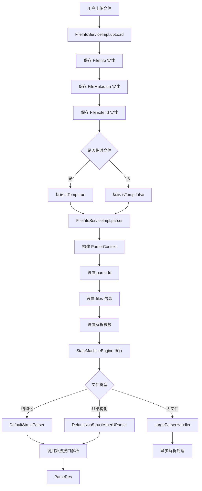

# 11. 文件上传与解析流程.md

## 一、核心流程图



## 二、核心数据表

### 1. file_info（文件基本信息表）

**作用**：存储文件的基础元数据信息

| 字段名 | 类型 | 说明 | 示例 |
|--------|------|------|------|
| id | VARCHAR(32) | 文件 ID（主键） | "1234567890" |
| file_name | VARCHAR(255) | 文件名 | "产品手册.pdf" |
| size | BIGINT | 文件大小（字节） | 1048576 |
| url | VARCHAR(500) | 文件存储 URL | "http://minio/bucket/file.pdf" |
| pdf_url | VARCHAR(500) | PDF 转换后的 URL | "http://minio/bucket/file.pdf" |
| catalog_id | VARCHAR(32) | 所属目录 ID | "catalog_001" |
| version | INT | 版本号 | 1 |
| created_by | VARCHAR(32) | 创建人 ID | "user_001" |
| created_time | DATETIME | 创建时间 | "2024-01-01 10:00:00" |
| updated_by | VARCHAR(32) | 更新人 ID | "user_001" |
| updated_time | DATETIME | 更新时间 | "2024-01-01 10:00:00" |

**索引**：
- PRIMARY KEY (id)
- INDEX idx_catalog_id (catalog_id)
- INDEX idx_created_by (created_by)

---

### 2. file_metadata（文件元数据表）

**作用**：存储文件的分类和层级信息，用于权限管理和空间隔离

| 字段名 | 类型 | 说明 | 示例 |
|--------|------|------|------|
| id | VARCHAR(32) | 主键 | "meta_001" |
| file_id | VARCHAR(32) | 文件 ID（外键） | "1234567890" |
| code | VARCHAR(100) | 分类编码 | "00010002" |
| level | INT | 层级（code 长度/4） | 2 |
| workspace_id | VARCHAR(32) | 工作空间 ID | "ws_001" |
| created_time | DATETIME | 创建时间 | "2024-01-01 10:00:00" |

**索引**：
- PRIMARY KEY (id)
- UNIQUE INDEX uk_file_id (file_id)
- INDEX idx_code (code)

**code 生成规则**：
```java
// 根据 catalog_id 生成 4 位一组的层级编码
// 例如：catalog_id="001" → code="0001"
// 例如：catalog_id="001.002" → code="00010002"
```

---

### 3. file_extend（文件扩展信息表）

**作用**：存储文件的扩展属性和业务配置

| 字段名 | 类型 | 说明 | 示例 |
|--------|------|------|------|
| id | VARCHAR(32) | 主键 | "extend_001" |
| file_id | VARCHAR(32) | 文件 ID（外键） | "1234567890" |
| parser_id | VARCHAR(32) | 解析器 ID | "parser_pdf_001" |
| light_mode | BOOLEAN | 轻量化解析模式 | false |
| repeat_chunks | BOOLEAN | 允许重复分片 | false |
| scope | VARCHAR(50) | 解析范围 | "FULL" / "LIGHT" |
| extra_config | TEXT | 额外配置（JSON） | '{"key":"value"}' |

**索引**：
- PRIMARY KEY (id)
- UNIQUE INDEX uk_file_id (file_id)

---

### 4. parser_log（解析日志表）

**作用**：记录每次文件解析的详细过程和结果

| 字段名 | 类型 | 说明 | 示例 |
|--------|------|------|------|
| id | VARCHAR(32) | 主键 | "log_001" |
| file_id | VARCHAR(32) | 文件 ID | "1234567890" |
| parser_id | VARCHAR(32) | 解析器 ID | "parser_pdf_001" |
| status | VARCHAR(20) | 解析状态 | "SUCCESS" / "FAILED" / "PARSING" |
| progress | INT | 解析进度（0-100） | 100 |
| error_msg | TEXT | 错误信息 | "文件损坏无法解析" |
| chunk_count | INT | 分片数量 | 15 |
| total_tokens | INT | 总 Token 数 | 5000 |
| parse_duration | BIGINT | 解析耗时（毫秒） | 3500 |
| created_time | DATETIME | 创建时间 | "2024-01-01 10:00:00" |

**索引**：
- PRIMARY KEY (id)
- INDEX idx_file_id (file_id)
- INDEX idx_status (status)

---

### 5. chunk（文件分片表）

**作用**：存储解析后的文件分片数据（向量库）

| 字段名 | 类型 | 说明 | 示例 |
|--------|------|------|------|
| id | VARCHAR(32) | 主键 | "chunk_001" |
| file_id | VARCHAR(32) | 文件 ID | "1234567890" |
| chunk_index | INT | 分片序号 | 1 |
| content | TEXT | 分片内容 | "这是文档的第一段内容..." |
| vector | VECTOR(768) | 向量 embedding | [0.1, 0.2, ...] |
| keywords | VARCHAR(500) | 关键词提取 | "AI，智能体，RAG" |
| page_num | INT | 页码（PDF 适用） | 5 |
| position | VARCHAR(100) | 位置信息 | "P5-S2" |
| metadata | JSON | 元数据 | {"section":"引言"} |

**索引**：
- PRIMARY KEY (id)
- INDEX idx_file_id (file_id)
- VECTOR INDEX idx_vector (vector) - 向量索引

---

## 三、核心代码流程

### 关键方法 1：upLoad() - 文件上传

**位置**：`FileInfoServiceImpl.java` 第 820-959 行

**作用**：批量上传文件并保存到数据库

```java
@Override
@Transactional
public List<FileInfoEntity> upLoad(UpLoadFileInfoFO fileFO) {
    List<FileInfoEntity> fileInfoEntityList = new ArrayList<>();
    
    // 1. 批量上传文件
    for (FileFO file : fileFO.getFileList()) {
        FileInfoEntity fileInfoEntity = new FileInfoEntity();
        String fileId = IdUtil.getSnowflake().nextIdStr();
        
        // 设置文件基本信息
        fileInfoEntity.setId(fileId);
        fileInfoEntity.setFileName(file.getFileName());
        fileInfoEntity.setSize(file.getSize());
        fileInfoEntity.setUrl(file.getUrl());
        fileInfoEntity.setCatalogId(fileFO.getCatalogId());
        fileInfoEntity.setVersion(1);
        
        save(fileInfoEntity);  // 保存到 file_info 表
        
        // 2. 保存元数据
        FileMetadataEntity fileMetadataEntity = new FileMetadataEntity();
        fileMetadataEntity.setFileId(fileId);
        String code = generateCodeByCatalogId(fileFO.getCatalogId());
        fileMetadataEntity.setCode(code);
        fileMetadataEntity.setLevel(code.length() / 4);
        fileMetadataService.save(fileMetadataEntity);  // 保存到 file_metadata 表
        
        // 3. 保存扩展信息
        FileExtendEntity fileExtendEntity = new FileExtendEntity();
        fileExtendEntity.setFileId(fileId);
        fileExtendService.save(fileExtendEntity);  // 保存到 file_extend 表
        
        fileInfoEntityList.add(fileInfoEntity);
    }
    
    // 4. 触发解析流程
    parser(fileInfoEntityList, fileFO);
    
    return fileInfoEntityList;
}
```

**关键点**：
- `@Transactional` 保证原子性
- 雪花算法生成唯一 ID
- 三个表同时保存（FileInfo + FileMetadata + FileExtend）
- 上传完成后立即触发解析

---

### 关键方法 2：parser() - 触发解析

**位置**：`FileInfoServiceImpl.java` 第 967-1023 行

**作用**：构建解析上下文并提交到状态机执行

```java
public void parser(List<FileInfoEntity> fileInfoEntityList, UpLoadFileInfoFO fileFO) {
    log.info("=== 测试日志：当前设置的解析器 ID 为 [{}] ===", fileFO.getParserId());
    
    // 1. 构建解析上下文
    ParserContext parserContext = new ParserContext();
    parserContext.setParserId(fileFO.getParserId());
    
    // 2. 构建文件信息列表
    List<ParserContext.FileInfo> files = fileInfoEntityList.stream().map(entity -> {
        return new ParserContext.FileInfo()
            .setFileId(entity.getId())
            .setFileSize(entity.getSize())
            .setFileName(entity.getFileName())
            .setFileVersion(entity.getVersion())
            .setPdfPath(OkHttpFileUploader.getFilePathByUrl(entity.getPdfUrl(), minioEndpoint))
            .setFilePath(OkHttpFileUploader.getFilePathByUrl(entity.getUrl(), minioEndpoint));
    }).collect(Collectors.toList());
    
    parserContext.setFiles(files);
    
    // 3. 设置解析参数
    parserContext.setTemp(fileFO.getIsTemp());  // 是否临时文件
    parserContext.setLightMode(fileFO.isLightMode());  // 轻量化模式
    parserContext.setRepeatChunks(fileFO.isRepeatChunks());  // 允许重复分片
    parserContext.setScope(fileFO.getScope());  // 解析范围
    
    // 4. 提交到状态机执行
    stateMachineEngine.handleParsePriorityAndExecute(parserContext);
}
```

**关键点**：
- 支持批量解析多个文件
- `isTemp=true` 标识临时文件（优先级更高）
- `lightMode=true` 启用轻量化解析（减少分片数量）
- 状态机驱动解析流程

---

### 关键方法 3：handle() - 解析处理器

**位置**：`LargeParserHandler.java` 第 89-126 行

**作用**：大文件异步解析的两阶段处理器

```java
@Override
public ParserContext handle(ParserContext context) {
    try {
        // 第一阶段：解析
        if (context.getCurrentState().equals(TaskUtil.TaskState.PARSING)) {
            parser(context);  // 执行解析
        }
        
        // 第二阶段：上传
        if (context.isSuccess()) {
            // 如果大文件直接返回，等待结果获取线程继续
            if (context.isLargeFile()) return context;
            
            if (context.getCurrentState().equals(TaskUtil.TaskState.UPLOAD)
                && !context.getEndState().equals(TaskUtil.TaskState.PARSING)) {
                upload(context);  // 执行上传
                if (context.isSuccess()) {
                    context.setCurrentState(TaskUtil.TaskState.SUCCESS);
                } else {
                    context.setCurrentState(TaskUtil.TaskState.FAILED);
                }
            }
        }
    } catch (Exception e) {
        log.error("解析异常：：{}", e.toString());
        context.setErrorMsg(e.getLocalizedMessage());
        context.setCurrentState(TaskUtil.TaskState.FAILED);
    }
    return context;
}
```

**关键点**：
- **两阶段处理**：PARSING → UPLOAD
- **大文件特殊处理**：`isLargeFile()` 标识大文件，异步解析
- **状态流转**：SUCCESS / FAILED
- **异常捕获**：记录错误信息到 context.errorMsg

---

### 关键方法 4：parser() - 非结构化文件解析

**位置**：`DefaultNonStructMinerUParser.java` 第 219-252 行

**作用**：调用算法接口进行非结构化文件解析

```java
@Override
public ParserContext parser(ParserContext context) {
    // 1. 调用算法接口进行文件解析
    Object res = ragProviderAdapter.modelCall(getParseParam(context));
    
    if (res != null) {
        ResponseEntity responseEntity = (ResponseEntity) res;
        if (responseEntity.getStatusCodeValue() == HttpStatus.HTTP_OK) {
            JSONObject jsonObject = JSONUtil.parseObj(responseEntity.getBody());
            if (jsonObject.containsKey("success") && jsonObject.getBool("success")) {
                context.setSuccess(true);
                jsonObject.set("data", new JSONObject().set("status", TaskUtil.TaskState.PARSING));
                context.setParserResult(jsonObject);
                context.setFileHash(jsonObject.getStr("fileHash"));
                
                // 如果大文件直接返回，等待结果获取线程继续
                if (context.isLargeFile()) return context;
                
                // 进入上传阶段
                context.setCurrentState(TaskUtil.TaskState.UPLOAD);
                
                // 转化解析结果
                JSONObject resTransfer = transferNonStructResult(jsonObject, context);
                parserParserResultAndSaveLog(context, resTransfer, parserLogService);
            }
        }
    }
    return context;
}

@Override
public ParserContext upload(ParserContext context) {
    return chunkUpload(context, ragProviderAdapter, fileInfoService, fileMetadataService, languageModelService);
}
```

**关键点**：
- 调用外部算法接口（ragProviderAdapter）
- 解析成功后设置状态为 UPLOAD
- 大文件异步处理
- 记录解析日志

---

### 关键方法 5：upLoadTempFile() - 临时文件上传

**位置**：`FileInfoServiceImpl.java` 第 1069-1094 行

**作用**：上传临时文件用于知识库创建前的文件预览

```java
@Transactional
@Override
public void upLoadTempFile(TempFileUploadVo tempFileUploadVo, List<FileFO> fileList, String parserId) {
    // 1. 上传临时文件
    List<FileInfoEntity> fileInfoEntityList = upLoad(fileFO);
    
    // 2. 解析文件
    ParserContext parserContext = new ParserContext();
    parserContext.setParserId(parserId);
    parserContext.setFiles(fileInfoEntityList.stream()
        .map(entity -> new ParserContext.FileInfo()
            .setFileId(entity.getId())
            .setFileSize(entity.getSize())
            .setFileName(entity.getFileName()))
        .collect(Collectors.toList()));
    parserContext.setTemp(true);  // 标记为临时文件
    
    stateMachineEngine.execute(parserContext);
    
    // 3. 返回文件 IDs
    List<String> fileIds = fileInfoEntityList.stream()
        .map(FileInfoEntity::getId)
        .collect(Collectors.toList());
    tempFileUploadVo.setFileIds(fileIds);
}
```

**关键点**：
- `isTemp=true` 标识临时文件
- 临时文件优先级更高（快速解析）
- 用于知识库创建前的文件预览场景
- 返回文件 ID 列表供前端展示

---

## 四、关键机制

### 1. 事务控制机制

**实现方式**：
```java
@Transactional  // 类级别或方法级别
public List<FileInfoEntity> upLoad(UpLoadFileInfoFO fileFO) {
    // 保存 FileInfo
    save(fileInfoEntity);
    
    // 保存 FileMetadata
    fileMetadataService.save(fileMetadataEntity);
    
    // 保存 FileExtend
    fileExtendService.save(fileExtendEntity);
    
    // 触发解析
    parser(fileInfoEntityList, fileFO);
}
```

**保证原子性**：
- 三个表要么全部保存成功，要么全部回滚
- 解析失败不影响文件上传结果（解析是异步的）
- 临时文件也使用事务保证

---

### 2. 状态机驱动

**状态定义**：
```java
TaskUtil.TaskState {
    PARSING,    // 解析中
    UPLOAD,     // 上传中
    SUCCESS,    // 成功
    FAILED      // 失败
}
```

**状态流转**：
```
初始状态 → PARSING → UPLOAD → SUCCESS/FAILED
```

**状态机引擎**：
```java
stateMachineEngine.handleParsePriorityAndExecute(parserContext);
```

**优先级处理**：
- 临时文件优先级 > 普通文件
- 大文件异步处理
- 小文件同步处理

---

### 3. 大文件异步处理

**大文件标识**：
```java
if (context.isLargeFile()) {
    return context;  // 直接返回，等待异步结果
}
```

**异步处理流程**：
1. 主线程提交解析任务
2. 状态机标记为 PARSING
3. 后台线程执行解析
4. 解析完成后更新状态为 UPLOAD
5. 执行分片上传
6. 最终状态更新为 SUCCESS/FAILED

**优势**：
- 避免主线程阻塞
- 支持超大文件解析
- 可查询解析进度

---

### 4. 临时文件机制

**临时文件特点**：
```java
parserContext.setTemp(true);  // 标记临时文件
```

**临时文件用途**：
- 知识库创建前的文件预览
- 应用配置中的文件选择
- 未正式入库的文件

**临时文件优先级**：
- 解析优先级更高（快速响应用户）
- 可以覆盖旧版本
- 支持批量上传

---

### 5. 解析器配置

**解析器选择**：
```java
parserContext.setParserId(fileFO.getParserId());
```

**常见解析器**：
- `parser_pdf`：PDF 文件解析
- `parser_word`：Word 文档解析
- `parser_excel`：Excel 表格解析
- `parser_txt`：纯文本解析
- `parser_markdown`：Markdown 解析

**轻量化模式**：
```java
parserContext.setLightMode(true);  // 减少分片数量
parserContext.setScope("LIGHT");   // 轻量级解析范围
```

**重复分片控制**：
```java
parserContext.setRepeatChunks(false);  // 不允许重复分片
```

---

## 五、完整数据流转路径

```
用户操作
  ↓
[前端上传组件] 
  ↓ HTTP POST
[Controller 层] AgentBuilderFileController.upLoad()
  ↓
[FO 对象] UpLoadFileInfoFO
  ↓
[Service 层] FileInfoServiceImpl.upLoad()
  ↓ @Transactional
[数据库保存] 
  ├─ file_info 表
  ├─ file_metadata 表
  └─ file_extend 表
  ↓
[Service 层] FileInfoServiceImpl.parser()
  ↓
[ParserContext 构建]
  ├─ parserId
  ├─ files[]
  ├─ isTemp
  ├─ lightMode
  └─ repeatChunks
  ↓
[状态机引擎] StateMachineEngine.handleParsePriorityAndExecute()
  ↓
[解析器选择]
  ├─ DefaultStructParser（结构化）
  ├─ DefaultNonStructMinerUParser（非结构化）
  └─ LargeParserHandler（大文件）
  ↓
[算法接口调用] ragProviderAdapter.modelCall()
  ↓
[解析结果处理]
  ├─ 解析成功 → context.setSuccess(true)
  └─ 解析失败 → context.setFailed()
  ↓
[分片上传] chunkUpload()
  ↓
[向量库存储] chunk 表
  ↓
[解析日志记录] parser_log 表
  ↓
[状态更新] parser_log.status = SUCCESS/FAILED
  ↓
[返回结果] List<FileInfoVO>
  ↓
[前端展示] 文件列表
```

---

## 六、关键配置参数

### 1. 文件上传配置

```yaml
# application.yml
file:
  upload:
    max-size: 104857600  # 最大上传大小：100MB
    allowed-types:       # 允许的文件类型
      - pdf
      - doc
      - docx
      - xls
      - xlsx
      - txt
      - md
    storage:
      type: minio        # 存储类型
      endpoint: http://localhost:9000
      bucket: agent-files
```

### 2. 解析器配置

```yaml
parser:
  default-id: parser_pdf_001
  large-file-threshold: 52428800  # 大文件阈值：50MB
  async:
    enabled: true
    thread-pool-size: 10
  chunk:
    max-size: 1000        # 单个分片最大字符数
    overlap: 200          # 分片重叠字符数
```

### 3. 向量化配置

```yaml
embedding:
  model: bge-large-zh-v1.5
  dimension: 768          # 向量维度
  batch-size: 100         # 批量向量化大小
```

### 4. 临时文件清理配置

```yaml
temp-file:
  cleanup:
    enabled: true
    interval-hours: 24    # 清理间隔
    retention-days: 7     # 保留天数
```

---

## 七、常见问题与解决方案

### Q1: 文件上传失败，提示"超出最大限制"

**问题原因**：
- 文件大小超过配置的 `max-size`
- 网络超时导致上传中断

**解决方案**：
```yaml
# 调整最大上传限制
file:
  upload:
    max-size: 209715200  # 调整为 200MB
```

或者使用分片上传功能。

---

### Q2: 文件解析卡在 PARSING 状态

**问题原因**：
- 大文件异步解析中
- 算法接口调用超时
- 解析器配置错误

**排查步骤**：
1. 查看 `parser_log` 表的 progress 字段
2. 检查算法接口日志
3. 确认 parser_id 是否正确

**解决方案**：
```java
// 手动重试解析
parserContext.setRetry(true);
stateMachineEngine.execute(parserContext);
```

---

### Q3: 解析后的分片数量为 0

**问题原因**：
- 文件格式不支持
- 文件内容为空
- 解析器不匹配

**排查步骤**：
1. 检查文件类型是否在 allowed-types 列表中
2. 查看 `parser_log.error_msg`
3. 尝试更换 parser_id

**解决方案**：
```java
// 切换解析器
parserContext.setParserId("parser_txt");  // 使用通用文本解析器
```

---

### Q4: 临时文件如何转为正式文件？

**解决方案**：
```java
// 1. 复制临时文件到目标目录
FileInfoEntity formalFile = copyFile(tempFileId, targetCatalogId);

// 2. 更新 is_temp 标记
formalFile.setIsTemp(false);
fileInfoService.update(formalFile);

// 3. 重新解析（可选）
parser(Arrays.asList(formalFile), uploadFO);
```

---

### Q5: 如何监控解析进度？

**解决方案**：
```java
// 查询解析日志
ParserLogEntity log = parserLogService.getByFileId(fileId);
Integer progress = log.getProgress();  // 0-100
String status = log.getStatus();       // PARSING/UPLOAD/SUCCESS/FAILED
```

**前端轮询**：
```javascript
// 每 3 秒轮询一次
setInterval(() => {
  axios.get(`/api/parser/log/${fileId}`)
    .then(res => {
      updateProgressBar(res.data.progress);
      if (res.data.status === 'SUCCESS') {
        stopPolling();
      }
    });
}, 3000);
```

---

## 八、关键要点总结

### ✅ 核心流程
1. **文件上传**：upLoad() 保存三个表（FileInfo + FileMetadata + FileExtend）
2. **触发解析**：parser() 构建 ParserContext 并提交状态机
3. **解析处理**：解析器调用算法接口解析文件
4. **分片上传**：chunkUpload() 将解析结果分片上传到向量库
5. **日志记录**：parser_log 记录完整解析过程

### ✅ 数据表结构
- **file_info**：文件基本信息
- **file_metadata**：文件元数据（分类/层级）
- **file_extend**：文件扩展属性
- **parser_log**：解析日志
- **chunk**：文件分片（向量库）

### ✅ 关键机制
- **事务控制**：@Transactional 保证原子性
- **状态机驱动**：PARSING → UPLOAD → SUCCESS/FAILED
- **大文件异步**：isLargeFile() 标识，后台线程解析
- **临时文件**：isTemp=true，优先级更高
- **解析器配置**：parserId 指定不同解析器

### ✅ 完整数据流
```
上传 → 保存 → 解析 → 分片 → 入库 → 日志
```

### ✅ 常见问题
- 文件大小限制
- 解析卡住
- 分片数量为 0
- 临时文件转正
- 进度监控

### ✅ 最佳实践
1. 大文件使用异步解析
2. 临时文件定期清理
3. 解析失败记录详细日志
4. 支持多种解析器适配不同格式
5. 向量化前做文本清洗
