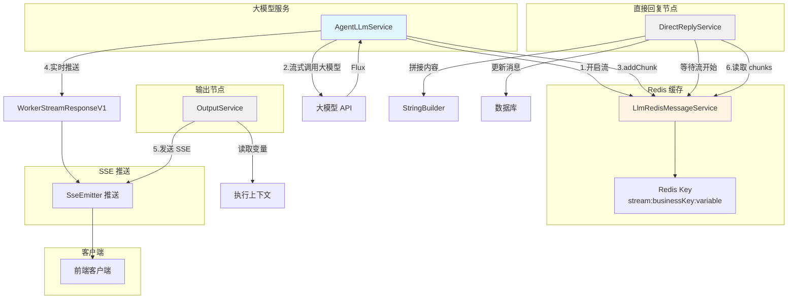

## 12、流式输出机制详解

## 一、核心架构图




## 二、核心数据表

### 1. agent_chat_message（对话消息表）

**作用**：存储对话历史消息（包括流式输出的最终结果）

| 字段名           | 类型        | 说明            | 示例                  |
| ---------------- | ----------- | --------------- | --------------------- |
| id               | VARCHAR(32) | 消息 ID（主键） | "msg_001"             |
| app_id           | VARCHAR(32) | 应用 ID         | "app_001"             |
| session_id       | VARCHAR(32) | 会话 ID         | "session_001"         |
| role             | VARCHAR(20) | 角色            | "user" / "assistant"  |
| content          | TEXT        | 消息内容        | "你好"                |
| thinking_content | TEXT        | 思考内容        | "让我想想..."         |
| status           | VARCHAR(20) | 状态            | "STOP" / "WAITING"    |
| total_tokens     | INT         | 总 Token 数     | 150                   |
| thinking_time    | DOUBLE      | 思考时间（秒）  | 2.5                   |
| parent_id        | VARCHAR(32) | 父消息 ID       | "msg_000"             |
| is_available     | VARCHAR(2)  | 是否可用        | "1"                   |
| delete_flag      | VARCHAR(2)  | 删除标记        | "0"                   |
| create_time      | DATETIME    | 创建时间        | "2024-01-01 10:00:00" |

**索引**：
- PRIMARY KEY (id)
- INDEX idx_app_session (app_id, session_id)
- INDEX idx_parent_id (parent_id)

---

### 2. bpm_proc_variable（流程变量表）

**作用**：记录流程执行过程中的变量值（包括流式输出的中间结果）

| 字段名         | 类型         | 说明        | 示例           |
| -------------- | ------------ | ----------- | -------------- |
| id             | VARCHAR(32)  | 主键        | "var_001"      |
| proc_def_id    | VARCHAR(32)  | 流程定义 ID | "proc_001"     |
| proc_inst_id   | VARCHAR(32)  | 流程实例 ID | "inst_001"     |
| node_id        | VARCHAR(32)  | 节点 ID     | "node_001"     |
| node_name      | VARCHAR(100) | 节点名称    | "大模型节点"   |
| var_name       | VARCHAR(100) | 变量名      | "llmText"      |
| var_value      | TEXT         | 变量值      | "回答内容"     |
| var_type       | VARCHAR(50)  | 变量类型    | "string"       |
| fill_type      | VARCHAR(20)  | 填充类型    | "NODE_END"     |
| node_type      | VARCHAR(50)  | 节点类型    | "ServiceTask"  |
| biz_id         | VARCHAR(32)  | 业务 ID     | "business_001" |
| execution_id   | VARCHAR(32)  | 执行 ID     | "exec_001"     |
| create_user_id | VARCHAR(32)  | 创建人 ID   | "user_001"     |

**索引**：
- PRIMARY KEY (id)
- INDEX idx_proc_inst (proc_inst_id)
- INDEX idx_biz_id (biz_id)

---

## 三、核心代码流程

### 关键方法 1：chatOneApiStream() - 流式调用大模型

**位置**：`AgentLLmService.java` 第 394-613 行

**作用**：调用大模型 API 并处理流式响应

```java
public void chatOneApiStream(DelegateExecution execution, LogicNodeState nodeState) {
    // 1. 获取配置参数
    String type = execution.getVariable("sys_type"); // "chatflow" 或 "workflow"
    String modelConfig = extProperties.get("llmConfig").toString();
    LlmDto llmDto = generateLlmConfig(modelConfig);
    
    // 2. 构建消息列表
    List<AgentMessage> agentMessageList = generateAgentMessageList(
        appId, sessionId, history, userPrompt, sysPrompt, isThinking);
    
    ModelParamDto modelParamDto = ModelParamDto.builder()
        .llm(llmDto)
        .agentMessages(agentMessageList)
        .build();
    
    // 3. 判断流式配置
    LlmDto.CompletionParams completionParams = modelParamDto.getLlm().getCompletionParams();
    
    if ("chatflow".equals(type)) {
        // 对话流：检查下一个节点是否为输出节点
        Boolean nextNodeIsStream = checkNextNodeStreamConfig(execution);
        
        if (nextNodeIsStream != null && !nextNodeIsStream) {
            // 非流式模式
            completionParams.setStream(false);
            String response = chatStrategySelector.chat(modelParamDto);
            // 处理非流式结果...
        } else {
            // 流式模式（默认）
            completionParams.setStream(true);
            Flux<String> flux = chatStrategySelector.chatWithStream(modelParamDto);
            asyncCacheStreamContent(flux, execution, nodeState, context, type);
        }
    } else {
        // 工作流：非流式模式
        completionParams.setStream(false);
        String response = chatStrategySelector.chat(modelParamDto);
        // 处理工作流结果...
    }
}
```


**关键点**：
- 对话流默认使用流式输出
- 工作流默认使用非流式输出
- 支持通过 `isStream` 配置动态切换

---

### 关键方法 2：cacheStreamContent() - 缓存流式内容

**位置**：`AgentLLmService.java` 第 680-891 行

**作用**：实时缓存并推送流式数据到前端

```java
public void cacheStreamContent(Flux<String> flux, DelegateExecution execution, 
    LogicNodeState nodeState, String context, String type) {
    
    String businessKey = execution.getBusinessKey();
    
    // 1. 开始流式消息处理（Redis）
    streamMessageService.startStream(businessKey, getOutputContentKey(execution));
    
    StringBuilder contentBuilder = new StringBuilder();
    StringBuilder thinkBuilder = new StringBuilder();
    AtomicInteger lastPushedLength = new AtomicInteger(0);
    
    // 2. 订阅流式数据
    flux.subscribe(
        chunk -> {
            // 添加到 Redis 缓存
            streamMessageService.addChunk(businessKey, getOutputContentKey(execution), chunk);
            
            // 解析 chunk（思考过程/回答内容）
            if (!chunk.equals("[DONE]")) {
                handleMessage(chunk, new AtomicBoolean(false), contentBuilder, thinkBuilder, execution);
            }
            
            // 3. 实时推送流式数据到前端（按 10 字符分块）
            int chunkSize = 10;
            String currentContent = contentBuilder.toString();
            int currentLength = currentContent.length();
            int start = lastPushedLength.get();
            
            if (currentLength >= start + chunkSize) {
                String newContent = currentContent.substring(start);
                while (newContent.length() >= chunkSize) {
                    String subContent = newContent.substring(0, chunkSize);
                    
                    // 创建流式响应对象
                    WorkerStreamResponseV1 streamResponseV1 = new WorkerStreamResponseV1(
                        execution.getBusinessKey(),
                        workflowId,
                        sessionId,
                        "assistant",
                        "",           // think content
                        subContent,   // 10 字符分块
                        0, 0, 0, 0.0,
                        null,
                        getCurrentTimeStr());
                    
                    // 推送实时流式数据
                    push(null, streamResponseV1, execution);
                    
                    lastPushedLength.addAndGet(chunkSize);
                    newContent = newContent.substring(chunkSize);
                }
            }
        },
        throwable -> {
            // 异常处理
            streamMessageService.endStream(businessKey, getOutputContentKey(execution));
            // 推送错误信息...
        },
        () -> {
            // 流完成
            streamMessageService.endStream(businessKey, getOutputContentKey(execution));
            
            // 推送最终完整结果
            WorkerStreamResponseV1 finalResponse = new WorkerStreamResponseV1(
                execution.getBusinessKey(),
                workflowId,
                sessionId,
                "assistant",
                thinkBuilder.toString(),
                contentBuilder.toString(),
                promptTokens, totalTokens, completionTokens, times,
                null,
                getCurrentTimeStr());
            
            push(null, finalResponse, execution);
            
            // 推送节点结束状态
            nodeState.setState(LogicNodeTag.END);
            push(null, nodeState, execution);
            
            isStop.put(businessKey, true);
        }
    );
}
```


**关键点**：
- 使用 Redis 缓存流式数据块
- 按 10 字符分块实时推送到前端
- 流完成后推送完整结果和节点状态

---

### 关键方法 3：LlmRedisMessageService - Redis 流式缓存服务

**位置**：`LlmRedisMessageService.java`

**作用**：管理 Redis 中的流式数据缓存

```java
@Service
public class LlmRedisMessageService {
    
    @Autowired
    private RedisTemplate<String, String> redisTemplate;
    
    private static final Map<String, AtomicBoolean> isStreaming = new ConcurrentHashMap<>();
    
    // Redis Key 格式：stream:businessKey:variable
    private String getRedisKey(String businessKey, String variable) {
        return "stream:" + businessKey + ":" + variable;
    }
    
    // 开始流处理
    public void startStream(String businessKey, String variable) {
        String key = getRedisKey(businessKey, variable);
        isStreaming.put(key, new AtomicBoolean(true));
    }
    
    // 添加 chunk
    public void addChunk(String businessKey, String variable, String chunk) {
        redisTemplate.opsForList().rightPush(getRedisKey(businessKey, variable), chunk);
    }
    
    // 获取所有 chunks（从 startIndex 开始）
    public List<String> getAllChunks(String businessKey, String variable, Long startIndex) {
        String key = getRedisKey(businessKey, variable);
        return redisTemplate.opsForList().range(key, startIndex, -1);
    }
    
    // 结束流处理
    public void endStream(String businessKey, String variable) {
        String key = getRedisKey(businessKey, variable);
        isStreaming.getOrDefault(key, new AtomicBoolean(false)).set(false);
    }
    
    // 判断是否正在流式处理
    public boolean isStreaming(String businessKey, String variable) {
        String key = getRedisKey(businessKey, variable);
        return isStreaming.getOrDefault(key, new AtomicBoolean(false)).get();
    }
    
    // 清理 Redis 缓存
    public void cleanup(String businessKey, String variable) {
        String key = getRedisKey(businessKey, variable);
        redisTemplate.delete(key);
        isStreaming.remove(businessKey);
    }
}
```


**关键点**：
- Redis List 结构存储 chunks
- `isStreaming` 标记流状态
- 支持轮询读取增量数据

---

### 关键方法 4：OutputService.doExecute() - 输出节点处理

**位置**：`OutputService.java` 第 20-40 行

**作用**：处理输出节点的变量替换和 SSE 推送

```java
@Override
protected void doExecute(DelegateExecution delegateExecution) throws Exception {
    Map<String, Object> inputParams = getInputParams(delegateExecution);
    
    // 1. 获取输出内容并替换变量
    String output = String.valueOf(inputParams.get("output"));
    String realOutput = replaceAllVariable2NewContentSupportLLM(delegateExecution, output);
    
    // 2. 读取 isStream 配置
    String isStreamStr = (String) delegateExecution.getVariable("isStream");
    boolean isStream = Boolean.parseBoolean(isStreamStr);
    
    String type = delegateExecution.getVariable("sys_type");
    
    // 3. 对话流特殊处理：不发送带 isOutput 标记的完整结果
    if (!"chatflow".equals(type)) {
        // 工作流：发送完整结果
        List<String> outputList = WorkflowUtil.transformStr2List(isStream, realOutput);
        WorkflowUtil.sendSseMessage(delegateExecution, outputList, true, 
            delegateExecution.getCurrentActivityId(), false);
    }
    
    // 4. 保存变量到执行上下文
    WorkflowUtil.setDefaultAndNodeVariables(delegateExecution, OUTPUT_PARAM, realOutput);
}
```


**关键点**：
- 对话流不调用 `sendSseMessage`，避免重复推送
- 工作流正常推送完整结果
- 支持 `isStream` 配置决定是否分块推送

---

### 关键方法 5：DirectReplyService.handleLlmMessage() - 等待大模型流

**位置**：`DirectReplyService.java` 第 180-234 行

**作用**：等待大模型流式输出完成并读取 Redis 缓存

```java
private void handleLlmMessage(String businessKey, String sessionId, 
    StringBuilder contentBuilder, StringBuilder thinkBuilder,
    AgentChatMessageEntity agentChatMessageEntity, 
    DelegateExecution delegateExecution, String varname, String workflowId) {
    
    // 1. 等待流开始（最多等 5 秒）
    long startTime = System.currentTimeMillis();
    long timeoutMillis = 50000;
    
    while (!streamMessageService.isStreaming(businessKey, varname)) {
        if (System.currentTimeMillis() - startTime > timeoutMillis) {
            log.warn("等待流开始超时");
            break;
        }
        Thread.sleep(50);
    }
    
    // 2. 循环读取 Redis chunks 直到流结束
    long count = 0L;
    long thinkStartTime = System.currentTimeMillis();
    long thinkEndTime = System.currentTimeMillis();
    Boolean run = true;
    
    while (streamMessageService.isStreaming(businessKey, varname)) {
        try {
            // 获取增量 chunks
            List<String> chunks = streamMessageService.getAllChunks(businessKey, varname, count);
            count = count + chunks.size();
            
            for (String chunk : chunks) {
                WorkerStreamResponseV1 streamResponseV1 = handleMessage(
                    chunk, businessKey, new AtomicBoolean(false), 
                    contentBuilder, thinkBuilder, sessionId, 
                    agentChatMessageEntity.getId(), delegateExecution, workflowId);
                
                if (streamResponseV1 != null) {
                    if (StringUtils.isNotBlank(streamResponseV1.getThink())) {
                        thinkEndTime = System.currentTimeMillis();
                    }
                    streamResponseV1.setTimes(
                        Math.round((((double) thinkEndTime - thinkStartTime) / 1000) * 100.0) / 100.0);
                    
                    // 注意：不在此处推送，因为 AgentLLmService 已经推送了流式数据
                    // this.push(null, streamResponseV1, delegateExecution);
                }
            }
            
            Thread.sleep(10); // 控制轮询频率
        } catch (InterruptedException e) {
            run = false;
            Thread.currentThread().interrupt();
            break;
        }
    }
    
    // 3. 保存最终结果到执行上下文
    delegateExecution.setVariable(AgentLLmService.OUTPUT_PARAM, contentBuilder.toString());
    
    // 4. 统计 Token 和思考时间
    Integer tokens = WorkflowServiceImpl.tokenMap.get(businessKey);
    if (run && (tokens == null || tokens == 0)) {
        WorkflowServiceImpl.setToken(businessKey, contentBuilder.toString().length());
    }
    WorkflowServiceImpl.setThinkTime(businessKey, (double) (thinkEndTime - thinkStartTime));
}
```


**关键点**：
- 轮询 Redis 等待流式数据
- 只拼装内容，不重复推送（AgentLLmService 已推送）
- 记录思考时间和 Token 消耗

---

## 四、WorkerStreamResponseV1 数据结构

**作用**：封装流式响应数据

```java
@Data
public class WorkerStreamResponseV1 {
    public String messageId;        // 消息 ID
    public String parentId;         // 父消息 ID
    public String sessionId;        // 会话 ID
    public String role;             // 角色："assistant"
    public String think;            // 思考内容
    public String context;          // 回答内容（流式分块/完整结果）
    public Integer promptTokens;    // 提示词 Token
    public Integer totalTokens;     // 总 Token
    public Integer completionTokens; // 回答 Token
    public Double times;            // 思考时间（秒）
    public List<Source> configReferences; // 引用来源
    public String timesStr;         // 回答时间字符串
}
```


**流式推送时的字段变化**：

| 推送阶段     | context 字段 | think 字段   | totalTokens   |
| ------------ | ------------ | ------------ | ------------- |
| 流式分块     | 10 字符分块  | ""           | 0             |
| 最终完整结果 | 完整回答内容 | 完整思考内容 | 实际 Token 数 |

---

## 五、流式输出配置

### 1. BPMN 配置方式

在输出节点的输入参数中配置 `isStream`：

```xml
<serviceTask id="outputNode" name="输出节点">
  <extensionElements>
    <camunda:inputOutput>
      <camunda:inputParameter name="output">${llmText}</camunda:inputParameter>
      <camunda:inputParameter name="isStream">${enableStream}</camunda:inputParameter>
    </camunda:inputOutput>
  </extensionElements>
</serviceTask>
```


### 2. 代码配置方式

```java
// 在 AgentLLmService 中动态设置
completionParams.setStream(true);  // 开启流式
completionParams.setStream(false); // 关闭流式
```


---

## 六、完整数据流转路径

```
用户提问
  ↓
[前端 SSE 连接]
  ↓
[Controller 层] AgentChatController.chat()
  ↓
[Service 层] AgentChatServiceImpl.chat()
  ↓
[流程引擎] Camunda 执行 BPMN
  ↓
[大模型节点] AgentLLmService.doExecute()
  ↓
[流式调用] chatOneApiStream()
  ↓
[Redis 缓存] LlmRedisMessageService.startStream()
  ↓
[大模型 API] Flux<String> 流式响应
  ↓
[订阅处理] cacheStreamContent()
  ├─ 实时：每 10 字符推送 WorkerStreamResponseV1
  ├─ 完成：推送完整结果 + 节点状态
  └─ 保存到 Redis：addChunk()
  ↓
[SSE 推送] SseEmitter.send()
  ↓
[前端接收] 实时显示回答内容
  ↓
[输出节点] OutputService.doExecute()
  ├─ 对话流：不推送（避免重复）
  └─ 工作流：推送完整结果
  ↓
[直接回复节点] DirectReplyService.handleVariables()
  ├─ 等待流开始
  ├─ 轮询 Redis 读取 chunks
  ├─ 拼装完整内容
  └─ 更新数据库消息
  ↓
[数据库保存] agent_chat_message 表
  ↓
[流程结束]
```


---

## 七、关键机制

### 1. Redis 缓存机制

**Redis 结构**：
```
Key: stream:businessKey:variable
Type: List
Value: ["chunk1", "chunk2", "chunk3", ...]
```


**缓存流程**：
1. `startStream()` - 标记流开始
2. `addChunk()` - 追加数据块
3. `getAllChunks()` - 轮询读取增量
4. `endStream()` - 标记流结束
5. `cleanup()` - 删除 Redis Key

**优势**：
- 支持多个节点并发读取
- 增量读取避免重复
- 内存隔离（按 businessKey 区分）

---

### 2. 流式分块推送

**分块大小**：10 字符

**推送逻辑**：
```java
int chunkSize = 10;
int lastPushedLength = 0;

while (currentLength >= lastPushedLength + chunkSize) {
    String subContent = currentContent.substring(lastPushedLength, lastPushedLength + chunkSize);
    push(new WorkerStreamResponseV1(context = subContent));
    lastPushedLength += chunkSize;
}
```


**优势**：
- 真正的实时输出体验
- 避免单条消息过大
- 前端打字机效果流畅

---

### 3. 思考过程处理

**思考标记**：
- 开始：`深度思考
````
- 结束：`
````

**处理逻辑**：
```java
if (chunk.contains("<think>")) {
    think.set(true);
} else if (chunk.contains("</think>")) {
    think.set(false);
} else {
    if (think.get()) {
        thinkBuilder.append(reasoning_content);
    } else {
        contentBuilder.append(content);
    }
}
```


**前端展示**：
- 思考过程：折叠框显示
- 回答内容：直接显示

---

### 4. 对话流 vs 工作流

| 特性         | 对话流 (chatflow)      | 工作流 (workflow) |
| ------------ | ---------------------- | ----------------- |
| 流式模式     | 默认开启               | 默认关闭          |
| 输出节点推送 | ❌ 不推送               | ✅ 推送完整结果    |
| SSE 消息类型 | WorkerStreamResponseV1 | LogicSseEnum.NODE |
| 前端体验     | 打字机效果             | 一次性显示        |
| 适用场景     | 多轮对话               | 复杂任务编排      |

---

### 5. 超时机制

**等待流开始超时**：5 秒
```java
long timeoutMillis = 50000;
while (!streamMessageService.isStreaming(businessKey, varname)) {
    if (System.currentTimeMillis() - startTime > timeoutMillis) {
        log.warn("等待流开始超时");
        break;
    }
    Thread.sleep(50);
}
```


**等待流结束超时**：18 秒
```java
long timeoutMillis = 18000;
while (!checkWorkflowStop(businessKey)) {
    if (System.currentTimeMillis() - startTime > timeoutMillis) {
        log.warn("等待流结束超时");
        break;
    }
    Thread.sleep(50);
}
```


---

## 八、常见问题与解决方案

### Q1: 前端显示重复内容

**问题原因**：
- AgentLLmService 已推送流式数据
- DirectReplyService 又推送了一次完整结果

**解决方案**：
```java
// DirectReplyService.handleMessage() 中注释掉推送
// this.push(null, streamResponseV1, delegateExecution); // 注释掉
```


**最佳实践**：
- 流式输出由 AgentLLmService 统一负责推送
- DirectReplyService 只拼装文本，不推送

---

### Q2: 流式输出卡住不动

**问题原因**：
- Redis 缓存未正确标记结束
- 前端未收到 `[DONE]` 信号

**排查步骤**：
1. 检查 `streamMessageService.endStream()` 是否调用
2. 查看 Redis Key 是否清理
3. 确认 `isStop.put(businessKey, true)` 是否执行

**解决方案**：
```java
// 在 flux.subscribe() 的 onComplete 回调中确保调用
streamMessageService.endStream(businessKey, getOutputContentKey(execution));
isStop.put(businessKey, true);
```


---

### Q3: 思考内容为空

**问题原因**：
- 大模型未返回 `深度思考

- `reasoning_content` 字段为空

**排查步骤**：
1. 检查大模型配置是否启用 thinking
2. 查看原始 chunk 数据是否包含 `<think>`
3. 确认 `HandleChatResult.getChatThinkContent()` 解析逻辑

**解决方案**：
```java
// 兼容多种思考标签
if (chunk.contains("<think>") || chunk.contains("<thinking>")) {
    think.set(true);
}
```

---

### Q4: Token 统计不准确

**问题原因**：
- 流式分块推送时 Token 数为 0
- 最终结果未统计 Usage

**解决方案**：
```java
// 在 handleMessage() 中提取 Usage
Usage usage = streamResponse.getUsage();
if (usage != null && usage.getTotalTokens() != 0) {
    WorkflowServiceImpl.setToken(businessKey, usage.getTotalTokens());
}
```

**注意**：
- 流式分块不统计 Token
- 只在最终结果推送时统计一次

---

### Q5: Redis 缓存泄漏

**问题原因**：
- 流结束后未清理 Redis Key
- 异常情况下未执行 cleanup

**解决方案**：
```java
// 在 DirectReplyService.doBusiness() 最后清理
streamMessageService.cleanup(businessKey, AgentLLmService.getOutputContentKey(delegateExecution));
```

**最佳实践**：
- 在 `finally` 块中执行 cleanup
- 设置 Redis Key 过期时间（如 1 小时）

---

## 九、关键要点总结

### ✅ 核心流程
1. **开启流式**：`startStream()` 标记 Redis Key
2. **流式调用**：`chatWithStream()` 获取 Flux
3. **实时推送**：每 10 字符推送 WorkerStreamResponseV1
4. **缓存 chunks**：`addChunk()` 保存到 Redis
5. **完成推送**：发送完整结果 + 节点状态
6. **等待读取**：DirectReply 轮询 Redis 拼装内容
7. **清理缓存**：`cleanup()` 删除 Redis Key

### ✅ 数据表结构
- **agent_chat_message**：对话消息表
- **bpm_proc_variable**：流程变量表

### ✅ 关键机制
- **Redis 缓存**：List 结构存储 chunks
- **分块推送**：10 字符实时推送
- **思考处理**：<think>标签识别
- **对话流特殊处理**：OutputService 不推送
- **超时机制**：5 秒等开始，18 秒等结束

### ✅ WorkerStreamResponseV1 结构
- **context**：流式分块 / 完整结果
- **think**：思考过程内容
- **totalTokens**：Token 消耗统计
- **times**：思考时间（秒）

### ✅ 常见问题
- 内容重复推送
- 流式卡住
- 思考内容为空
- Token 统计不准
- Redis 缓存泄漏

### ✅ 最佳实践
1. 流式输出由 AgentLLmService 统一推送
2. DirectReplyService 只拼装不推送
3. 在 finally 块中清理 Redis 缓存
4. 兼容多种思考标签格式
5. 对话流和工作流区别处理

