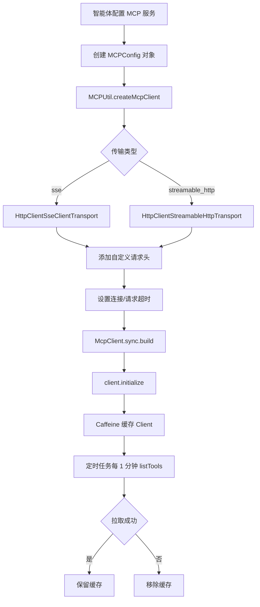

## 13、MCP 工具调用机制

## 一、核心流程图




## 二、核心数据表

### 1. agent_mcp_service（MCP 服务配置表）

**作用**：存储 MCP 服务的基础配置信息

| 字段名          | 类型         | 说明           | 示例                          |
| --------------- | ------------ | -------------- | ----------------------------- |
| id              | VARCHAR(32)  | 主键 ID        | "mcp_001"                     |
| workspace_id    | VARCHAR(32)  | 工作空间 ID    | "ws_001"                      |
| name            | VARCHAR(100) | MCP 服务名称   | "天气查询服务"                |
| icon            | VARCHAR(500) | 图标 URL       | "http://example.com/icon.png" |
| description     | TEXT         | 服务描述       | "提供全国天气查询"            |
| url             | VARCHAR(500) | MCP 服务地址   | "http://api.weather.com/mcp"  |
| transport_type  | VARCHAR(20)  | 传输类型       | "sse" / "streamable_http"     |
| status          | VARCHAR(2)   | 状态           | "1-启用" / "0-禁用"           |
| connect_timeout | INT          | 连接超时（秒） | 10                            |
| request_timeout | INT          | 请求超时（秒） | 30                            |
| delete_flag     | TINYINT      | 删除标志       | 0-正常 / 1-删除               |

**索引**：
- PRIMARY KEY (id)
- INDEX idx_workspace_id (workspace_id)
- INDEX idx_status (status)

---

### 2. agent_mcp_header（MCP 服务请求头表）

**作用**：存储 MCP 服务的自定义请求头配置

| 字段名         | 类型         | 说明                | 示例              |
| -------------- | ------------ | ------------------- | ----------------- |
| id             | VARCHAR(32)  | 主键 ID             | "header_001"      |
| mcp_service_id | VARCHAR(32)  | MCP 服务 ID（外键） | "mcp_001"         |
| header_name    | VARCHAR(100) | 请求头名称          | "Authorization"   |
| header_value   | VARCHAR(500) | 请求头值            | "Bearer token123" |
| delete_flag    | TINYINT      | 删除标志            | 0-正常 / 1-删除   |

**索引**：
- PRIMARY KEY (id)
- INDEX idx_mcp_service_id (mcp_service_id)

---

### 3. agent_mcp_tool（MCP 服务工具表）

**作用**：存储 MCP 服务提供的工具定义

| 字段名         | 类型         | 说明                | 示例                                                      |
| -------------- | ------------ | ------------------- | --------------------------------------------------------- |
| id             | VARCHAR(32)  | 主键 ID             | "tool_001"                                                |
| mcp_service_id | VARCHAR(32)  | MCP 服务 ID（外键） | "mcp_001"                                                 |
| name           | VARCHAR(100) | 工具唯一标识        | "get_weather"                                             |
| title          | VARCHAR(200) | 工具标题            | "天气查询"                                                |
| description    | TEXT         | 工具描述            | "查询指定城市的当前天气"                                  |
| input_schema   | JSON         | 输入参数 Schema     | {"type":"object","properties":{"city":{"type":"string"}}} |
| output_schema  | JSON         | 输出 Schema（可选） | {"type":"object","properties":{"temp":{"type":"number"}}} |
| tool_enabled   | VARCHAR(2)   | 是否启用            | "1-启用" / "2-禁用"                                       |

**索引**：
- PRIMARY KEY (id)
- INDEX idx_mcp_service_id (mcp_service_id)

---

## 三、核心代码流程

### 关键方法 1：add() - 新增 MCP 服务

**位置**：`McpServiceImpl.java` 第 60-80 行

**作用**：保存 MCP 服务及其关联的请求头和工具配置

```java
@Override
@Transactional
public String add(McpServiceFO mcpServiceFO) {
    // 1. 保存 MCP 服务主表
    McpServiceEntity entity = JsonUtil.getJsonToBean(mcpServiceFO, McpServiceEntity.class);
    if (entity.getStatus() == null) {
        entity.setStatus(McpStatusEnum.ENABLE.getStatus()); // 默认启用
    }
    save(entity);

    // 2. 保存请求头配置
    saveHeaders(entity.getId(), mcpServiceFO.getHeaders());

    // 3. 保存工具配置
    saveTools(entity.getId(), mcpServiceFO.getTools());

    // 4. 添加到工具分组
    agentToolGroupRelationService.addToolToGroup(
        entity.getId(), 
        MCP_TOOL.name(), 
        mcpServiceFO.getGroupId(),
        entity.getWorkspaceId()
    );

    return entity.getId();
}
```


**关键点**：
- `@Transactional` 保证原子性
- 默认启用状态
- 同时保存主表 + 请求头 + 工具
- 自动关联到工具分组

---

### 关键方法 2：createMcpClient() - 创建 MCP 客户端

**位置**：`MCPUtil.java` 第 76-123 行

**作用**：根据配置创建并初始化 MCP 同步客户端

```java
@NotNull
private static McpSyncClient createMcpClient(MCPConfig config) {
    // 1. 创建自定义请求头处理器
    McpAsyncHttpClientRequestCustomizer customizer = (requestBuilder, method, uri, body, context) -> {
        Map<String, String> mcpHeaders = config.getMcp_headers();
        if (mcpHeaders != null && !mcpHeaders.isEmpty()) {
            for (Map.Entry<String, String> entry : mcpHeaders.entrySet()) {
                requestBuilder.header(entry.getKey(), entry.getValue());
            }
        }

        // 根据传输类型设置 Accept 头
        if (TYPE_SSE.equalsIgnoreCase(config.getTransportType())) {
            requestBuilder.header("Accept", "text/event-stream");
        } else if (TYPE_STREAMABLE_HTTP.equalsIgnoreCase(config.getTransportType())) {
            requestBuilder.header("Accept", "application/json, text/event-stream");
        }
        return Mono.just(requestBuilder);
    };

    // 2. 创建传输层
    McpClientTransport transport;
    if (TYPE_SSE.equalsIgnoreCase(config.getTransportType())) {
        transport = HttpClientSseClientTransport.builder(config.getUrl())
                .sseEndpoint(config.getUrl())
                .connectTimeout(Duration.ofSeconds(
                    config.getConnectTimeout() == null ? 10 : config.getConnectTimeout()))
                .asyncHttpRequestCustomizer(customizer)
                .build();
    } else {
        transport = HttpClientStreamableHttpTransport.builder(config.getUrl())
                .endpoint(config.getUrl())
                .connectTimeout(Duration.ofSeconds(
                    config.getConnectTimeout() == null ? 10 : config.getConnectTimeout()))
                .asyncHttpRequestCustomizer(customizer)
                .build();
    }

    // 3. 创建 MCP 同步客户端
    McpSyncClient client = McpClient.sync(transport)
            .requestTimeout(Duration.ofSeconds(
                config.getRequestTimeout() == null ? 30 : config.getRequestTimeout()))
            .build();

    // 4. 初始化客户端
    try {
        client.initialize();
    } catch (Exception e) {
        try {
            client.closeGracefully();
        } catch (Exception ignored) {
        }
        throw new BusinessException(
            AgentExceptionEnum.MCP_CANNOT_ACCESS, 
            config.getName(), 
            e.getMessage()
        );
    }
    return client;
}
```


**关键点**：
- 支持两种传输类型：SSE / Streamable HTTP
- 自定义请求头注入
- 超时时间配置
- 初始化失败自动关闭连接

---

### 关键方法 3：getMCPClient() - 获取缓存的客户端

**位置**：`MCPUtil.java` 第 71-73 行

**作用**：使用 Caffeine 缓存 MCP 客户端，避免重复创建

```java
public static McpSyncClient getMCPClient(MCPConfig config) {
    return clientCache.get(config, MCPUtil::createMcpClient);
}
```


**缓存配置**：
```java
private static final Cache<MCPConfig, McpSyncClient> clientCache = Caffeine.newBuilder()
        .maximumSize(64)           // 最多缓存 64 个客户端
        .expireAfterAccess(1, TimeUnit.HOURS)  // 1 小时未访问则失效
        .removalListener((config, client, cause) -> {
            if (client != null) {
                try {
                    client.closeGracefully();  // 关闭连接
                } catch (Exception e) {
                    log.error("关闭 MCP Client 失败：{}", e.getMessage());
                }
            }
        })
        .build();
```


**关键点**：
- 基于 MCPConfig 的 equals/hashCode 缓存
- 自动关闭失效的客户端连接
- 最大缓存 64 个，避免内存溢出

---

### 关键方法 4：getMcpTools() - 获取工具列表

**位置**：`MCPUtil.java` 第 125-135 行

**作用**：从 MCP 服务拉取可用工具列表

```java
public static List<McpSchema.Tool> getMcpTools(MCPConfig config) {
    McpSyncClient mcpClient = getMCPClient(config);
    try {
        McpSchema.ListToolsResult listToolsResult = mcpClient.listTools();
        return listToolsResult.tools();
    } catch (Exception e) {
        log.error("获取 MCP 工具列表失败", e);
        throw new BusinessException(
            AgentExceptionEnum.MCP_CANNOT_ACCESS, 
            config.getName(), 
            e.getMessage()
        );
    }
}
```


**关键点**：
- 使用缓存的客户端
- 调用 `listTools()` 获取工具列表
- 异常处理并抛出业务异常

---

### 关键方法 5：定时保活任务

**位置**：`MCPUtil.java` 第 54-69 行

**作用**：每分钟拉取一次工具列表，保持客户端活跃

```java
static {
    keepAliveExecutor.scheduleAtFixedRate(() -> {
        try {
            for (Map.Entry<MCPConfig, McpSyncClient> entry : clientCache.asMap().entrySet()) {
                try {
                    entry.getValue().listTools();  // 拉取工具列表保活
                } catch (Exception e) {
                    log.warn("MCP Client 保活拉取 toolList 失败，移除缓存：{}", e.getMessage());
                    clientCache.invalidate(entry.getKey());  // 移除失效客户端
                }
            }
        } catch (Exception e) {
            log.error("MCP Client 保活任务异常", e);
        }
    }, 1, 1, TimeUnit.MINUTES);  // 每 1 分钟执行一次
}
```


**关键点**：
- 后台守护线程执行
- 每 1 分钟执行一次
- 失败自动移除缓存
- 防止长连接超时断开

---

### 关键方法 6：getConfigBatchById() - 批量获取 MCP 配置

**位置**：`McpServiceImpl.java` 第 187-229 行

**作用**：批量查询 MCP 服务配置并转换为 MCPConfig 对象

```java
@Override
public List<MCPConfig> getConfigBatchById(List<String> ids, boolean includeDeleted) {
    if (CollUtil.isEmpty(ids)) {
        return List.of();
    }
    
    // 1. 批量查询 MCP 服务
    List<McpServiceEntity> mcpServiceEntityList = this.baseMapper.getByIds(ids, includeDeleted);
    if (CollUtil.isEmpty(mcpServiceEntityList)) {
        return List.of();
    }

    Map<String, McpServiceEntity> entityMap = mcpServiceEntityList.stream()
            .collect(Collectors.toMap(
                McpServiceEntity::getId, 
                entity -> entity, 
                (left, right) -> left,
                LinkedHashMap::new
            ));
    
    // 2. 批量查询请求头
    List<McpServiceHeaderEntity> headerEntityList = mcpServiceHeaderService
            .getByMcpServiceIds(new ArrayList<>(entityMap.keySet()));
    Map<String, List<McpServiceHeaderEntity>> collect = headerEntityList.stream()
            .collect(Collectors.groupingBy(McpServiceHeaderEntity::getMcpServiceId));

    List<MCPConfig> list = new ArrayList<>();
    for (String id : ids) {
        McpServiceEntity entity = entityMap.get(id);
        if (entity == null) {
            continue;
        }

        MCPConfig mcpConfig = new MCPConfig();
        mcpConfig.setName(entity.getName());
        mcpConfig.setDescription(entity.getDescription());
        mcpConfig.setUrl(entity.getUrl());
        mcpConfig.setWorkspaceId(entity.getWorkspaceId());
        mcpConfig.setTransportType(entity.getTransportType());
        mcpConfig.setConnectTimeout(entity.getConnectTimeout());
        mcpConfig.setRequestTimeout(entity.getRequestTimeout());

        // 3. 设置请求头
        List<McpServiceHeaderEntity> headerList = collect.get(entity.getId());
        if (headerList != null) {
            Map<String, String> headerMap = headerList.stream()
                    .collect(Collectors.toMap(
                        McpServiceHeaderEntity::getHeaderName, 
                        McpServiceHeaderEntity::getHeaderValue
                    ));
            mcpConfig.setMcp_headers(headerMap);
        }
        list.add(mcpConfig);
    }
    return list;
}
```


**关键点**：
- 批量查询避免 N+1 问题
- 使用 LinkedHashMap 保持顺序
- 请求头转为 Map 便于使用

---

## 四、MCPConfig 配置结构

```java
@Data
@EqualsAndHashCode
public class MCPConfig {
    private String name;              // MCP 服务名称
    private String description;        // 服务描述
    private String url;                // 服务地址
    private String workspaceId;        // 工作空间 ID
    
    /**
     * 传输类型：STREAMABLE_HTTP, SSE
     * 默认为 STREAMABLE_HTTP
     */
    private String transportType = "STREAMABLE_HTTP";
    
    private Integer connectTimeout;    // 连接超时时间（秒）
    private Integer requestTimeout;    // 请求超时时间（秒）
    
    private Map<String, String> mcp_headers;  // 自定义请求头
}
```


**配置说明**：
- **name**：服务的唯一标识
- **url**：MCP 服务的 HTTP 端点
- **transportType**：
  - `sse`：Server-Sent Events 传输
  - `streamable_http`：HTTP 流式传输
- **mcp_headers**：认证 Token 等自定义请求头

---

## 五、完整数据流转路径

```
用户配置 MCP 服务
  ↓
[前端表单] McpServiceFO
  ↓ HTTP POST
[Controller] McpServiceController.add()
  ↓
[Service] McpServiceImpl.add()
  ↓ @Transactional
[数据库保存]
  ├─ agent_mcp_service（主表）
  ├─ agent_mcp_header（请求头）
  └─ agent_mcp_tool（工具）
  ↓
[工具分组关联] agent_tool_group_relation
  ↓
[智能体配置引用] AgentAppConfig.llmConfig.mcps
  ↓
[LLM 调用时] SpringAiClient.buildMcpToolCallbacks()
  ↓
[MCPUtil.getMCPClient()]
  ├─ Caffeine 缓存检查
  ├─ 未命中 → createMcpClient()
  └─ 命中 → 直接返回
  ↓
[创建传输层]
  ├─ SSE → HttpClientSseClientTransport
  └─ HTTP → HttpClientStreamableHttpTransport
  ↓
[添加请求头] customizer.header()
  ↓
[初始化客户端] client.initialize()
  ↓
[SyncMcpToolCallbackProvider]
  ↓
[LLM 工具调用] mcpClient.callTool()
  ↓
[返回结果] ToolExecutionResult
  ↓
[LLM 处理结果] → 生成最终回复
  ↓
[定时保活] 每 1 分钟 listTools()
```


---

## 六、关键机制

### 1. Caffeine 缓存机制

**缓存策略**：
```java
Cache<MCPConfig, McpSyncClient> clientCache = Caffeine.newBuilder()
    .maximumSize(64)           // 最大缓存数
    .expireAfterAccess(1, TimeUnit.HOURS)  // 访问后 1 小时过期
    .removalListener(...)      // 删除时自动关闭连接
    .build();
```


**优势**：
- 避免重复创建客户端连接
- 自动管理连接生命周期
- 防止内存泄漏

---

### 2. 定时保活机制

**执行逻辑**：
```java
scheduleAtFixedRate(() -> {
    for (McpSyncClient client : clientCache.values()) {
        client.listTools();  // 保活调用
    }
}, 1, 1, TimeUnit.MINUTES);
```


**作用**：
- 保持长连接活跃
- 防止服务端超时断开
- 失败自动移除缓存

---

### 3. 传输类型适配

**SSE 模式**：
```java
HttpClientSseClientTransport.builder(url)
    .sseEndpoint(url)
    .header("Accept", "text/event-stream")
    .build();
```


**Streamable HTTP 模式**：
```java
HttpClientStreamableHttpTransport.builder(url)
    .endpoint(url)
    .header("Accept", "application/json, text/event-stream")
    .build();
```


**区别**：
- **SSE**：单向服务器推送
- **HTTP**：双向通信支持

---

### 4. 请求头注入

**实现方式**：
```java
McpAsyncHttpClientRequestCustomizer customizer = (requestBuilder, method, uri, body, context) -> {
    Map<String, String> mcpHeaders = config.getMcp_headers();
    if (mcpHeaders != null && !mcpHeaders.isEmpty()) {
        for (Map.Entry<String, String> entry : mcpHeaders.entrySet()) {
            requestBuilder.header(entry.getKey(), entry.getValue());
        }
    }
    return Mono.just(requestBuilder);
};
```


**应用场景**：
- API Key 认证
- Tenant ID 传递
- 自定义元数据

---

### 5. 超时控制

**连接超时**：
```java
.connectTimeout(Duration.ofSeconds(
    config.getConnectTimeout() == null ? 10 : config.getConnectTimeout()
))
```


**请求超时**：
```java
.requestTimeout(Duration.ofSeconds(
    config.getRequestTimeout() == null ? 30 : config.getRequestTimeout()
))
```


**默认值**：
- 连接超时：10 秒
- 请求超时：30 秒

---

## 七、常见问题与解决方案

### Q1: MCP 服务无法连接

**问题原因**：
- URL 配置错误
- 网络不通
- 认证失败（缺少 Token）

**排查步骤**：
1. 检查 `agent_mcp_service.url` 是否正确
2. 测试网络连通性：`curl http://api.weather.com/mcp`
3. 查看 `agent_mcp_header` 是否配置了认证信息

**解决方案**：
```java
// 添加 Authorization 请求头
McpServiceHeaderFO header = new McpServiceHeaderFO();
header.setHeaderName("Authorization");
header.setHeaderValue("Bearer YOUR_API_KEY");
mcpServiceFO.setHeaders(List.of(header));
```


---

### Q2: 工具列表获取失败

**问题原因**：
- MCP 服务未启动
- 传输类型不匹配
- 服务端异常

**排查步骤**：
1. 查看 `MCPUtil.getMcpTools()` 异常日志
2. 检查服务端日志
3. 确认传输类型（SSE vs HTTP）

**解决方案**：
```java
// 切换传输类型
if (transportType.equals("sse")) {
    config.setTransportType(MCPUtil.TYPE_SSE);
} else {
    config.setTransportType(MCPUtil.TYPE_STREAMABLE_HTTP);
}
```


---

### Q3: 缓存客户端失效

**问题原因**：
- 1 小时未访问自动过期
- 保活任务失败被移除

**排查步骤**：
1. 检查 Caffeine 缓存状态
2. 查看保活任务日志
3. 确认 MCP 服务是否正常

**解决方案**：
```java
// 手动清除缓存并重新创建
clientCache.invalidate(config);
McpSyncClient newClient = MCPUtil.getMCPClient(config);
```


---

### Q4: 自定义请求头未生效

**问题原因**：
- `mcp_headers` 未正确配置
- 请求头名称拼写错误

**排查步骤**：
1. 检查 `MCPConfig.mcp_headers` 是否为空
2. 查看实际发送的 HTTP 请求头
3. 确认请求头名称大小写

**解决方案**：
```java
Map<String, String> headers = new HashMap<>();
headers.put("Authorization", "Bearer token123");
headers.put("X-Tenant-ID", "tenant_001");
mcpConfig.setMcp_headers(headers);
```


---

### Q5: 工具调用超时

**问题原因**：
- 请求超时时间设置过短
- 工具执行时间过长

**排查步骤**：
1. 检查 `request_timeout` 配置
2. 查看工具执行日志
3. 确认服务端性能

**解决方案**：
```java
// 增加超时时间
mcpService.setRequestTimeout(60);  // 60 秒
mcpService.setConnectTimeout(30);  // 30 秒
```


---

## 八、关键要点总结

### ✅ 核心流程
1. **配置保存**：MCP 服务 + 请求头 + 工具
2. **客户端创建**：根据传输类型创建 Transport
3. **缓存管理**：Caffeine 缓存 Client
4. **定时保活**：每 1 分钟 listTools
5. **工具调用**：LLM → SyncMcpToolCallbackProvider → MCP Client

### ✅ 数据表结构
- **agent_mcp_service**：MCP 服务主表
- **agent_mcp_header**：请求头配置
- **agent_mcp_tool**：工具定义

### ✅ 关键机制
- **Caffeine 缓存**：避免重复创建连接
- **定时保活**：防止长连接超时
- **传输适配**：SSE / Streamable HTTP
- **请求头注入**：认证/元数据传递
- **超时控制**：连接超时 + 请求超时

### ✅ MCPConfig 配置
```java
{
    "name": "天气服务",
    "url": "http://api.weather.com/mcp",
    "transportType": "sse",
    "connectTimeout": 10,
    "requestTimeout": 30,
    "mcp_headers": {
        "Authorization": "Bearer token"
    }
}
```


### ✅ 常见问题
- 无法连接 → 检查 URL 和认证
- 工具列表失败 → 确认传输类型
- 缓存失效 → 等待保活或重建
- 请求头不生效 → 检查配置格式
- 调用超时 → 调整超时时间

### ✅ 最佳实践
1. 配置合理的超时时间（30-60 秒）
2. 启用定时保活任务
3. 使用 Caffeine 缓存管理连接
4. 区分 SSE 和 HTTP 传输场景
5. 请求头包含必要的认证信息

