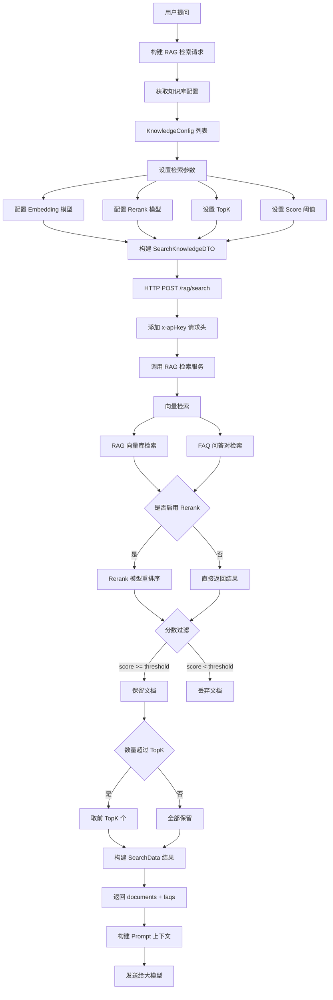

## 14、RAG 检索流程.md

## 一、核心流程图




## 二、核心数据表

### 1. SearchData（检索结果数据结构）

**作用**：封装 RAG 检索返回的完整结果

| 字段名     | 类型                | 说明           | 示例                   |
| ---------- | ------------------- | -------------- | ---------------------- |
| llm_result | Object              | 大模型回答结果 | {"content":"回答内容"} |
| documents  | List<RagSearchData> | 文档检索结果   | 向量检索返回的文档片段 |
| faqs       | List<FaqSearchData> | 问答对检索结果 | FAQ 问答对列表         |
| db_info    | Object              | 数据库信息     | {"db":"tenant"}        |
| extra      | Object              | 其他扩展信息   | {"custom":"data"}      |

---

### 2. RagSearchData（文档检索结果）

**作用**：存储单个文档分片的检索结果

| 字段名       | 类型     | 说明       | 示例                    |
| ------------ | -------- | ---------- | ----------------------- |
| page_content | String   | 分片内容   | "这是文档的具体内容..." |
| metadata     | Metadata | 元数据信息 | 包含文件 ID、路径等     |
| score        | Double   | 相似度分数 | 0.85                    |
| id           | String   | 分片 ID    | "chunk_001"             |

**Metadata 结构**：
| 字段名     | 类型         | 说明       | 示例               |
| ---------- | ------------ | ---------- | ------------------ |
| source     | String       | 来源文档   | "产品手册.pdf"     |
| file_id    | String       | 文件 ID    | "file_123"         |
| file_path  | String       | 文件路径   | "/docs/manual.pdf" |
| code       | String       | 分类编码   | "00010002"         |
| state      | String       | 状态       | "Open"             |
| type       | String       | 类型       | "rag"              |
| data_type  | String       | 数据类型   | "private"          |
| group_id   | String       | 分组 ID    | "group_001"        |
| chunk_size | Integer      | 分片大小   | 500                |
| key_words  | List<String> | 关键词列表 | ["AI", "智能体"]   |

---

### 3. FaqSearchData（FAQ 问答对检索结果）

**作用**：存储单个 FAQ 问答对的检索结果

| 字段名   | 类型   | 说明       | 示例                        |
| -------- | ------ | ---------- | --------------------------- |
| question | String | 问题       | "如何重置密码？"            |
| answer   | String | 答案       | "请访问个人中心点击重置..." |
| score    | Double | 相似度分数 | 0.92                        |
| id       | String | FAQ ID     | "faq_001"                   |
| group_id | String | 分组 ID    | "group_001"                 |

---

### 4. KnowledgeConfig（知识库配置）

**作用**：配置单个知识库的检索参数

| 字段名       | 类型        | 说明               | 示例       |
| ------------ | ----------- | ------------------ | ---------- |
| knowledge_id | String      | 知识库 ID          | "kb_001"   |
| top_k        | Integer     | 返回数量           | 10         |
| score        | Double      | 分数阈值           | 0.5        |
| embedding_fn | EmbeddingFn | Embedding 模型配置 | 向量化模型 |

---

### 5. SearchKnowledgeDTO（检索请求 DTO）

**作用**：封装完整的 RAG 检索请求

| 字段名           | 类型            | 说明         | 示例             |
| ---------------- | --------------- | ------------ | ---------------- |
| knowledge_config | KnowledgeConfig | 知识库配置   | 包含所有配置     |
| query            | String          | 检索查询文本 | "如何安装软件？" |
| incontext        | List<Object>    | 上下文信息   | 历史对话         |

**KnowledgeConfig 详细结构**：
| 字段名               | 类型       | 说明            | 示例                            |
| -------------------- | ---------- | --------------- | ------------------------------- |
| rerank_fn            | RerankFn   | Rerank 模型配置 | 重排序模型                      |
| rerank_model_enabled | Boolean    | 是否启用 Rerank | true                            |
| retrieval_type       | String     | 检索类型        | "vector" / "keyword" / "hybrid" |
| priority             | String     | 优先级          | "faq" / "rag"                   |
| top_k                | Integer    | 返回数量        | 10                              |
| score_threshold      | Double     | 分数阈值        | 0.5                             |
| incontext_window     | Integer    | 上下文窗口      | 0                               |
| repos                | List<Repo> | 知识库列表      | 多个知识库                      |

**Repo 结构**：
| 字段名          | 类型               | 说明           | 示例               |
| --------------- | ------------------ | -------------- | ------------------ |
| collection_name | String             | 集合名称       | "kb_001"           |
| db_name         | String             | 数据库名       | "tenant"           |
| scope           | List<Scope>        | 检索范围       | FAQ + RAG          |
| embedding_fn    | EmbeddingFn        | Embedding 配置 | 向量化模型         |
| filter          | String             | 过滤表达式     | "state == {state}" |
| filter_params   | Map<String,Object> | 过滤参数       | {"state":"Open"}   |

**Scope 结构**：
| 字段名          | 类型    | 说明     | 示例          |
| --------------- | ------- | -------- | ------------- |
| repo_type       | String  | 检索类型 | "faq" / "rag" |
| top_k           | Integer | 返回数量 | 10            |
| score_threshold | Double  | 分数阈值 | 0.5           |

---

## 三、核心代码流程

### 关键方法 1：ragSearch() - RAG 检索入口

**位置**：`RagSearchServiceImpl.java` 第 85-118 行

**作用**：执行 RAG 检索并返回结果

```java
@Override
public SearchData ragSearch(RagSearchBuildFO ragSearchBuildFo) {
    // 1. 构建检索请求
    SearchKnowledgeDTO ragSearchRequestV3 = fileInfoAPI.getRagSearchRequestV3(
        ragSearchBuildFo.getKnowledgeConfigs(), 
        ragSearchBuildFo.getExternalRetrievalModel(), 
        ragSearchBuildFo.getPrompt()
    );
    
    String requestBody = JSON.toJSONString(ragSearchRequestV3);
    log.info("知识检索请求体：" + requestBody);
    
    String url = ragUrl + "/rag/search";
    
    try {
        // 2. 设置请求头
        Map<String, String> header = new HashMap<>();
        header.put("x-api-key", ragKey);
        
        // 3. 发送 HTTP POST 请求
        HttpRequest httpRequest = HttpRequest.post(url);
        httpRequest.headerMap(header, true);
        httpRequest.body(requestBody);
        httpRequest.header("Content-Type", "application/json");
        
        // 4. 执行请求并获取响应
        String result;
        try (HttpResponse response = httpRequest.execute()) {
            result = response.body();
        }
        log.info("知识检索结果：" + result);
        
        // 5. 解析响应
        SearchResponse searchResponse = JSON.parseObject(result, SearchResponse.class);
        if (!searchResponse.isSuccess()) {
            log.error("知识检索失败，searchResponse:{}", searchResponse);
            throw new BusinessException(AgentExceptionEnum.RAG_ERROR);
        }
        return searchResponse.getData();
    } catch (Exception e) {
        log.error("知识检索失败", e);
        throw new BusinessException(AgentExceptionEnum.RAG_ERROR);
    }
}
```


**关键点**：
- 构建完整的检索请求 DTO
- 添加 API Key 认证
- 异常处理并抛出业务异常

---

### 关键方法 2：getKnowledgeConfigs() - 获取知识库配置

**位置**：`RagSearchServiceImpl.java` 第 60-82 行

**作用**：批量获取知识库配置并设置检索参数

```java
@Override
public List<KnowledgeConfig> getKnowledgeConfigs(
    List<SearchKnowledgeQO.KnowledgeConfigBase> knowledgeConfigBases, 
    AgentExternalRetrievalModel agentExternalRetrievalModel
) {
    List<KnowledgeConfig> knowledgeConfigs = new ArrayList<>();
    
    for (SearchKnowledgeQO.KnowledgeConfigBase base : knowledgeConfigBases) {
        KnowledgeConfig knowledgeConfig = new KnowledgeConfig();
        
        // 1. 设置 TopK 和分数阈值
        knowledgeConfig.setScore(Double.parseDouble(base.getScore()));
        knowledgeConfig.setTopK(Integer.parseInt(base.getTopK()));
        knowledgeConfig.setKnowledgeId(base.getKnowledgeId());
        
        // 2. 获取默认 Embedding 模型
        ModelInfo embeddingFn = languageModelMapper.getDefaultModelInfoByTypeByWorker("embedding");
        knowledgeConfig.setEmbedding_fn(embeddingFn);
        
        knowledgeConfigs.add(knowledgeConfig);
    }
    return knowledgeConfigs;
}
```


**关键点**：
- 支持批量配置多个知识库
- 自动获取默认 Embedding 模型
- 支持统一配置或独立配置

---

### 关键方法 3：getExternalRetrievalModel() - 获取外部检索模型

**位置**：`RagSearchServiceImpl.java` 第 41-58 行

**作用**：配置 Rerank 模型和检索参数

```java
@Override
public ExternalRetrievalModel getExternalRetrievalModel(
    AgentExternalRetrievalModel agentExternalRetrievalModel
) {
    ModelInfo rerankModelInfo;
    
    // 1. 获取 Rerank 模型
    if (StringUtils.isBlank(agentExternalRetrievalModel.getRerankModelId())) {
        rerankModelInfo = languageModelMapper.getDefaultModelInfoByTypeByWorker("rerank");
    } else {
        rerankModelInfo = languageModelMapper.getModelInfo(
            agentExternalRetrievalModel.getRerankModelId()
        );
    }
    
    // 2. 构建外部检索模型配置
    ExternalRetrievalModel externalRetrievalModel = new ExternalRetrievalModel();
    externalRetrievalModel.setRerank_fn(rerankModelInfo);
    externalRetrievalModel.setRerank_enabled(agentExternalRetrievalModel.getRerankModelEnabled());
    externalRetrievalModel.setRetrieval_type(agentExternalRetrievalModel.getRetrieval_type());
    externalRetrievalModel.setPriority(agentExternalRetrievalModel.getPriority());
    
    Boolean incontextWindow = agentExternalRetrievalModel.getIncontextWindow();
    externalRetrievalModel.setIncontextWindow(incontextWindow != null && incontextWindow);
    
    return externalRetrievalModel;
}
```


**关键点**：
- 支持指定 Rerank 模型或使用默认模型
- 配置检索类型（向量/关键词/混合）
- 支持上下文窗口功能

---

### 关键方法 4：ragSearch() - ChatRequestDTOV3 入口

**位置**：`RagSearchServiceImpl.java` 第 120-143 行

**作用**：从对话请求中提取检索配置并执行检索

```java
@Override
public SearchData ragSearch(ChatRequestDTOV3 dtov3) {
    // 1. 提取知识库配置
    ChatRequestDTOV3.KnowledgeConfig knowledgeConfig = dtov3.getDialogConfig().getKnowledgeConfig();
    AgentExternalRetrievalModel agentExternalRetrievalModel = JsonUtil.getJsonToBean(
        knowledgeConfig, 
        AgentExternalRetrievalModel.class
    );
    
    // 2. 获取外部检索模型
    ExternalRetrievalModel externalRetrievalModel = getExternalRetrievalModel(agentExternalRetrievalModel);
    
    // 3. 构建知识库配置列表
    List<SearchKnowledgeQO.KnowledgeConfigBase> knowledgeConfigBaseList = new ArrayList<>();
    for (ChatRequestDTOV3.Repo repo : knowledgeConfig.getRepos()) {
        SearchKnowledgeQO.KnowledgeConfigBase base = new SearchKnowledgeQO.KnowledgeConfigBase();
        base.setKnowledgeId(repo.getId());
        ChatRequestDTOV3.Scope first = repo.getScope().getFirst();
        base.setTopK(String.valueOf(first.getTopK()));
        base.setScore(String.valueOf(first.getScoreThreshold()));
        knowledgeConfigBaseList.add(base);
    }
    
    // 4. 获取完整的知识库配置
    List<KnowledgeConfig> knowledgeConfigs = getKnowledgeConfigs(
        knowledgeConfigBaseList, 
        agentExternalRetrievalModel
    );
    
    // 5. 构建检索请求并执行
    RagSearchBuildFO fo = new RagSearchBuildFO();
    Map<String, String> last = dtov3.getMessages().getLast();
    fo.setPrompt(last.get("content"));
    fo.setKnowledgeConfigs(knowledgeConfigs);
    fo.setExternalRetrievalModel(externalRetrievalModel);
    
    return ragSearch(fo);
}
```


**关键点**：
- 从对话配置中提取知识库信息
- 支持多个知识库同时检索
- 每个知识库独立配置 TopK 和分数

---

## 四、RAG 检索配置参数

### 1. Embedding 模型配置

```java
@Data
public class EmbeddingFn {
    private String api_base;      // API 地址
    private String model;         // 模型名称
    private String provider;      // 提供商
    private String api_key;       // API Key
}
```


**示例配置**：
```json
{
    "api_base": "http://localhost:11434/v1",
    "model": "bge-large-zh-v1.5",
    "provider": "ollama",
    "api_key": "sk-xxx"
}
```


---

### 2. Rerank 模型配置

```java
@Data
public class RerankFn {
    private String base_url;      // API 地址
    private String model;         // 模型名称
    private String provider;      // 提供商
    private String api_key;       // API Key
}
```


**示例配置**：
```json
{
    "base_url": "http://localhost:11434/v1",
    "model": "bge-reranker-v2-m3",
    "provider": "ollama",
    "api_key": "sk-xxx"
}
```


---

### 3. 检索类型配置

| 类型    | 说明       | 适用场景         |
| ------- | ---------- | ---------------- |
| vector  | 向量检索   | 语义相似度检索   |
| keyword | 关键词检索 | 精确匹配         |
| hybrid  | 混合检索   | 综合语义和关键词 |

---

### 4. 优先级配置

| 优先级 | 说明     | 返回顺序                   |
| ------ | -------- | -------------------------- |
| faq    | FAQ 优先 | FAQ 结果在前，RAG 结果在后 |
| rag    | RAG 优先 | RAG 结果在前，FAQ 结果在后 |

---

### 5. TopK 配置

**作用**：控制返回的文档数量

**推荐值**：
- FAQ：5-10 个
- RAG：10-20 个

**配置示例**：
```java
knowledgeConfig.setTopK(10);  // 返回最多 10 个文档
```


---

### 6. 分数阈值配置

**作用**：过滤低相似度文档

**推荐值**：0.5-0.8

**配置示例**：
```java
knowledgeConfig.setScore(0.5);  // 只返回分数 >= 0.5 的文档
```


---

## 五、完整数据流转路径

```
用户提问
  ↓
[对话请求] ChatRequestDTOV3
  ↓
[提取配置] RagSearchServiceImpl.ragSearch()
  ↓
[构建知识库配置] getKnowledgeConfigs()
  ├─ 遍历 Repo 列表
  ├─ 提取 TopK 和 Score
  └─ 获取 Embedding 模型
  ↓
[构建外部检索模型] getExternalRetrievalModel()
  ├─ 获取 Rerank 模型
  ├─ 设置检索类型
  └─ 设置优先级
  ↓
[构建检索请求] SearchKnowledgeDTO
  ├─ knowledge_config
  ├─ query
  └─ repos[]
  ↓
[HTTP POST] /rag/search
  ├─ Header: x-api-key
  └─ Body: SearchKnowledgeDTO
  ↓
[RAG 检索服务]
  ├─ Embedding 向量化
  ├─ 向量检索（RAG）
  ├─ 问答检索（FAQ）
  ├─ Rerank 重排序
  └─ 分数过滤
  ↓
[返回结果] SearchData
  ├─ documents[] (RagSearchData)
  ├─ faqs[] (FaqSearchData)
  └─ metadata
  ↓
[构建 Prompt 上下文]
  ├─ 提取文档内容
  ├─ 添加引用角标
  └─ 格式化上下文
  ↓
[发送给 LLM] 流式调用
  ↓
[返回最终回答]
```


---

## 六、关键机制

### 1. 混合检索机制

**检索流程**：
```
1. 向量检索（Vector Search）
   └─ 使用 Embedding 模型向量化
   └─ 计算余弦相似度

2. 关键词检索（Keyword Search）
   └─ BM25 算法
   └─ 精确匹配关键词

3. 混合排序（Hybrid Ranking）
   └─ 加权融合两种结果
   └─ 归一化分数
```


**优势**：
- 兼顾语义理解和精确匹配
- 提高检索准确率

---

### 2. Rerank 重排序机制

**重排序流程**：
```
1. 初检（Embedding 检索）
   └─ 返回 Top 50 个候选文档

2. Rerank 精排
   └─ 使用 Cross-Encoder 模型
   └─ 计算 query-document 相关性

3. 分数归一化
   └─ Softmax 归一化
   └─ 映射到 0-1 区间

4. 最终排序
   └─ 按 Rerank 分数降序
   └─ 取 TopK 返回
```


**优势**：
- Cross-Encoder 比 Bi-Encoder 更准确
- 提升高相关文档排名

---

### 3. 分数过滤机制

**过滤逻辑**：
```java
if (doc.getScore() >= scoreThreshold) {
    keepDocument(doc);  // 保留文档
} else {
    discardDocument(doc);  // 丢弃文档
}
```


**作用**：
- 过滤低质量文档
- 避免噪声干扰 LLM 判断

**推荐阈值**：
- FAQ：0.7-0.9
- RAG：0.5-0.7

---

### 4. 上下文窗口机制

**实现方式**：
```java
if (incontextWindow) {
    knowledgeConfig.setIncontextWindow(1);
    // 添加历史对话到检索上下文
    searchKnowledgeDTO.setIncontext(historyMessages);
}
```


**作用**：
- 利用历史对话提升检索准确性
- 支持多轮对话场景

---

### 5. 元数据过滤机制

**过滤表达式**：
```java
repo.setFilter("state == {state}");
repo.setFilterParams(Collections.singletonMap("state", "Open"));
```


**支持的操作符**：
- `==` 等于
- `!=` 不等于
- `in` 包含
- `>` `>=` 大于
- `<` `<=` 小于

**应用场景**：
- 只检索公开文档
- 按时间范围过滤
- 按文档类型过滤

---

## 七、常见问题与解决方案

### Q1: 检索结果为空

**问题原因**：
- 分数阈值设置过高
- TopK 设置过小
- Embedding 模型不匹配

**排查步骤**：
1. 降低 `score_threshold` 到 0.3
2. 增加 `top_k` 到 20
3. 检查 Embedding 模型配置

**解决方案**：
```java
// 临时降低阈值测试
knowledgeConfig.setScore(0.3);
knowledgeConfig.setTopK(20);
```


---

### Q2: 检索结果不准确

**问题原因**：
- 未启用 Rerank 重排序
- Embedding 模型效果差
- 文档分片质量低

**解决方案**：
```java
// 启用 Rerank
externalRetrievalModel.setRerank_enabled(true);
externalRetrievalModel.setRerank_fn(rerankModelInfo);
```


**优化建议**：
1. 使用更好的 Embedding 模型（如 bge-large-zh）
2. 优化文档分片策略
3. 添加关键词提取

---

### Q3: RAG 检索超时

**问题原因**：
- 检索文档数量过多
- Rerank 模型响应慢
- 网络问题

**排查步骤**：
1. 检查 RAG 服务日志
2. 减少 TopK 数量
3. 检查网络连接

**解决方案**：
```java
// 减少检索数量
knowledgeConfig.setTopK(5);

// 关闭 Rerank（如果不需要）
externalRetrievalModel.setRerank_enabled(false);
```


---

### Q4: FAQ 和 RAG 结果重复

**问题原因**：
- FAQ 和 RAG 使用了相同的文档
- 优先级配置不当

**解决方案**：
```java
// 设置 FAQ 优先
knowledgeConfig.setPriority("faq");

// 或者只使用一种检索类型
repo.getScope().removeIf(s -> "faq".equals(s.getRepoType()));
```


---

### Q5: 引用角标错误

**问题原因**：
- 文档片段顺序混乱
- 角标计算逻辑错误

**解决方案**：
```java
// 按分数降序排列
documents.sort(Comparator.comparingDouble(RagSearchData::getScore).reversed());

// 重新计算角标
for (int i = 0; i < documents.size(); i++) {
    documents.get(i).setIndex(i + 1);
}
```


---

## 八、关键要点总结

### ✅ 核心流程
1. **构建请求**：提取知识库配置 + 检索参数
2. **向量化**：使用 Embedding 模型将 query 转为向量
3. **检索**：向量检索 + FAQ 检索
4. **重排序**：Rerank 模型精排
5. **过滤**：分数阈值 + TopK 限制
6. **构建上下文**：格式化文档 + 引用角标
7. **发送给 LLM**：流式调用生成回答

### ✅ 数据表结构
- **SearchData**：检索结果封装
- **RagSearchData**：文档检索结果
- **FaqSearchData**：FAQ 问答结果
- **KnowledgeConfig**：知识库配置
- **SearchKnowledgeDTO**：检索请求 DTO

### ✅ 关键机制
- **混合检索**：向量 + 关键词
- **Rerank 重排序**：Cross-Encoder 精排
- **分数过滤**：阈值控制质量
- **上下文窗口**：利用历史对话
- **元数据过滤**：灵活筛选文档

### ✅ 配置参数
- **TopK**：返回数量（5-20）
- **Score Threshold**：分数阈值（0.5-0.8）
- **Retrieval Type**：检索类型（vector/keyword/hybrid）
- **Priority**：优先级（faq/rag）
- **Rerank Enabled**：是否启用重排序

### ✅ 常见问题
- 检索结果为空 → 降低阈值
- 结果不准确 → 启用 Rerank
- 检索超时 → 减少 TopK
- 结果重复 → 调整优先级
- 引用角标错误 → 重新排序计算

### ✅ 最佳实践
1. 启用 Rerank 提升准确率
2. 合理设置 TopK 和分数阈值
3. 使用混合检索模式
4. 优化文档分片质量
5. 定期更新 Embedding 模型
