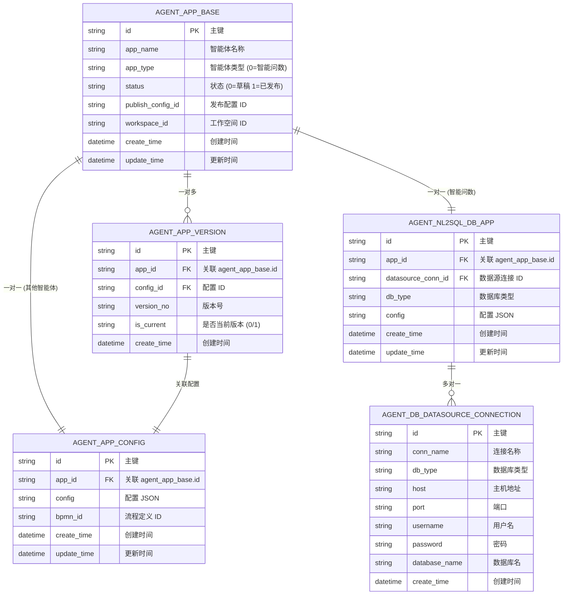
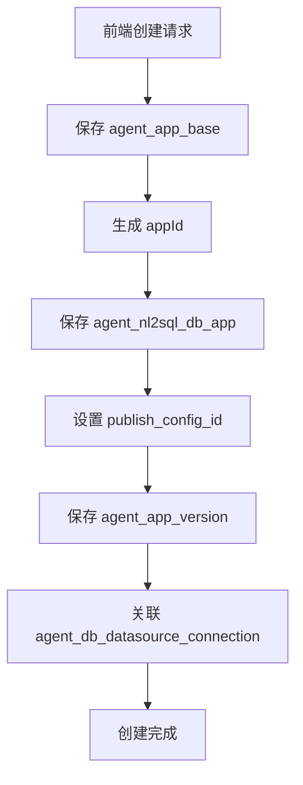
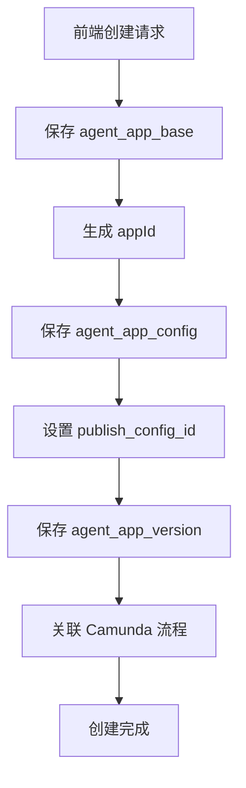
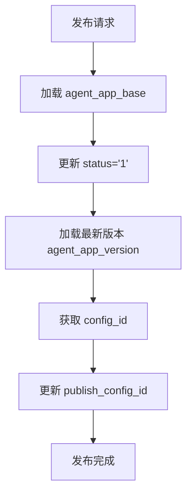
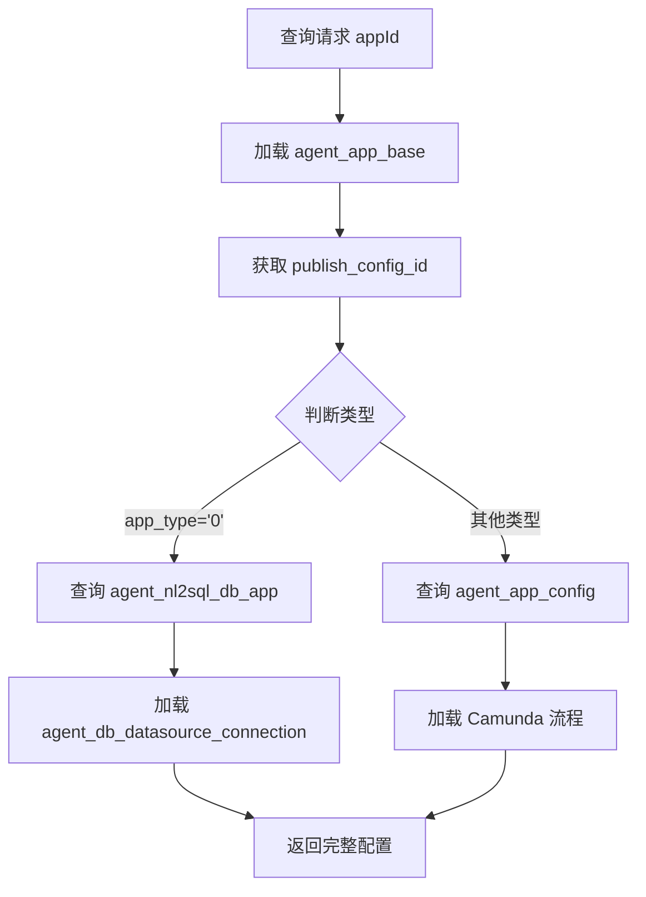

## 15、 核心数据表关系图

## 一、核心数据表关系图（ERD）




---

## 二、数据表详细说明

### 1. agent_app_base（智能体基本信息表）⭐

**作用**：存储智能体的基本信息，是所有智能体的主表

| 字段名            | 类型     | 说明        | 示例                   | 备注                           |
| ----------------- | -------- | ----------- | ---------------------- | ------------------------------ |
| id                | VARCHAR  | 主键 ID     | "773229010887905285"   | 雪花算法生成                   |
| app_name          | VARCHAR  | 智能体名称  | "测试智能问数 031601"  | 前端展示名称                   |
| app_type          | VARCHAR  | 智能体类型  | "0"                    | **0=智能问数**，其他类型待补充 |
| status            | VARCHAR  | 状态        | "1"                    | **0=草稿**，**1=已发布**       |
| publish_config_id | VARCHAR  | 发布配置 ID | "8010150388576901"     | 关联配置表主键                 |
| workspace_id      | VARCHAR  | 工作空间 ID | "workspace_001"        | 多租户隔离                     |
| description       | TEXT     | 描述信息    | "这是一个测试智能体"   | 可选                           |
| icon              | VARCHAR  | 图标 URL    | "/icons/agent_001.png" | 可选                           |
| create_time       | DATETIME | 创建时间    | "2025-03-16 10:00:00"  | 自动填充                       |
| update_time       | DATETIME | 更新时间    | "2025-03-16 12:00:00"  | 自动更新                       |

**关键点**：
- **前端传的 appId 是这个表的主键 ID**
- **publish_config_id 字段关联配置表的主键 ID**
- app_type='0' 表示智能问数类型
- status='1' 表示已发布状态

**查询示例**：
```sql
-- 查询所有智能体
SELECT * FROM agent_app_base ORDER BY create_time DESC;

-- 查询智能问数类型的智能体
SELECT * FROM agent_app_base WHERE app_type = '0';

-- 查询特定名称且已发布的智能体
SELECT * FROM agent_app_base 
WHERE app_name = '测试智能问数 031601' 
  AND status = '1' 
  AND publish_config_id = '801015039388576901';

-- 根据 ID 查询
SELECT * FROM agent_app_base WHERE id = '773229010887905285';
```


---

### 2.1. agent_nl2sql_db_app（智能体配置信息 - 智能问数）⭐

**作用**：专门存储**智能问数**类型智能体的配置信息

| 字段名             | 类型     | 说明          | 示例                   | 备注                   |
| ------------------ | -------- | ------------- | ---------------------- | ---------------------- |
| id                 | VARCHAR  | 主键 ID       | "781203549169135365"   | 雪花算法生成           |
| app_id             | VARCHAR  | 外键          | "773229010887905285"   | 关联 agent_app_base.id |
| datasource_conn_id | VARCHAR  | 数据源连接 ID | "203083868775967539"   | 关联数据源表           |
| db_type            | VARCHAR  | 数据库类型    | "MySQL" / "PostgreSQL" | 支持的数据库类型       |
| config             | JSON     | 配置信息      | {"tables":[...]}       | NL2SQL 相关配置        |
| create_time        | DATETIME | 创建时间      | "2025-03-16 10:00:00"  | 自动填充               |
| update_time        | DATETIME | 更新时间      | "2025-03-16 12:00:00"  | 自动更新               |

**关键点**：
- **仅用于智能问数类型（app_type='0'）**
- **发布后通过 publish_config_id 查询此表**
- datasource_conn_id 外键到数据源连接表

**查询示例**：
```sql
-- 查询所有智能问数配置
SELECT * FROM agent_nl2sql_db_app ORDER BY create_time DESC;

-- 根据 ID 查询
SELECT * FROM agent_nl2sql_db_app WHERE id = '781203549169135365';
```


---

### 2.2. agent_app_config（智能体基本配置表 - 其他类型）⭐

**作用**：存储**除智能问数外**其他类型智能体的配置信息

| 字段名      | 类型     | 说明        | 示例                         | 备注                   |
| ----------- | -------- | ----------- | ---------------------------- | ---------------------- |
| id          | VARCHAR  | 主键 ID     | "803265398194606213"         | 雪花算法生成           |
| app_id      | VARCHAR  | 外键        | "773229010887905285"         | 关联 agent_app_base.id |
| config      | JSON     | 配置信息    | {"prompt":"...", "tools":[]} | 智能体完整配置         |
| bpmn_id     | VARCHAR  | 流程定义 ID | "bpmn_001"                   | Camunda 流程 ID        |
| create_time | DATETIME | 创建时间    | "2025-03-16 10:00:00"        | 自动填充               |
| update_time | DATETIME | 更新时间    | "2025-03-16 12:00:00"        | 自动更新               |

**关键点**：
- **用于除智能问数外的其他智能体类型**
- 存储完整的智能体配置（Prompt、工具、流程等）
- bpmn_id 关联 Camunda 流程定义

**查询示例**：
```sql
-- 查询所有配置
SELECT * FROM agent_app_config ORDER BY create_time DESC;

-- 根据 ID 查询
SELECT * FROM agent_app_config WHERE id = '803265398194606213';
```


---

### 3. agent_app_version（版本信息表）⭐

**作用**：存储智能体的历史版本，支持版本回滚和版本管理

| 字段名      | 类型     | 说明         | 示例                  | 备注                           |
| ----------- | -------- | ------------ | --------------------- | ------------------------------ |
| id          | VARCHAR  | 主键 ID      | "version_001"         | 雪花算法生成                   |
| app_id      | VARCHAR  | 外键         | "773229010887905285"  | 关联 agent_app_base.id         |
| config_id   | VARCHAR  | 配置 ID      | "803265398194606213"  | 关联配置表主键                 |
| version_no  | VARCHAR  | 版本号       | "v1.0.0" / "1"        | 版本标识                       |
| is_current  | VARCHAR  | 是否当前版本 | "1"                   | **0=历史版本**，**1=当前版本** |
| description | TEXT     | 版本描述     | "修复了 XX 问题"      | 可选                           |
| create_time | DATETIME | 创建时间     | "2025-03-16 10:00:00" | 自动填充                       |

**关键点**：
- **每次保存都会生成一个版本记录**
- **最新版本的 config_id 关联配置表主键**
- is_current='1' 标识当前正在使用的版本
- 支持版本回滚和历史查询

**查询示例**：
```sql
-- 查询某个配置的所有版本
SELECT * FROM agent_app_version 
WHERE config_id = '803265398194606213' 
ORDER BY create_time;

-- 查询某个应用的当前版本
SELECT * FROM agent_app_version 
WHERE app_id = '774194770171687045' 
  AND is_current = '1' 
ORDER BY create_time;
```


---

### 4. agent_db_datasource_connection（数据源连接信息表）⭐

**作用**：存储数据库连接配置，支持多种数据库类型

| 字段名        | 类型     | 说明       | 示例                       | 备注         |
| ------------- | -------- | ---------- | -------------------------- | ------------ |
| id            | VARCHAR  | 主键 ID    | "203083868775967539"       | 雪花算法生成 |
| conn_name     | VARCHAR  | 连接名称   | "生产数据库"               | 自定义名称   |
| db_type       | VARCHAR  | 数据库类型 | "MySQL" / "PostgreSQL"     | 支持的类型   |
| host          | VARCHAR  | 主机地址   | "192.168.1.100"            | IP 或域名    |
| port          | VARCHAR  | 端口       | "3306" / "5432"            | 数据库端口   |
| username      | VARCHAR  | 用户名     | "root"                     | 数据库用户   |
| password      | VARCHAR  | 密码       | "encrypted_password"       | 加密存储     |
| database_name | VARCHAR  | 数据库名   | "agent_db"                 | 目标数据库   |
| config        | JSON     | 扩展配置   | {"ssl":true, "timeout":30} | 可选配置     |
| create_time   | DATETIME | 创建时间   | "2025-03-16 10:00:00"      | 自动填充     |

**关键点**：
- **主键外键到 agent_nl2sql_db_app 表的 datasource_conn_id**
- 密码需要加密存储
- 支持多种数据库类型（MySQL、PostgreSQL 等）

**查询示例**：
```sql
-- 查询所有数据源连接
SELECT * FROM agent_db_datasource_connection ORDER BY create_time DESC;

-- 根据 ID 查询
SELECT * FROM agent_db_datasource_connection 
WHERE id = '203083868775967539';
```


---

## 三、数据流转关系图

### 场景 1：创建智能问数智能体




**步骤说明**：
1. 前端传入智能体基本信息
2. 保存到 `agent_app_base`，生成 `appId`
3. 保存到 `agent_nl2sql_db_app`，生成 `id` 作为配置 ID
4. 更新 `agent_app_base.publish_config_id` 指向配置 ID
5. 保存版本记录到 `agent_app_version`
6. 关联数据源连接

---

### 场景 2：创建其他类型智能体




**步骤说明**：
1. 前端传入智能体基本信息
2. 保存到 `agent_app_base`，生成 `appId`
3. 保存到 `agent_app_config`，生成 `id` 作为配置 ID
4. 更新 `agent_app_base.publish_config_id` 指向配置 ID
5. 保存版本记录到 `agent_app_version`
6. 关联 Camunda 流程定义

---

### 场景 3：发布智能体




**步骤说明**：
1. 加载智能体基本信息
2. 更新状态为已发布（status='1'）
3. 加载当前最新版本
4. 获取版本的配置 ID
5. 更新 publish_config_id 指向该配置

---

### 场景 4：查询智能体配置




**步骤说明**：
1. 根据 appId 查询基本信息
2. 获取 publish_config_id
3. 根据 app_type 判断查询哪个配置表
4. 智能问数：查询 `agent_nl2sql_db_app` + 数据源连接
5. 其他类型：查询 `agent_app_config` + BPMN 流程

---

## 四、表关系总结

### 核心关系

| 关系        | 说明                                                  | 关联字段                           |
| ----------- | ----------------------------------------------------- | ---------------------------------- |
| **1 对 1**  | agent_app_base → agent_nl2sql_db_app                  | base.id = nl2sql.app_id            |
| **1 对 1**  | agent_app_base → agent_app_config                     | base.id = config.app_id            |
| **1 对 多** | agent_app_base → agent_app_version                    | base.id = version.app_id           |
| **1 对 1**  | agent_nl2sql_db_app → agent_db_datasource_connection  | nl2sql.datasource_conn_id = ds.id  |
| **1 对 1**  | agent_app_base → agent_nl2sql_db_app/agent_app_config | base.publish_config_id = config.id |

---

### 类型映射关系

| app_type | 配置表              | 说明           |
| -------- | ------------------- | -------------- |
| '0'      | agent_nl2sql_db_app | 智能问数类型   |
| 其他     | agent_app_config    | 其他智能体类型 |

---

### 状态流转

| status | 说明   | publish_config_id      |
| ------ | ------ | ---------------------- |
| '0'    | 草稿   | 可能为空或指向草稿配置 |
| '1'    | 已发布 | 必须指向已发布的配置   |

---

## 五、常用查询 SQL

### 1. 查询智能体完整信息（智能问数）

```sql
SELECT 
    base.id AS app_id,
    base.app_name,
    base.app_type,
    base.status,
    base.publish_config_id,
    nl2sql.id AS config_id,
    nl2sql.datasource_conn_id,
    nl2sql.db_type,
    nl2sql.config,
    ds.conn_name,
    ds.host,
    ds.port,
    ds.database_name,
    version.version_no,
    version.is_current
FROM agent_app_base base
LEFT JOIN agent_nl2sql_db_app nl2sql ON base.publish_config_id = nl2sql.id
LEFT JOIN agent_db_datasource_connection ds ON nl2sql.datasource_conn_id = ds.id
LEFT JOIN agent_app_version version ON base.id = version.app_id AND version.is_current = '1'
WHERE base.id = '773229010887905285';
```


---

### 2. 查询智能体完整信息（其他类型）

```sql
SELECT 
    base.id AS app_id,
    base.app_name,
    base.app_type,
    base.status,
    base.publish_config_id,
    config.id AS config_id,
    config.bpmn_id,
    config.config,
    version.version_no,
    version.is_current
FROM agent_app_base base
LEFT JOIN agent_app_config config ON base.publish_config_id = config.id
LEFT JOIN agent_app_version version ON base.id = version.app_id AND version.is_current = '1'
WHERE base.id = '773229010887905285';
```


---

### 3. 查询智能体所有历史版本

```sql
SELECT 
    version.id,
    version.version_no,
    version.config_id,
    version.is_current,
    version.create_time,
    base.app_name
FROM agent_app_version version
JOIN agent_app_base base ON version.app_id = base.id
WHERE version.app_id = '774194770171687045'
ORDER BY version.create_time DESC;
```


---

### 4. 查询已发布的智能问数智能体

```sql
SELECT 
    base.*,
    nl2sql.datasource_conn_id,
    nl2sql.db_type,
    ds.conn_name,
    ds.database_name
FROM agent_app_base base
JOIN agent_nl2sql_db_app nl2sql ON base.publish_config_id = nl2sql.id
JOIN agent_db_datasource_connection ds ON nl2sql.datasource_conn_id = ds.id
WHERE base.app_type = '0' 
  AND base.status = '1'
ORDER BY base.create_time DESC;
```


---

### 5. 查询当前版本配置

```sql
SELECT 
    base.id AS app_id,
    base.app_name,
    CASE 
        WHEN base.app_type = '0' THEN nl2sql.config
        ELSE config.config
    END AS config_json,
    version.version_no
FROM agent_app_base base
LEFT JOIN agent_nl2sql_db_app nl2sql ON base.publish_config_id = nl2sql.id
LEFT JOIN agent_app_config config ON base.publish_config_id = config.id
LEFT JOIN agent_app_version version ON base.id = version.app_id AND version.is_current = '1'
WHERE base.status = '1';
```


---

## 六、关键要点总结

### ✅ 核心表结构
- **agent_app_base**：智能体基本信息（主表）
- **agent_nl2sql_db_app**：智能问数配置表（专用）
- **agent_app_config**：其他智能体配置表（通用）
- **agent_app_version**：版本管理表
- **agent_db_datasource_connection**：数据源连接表

### ✅ 关键字段
- **agent_app_base.id**：前端传入的 appId
- **agent_app_base.publish_config_id**：关联配置表主键
- **agent_nl2sql_db_app.id**：智能问数配置 ID
- **agent_app_config.id**：其他配置 ID
- **agent_app_version.is_current**：标识当前版本

### ✅ 类型区分
- **app_type='0'** → 使用 `agent_nl2sql_db_app`
- **其他类型** → 使用 `agent_app_config`

### ✅ 状态管理
- **status='0'**：草稿状态
- **status='1'**：已发布状态
- **发布后**：publish_config_id 必须指向有效配置

### ✅ 版本管理
- **每次保存**：生成新版本记录
- **最新版本**：is_current='1'
- **config_id**：关联对应配置表主键

### ✅ 数据源关联
- **智能问数**：通过 datasource_conn_id 关联
- **其他类型**：不需要数据源连接
