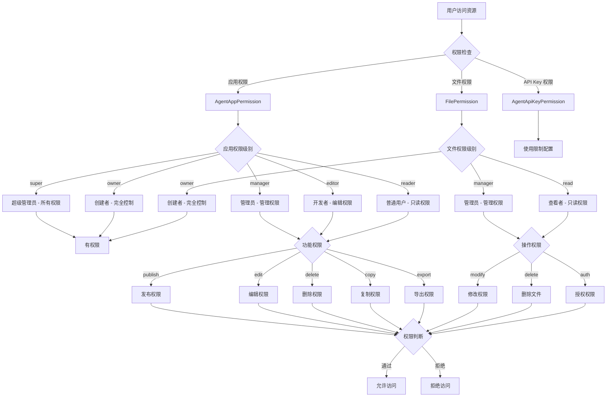

# 16、权限与授权机制

## 一、核心权限模型




## 二、核心数据表

### 1. agent_app_permission（应用权限表）

**作用**：存储应用/文件夹的权限配置

| 字段名          | 类型        | 说明           | 示例                                      |
| --------------- | ----------- | -------------- | ----------------------------------------- |
| id              | varchar(32) | 主键 ID        | "1234567890"                              |
| app_id          | varchar(32) | 应用/文件夹 ID | "app_001"                                 |
| target_id       | varchar(32) | 授权目标 ID    | "user_001" / "org_001" / "all"            |
| target_type     | varchar(32) | 目标类型       | "user" / "org"                            |
| app_permission  | varchar(10) | 权限级别       | "owner" / "manager" / "editor" / "reader" |
| permission_type | varchar(1)  | 权限类型       | "1"=自定义 / "2"=继承上级                 |

**权限级别说明**：
- **super**：超级管理员（系统级，拥有所有权限）
- **owner**：创建者/所有者（完全控制）
- **manager**：管理员（管理权限，可编辑、删除、授权）
- **editor**：开发者（编辑权限，可配置和调试）
- **reader**：普通用户（只读权限，仅可查看和使用）

---

### 2. file_permission（文件/知识库权限表）

**作用**：存储文件/知识库的权限配置

| 字段名       | 类型        | 说明                   | 示例                         |
| ------------ | ----------- | ---------------------- | ---------------------------- |
| id           | varchar(32) | 主键 ID                | "1234567890"                 |
| resource_id  | varchar(32) | 资源 ID（文件/知识库） | "file_001"                   |
| target_id    | varchar(32) | 授权目标 ID            | "user_001" / "org_001"       |
| permission   | varchar(10) | 权限级别               | "owner" / "manager" / "read" |
| type         | varchar(32) | 目标类型               | "user" / "org"               |
| is_recursion | int2        | 是否递归下级           | 0=否 / 1=是                  |
| is_extend    | int2        | 是否继承上级           | 0=自定义 / 1=继承            |
| changed      | int2        | 是否变更               | 0=否 / 1=是                  |

**权限级别说明**：
- **owner**：创建者（完全控制，自动包含 manager 和 read）
- **manager**：管理员（管理权限，可修改、删除、授权）
- **read**：查看者（只读权限，仅可查看和下载）

---

### 3. agent_api_key_permission（API Key 权限表）

**作用**：存储 API Key 的资源访问权限

| 字段名         | 类型        | 说明         | 示例                |
| -------------- | ----------- | ------------ | ------------------- |
| id             | varchar(32) | 主键 ID      | "1234567890"        |
| api_key_id     | varchar(32) | API Key ID   | "apikey_001"        |
| resource_type  | varchar(32) | 资源类型     | "app" / "knowledge" |
| resource_id    | varchar(32) | 资源 ID      | "app_001"           |
| usage_limit    | text        | 使用限制配置 | JSON 配置           |
| create_user_id | varchar(32) | 创建人 ID    | "user_001"          |
| create_time    | timestamp   | 创建时间     | 2024-01-01 10:00:00 |

---

### 4. sys_org_permissions（组织权限表）

**作用**：存储组织管理员的权限配置

| 字段名       | 类型        | 说明             | 示例         |
| ------------ | ----------- | ---------------- | ------------ |
| id           | varchar(32) | 主键 ID          | "1234567890" |
| org_id       | varchar(32) | 组织 ID          | "org_001"    |
| user_id      | varchar(32) | 被授权人 ID      | "user_001"   |
| cur_add      | int2        | 当前组织新增权限 | 0/1          |
| cur_delete   | int2        | 当前组织删除权限 | 0/1          |
| cur_edit     | int2        | 当前组织编辑权限 | 0/1          |
| under_add    | int2        | 下级组织新增权限 | 0/1          |
| under_delete | int2        | 下级组织删除权限 | 0/1          |
| under_edit   | int2        | 下级组织编辑权限 | 0/1          |

---

## 三、核心代码流程

### 关键方法 1：应用创建时自动授权

**位置**：`AgentAppBaseServiceImpl.add()` 第 194-288 行

**作用**：创建应用时，自动为创建者添加 owner 权限

```java
@Override
@Transactional(rollbackFor = Exception.class)
public AgentAppBaseVO add(AgentAppBaseFO agentAppBaseFO) {
    // 1. 保存应用基础数据
    AgentAppBaseEntity agentAppBaseEntity = JsonUtil.getJsonToBean(agentAppBaseFO, AgentAppBaseEntity.class);
    save(agentAppBaseEntity);
    String appId = agentAppBaseEntity.getId();
    
    // 2. 构建权限列表
    List<AgentAppPermissionEntity> agentAppPermissionEntityList = new ArrayList<>();
    
    // 3. 处理前端传入的权限（组织/用户）
    if (!ObjectUtils.isEmpty(agentAppBaseFO.getAppPermissionList())) {
        // 组织权限
        List<AgentAppPermissionFO> orgPermissionList = agentAppBaseFO.getAppPermissionList().stream()
                .filter(item -> ORG.equals(item.getType())).collect(Collectors.toList());
        List<AgentAppPermissionEntity> agentAppPermissionEntityOrgList = orgPermissionList.stream().map(item -> {
            return new AgentAppPermissionEntity()
                    .setAppId(appId)
                    .setTargetId(item.getTargetId())
                    .setTargetType(item.getType())
                    .setAppPermission(AppBasePermissionEnum.READER.getCode())  // 组织默认为 reader
                    .setPermissionType(item.getPermissionType());
        }).collect(Collectors.toList());
        agentAppPermissionEntityList.addAll(agentAppPermissionEntityOrgList);
        
        // 用户权限
        List<String> userIdList = agentAppBaseFO.getAppPermissionList().stream()
                .filter(item -> USER.equals(item.getType()))
                .map(AgentAppPermissionFO::getTargetId)
                .collect(Collectors.toList());
        userIdList.remove(userUtil.getUser().getUserId());  // 移除当前用户
        
        List<AgentAppPermissionEntity> agentAppPermissionEntityUserList = userIdList.stream().map(item -> {
            return new AgentAppPermissionEntity()
                    .setAppId(appId)
                    .setTargetId(item)
                    .setTargetType(USER)
                    .setAppPermission(AppBasePermissionEnum.READER.getCode())  // 用户默认为 reader
                    .setPermissionType(ONE);
        }).collect(Collectors.toList());
        agentAppPermissionEntityList.addAll(agentAppPermissionEntityUserList);
    }
    
    // 4. 当前登录人自动添加 owner 权限
    agentAppPermissionEntityList.add(new AgentAppPermissionEntity()
            .setAppId(appId)
            .setTargetId(userUtil.getUser().getUserId())
            .setTargetType(USER)
            .setAppPermission(AppBasePermissionEnum.OWNER.getCode())  // 创建者为 owner
            .setPermissionType(ONE));
    
    // 5. 批量保存权限数据
    agentAppPermissionService.saveBatch(agentAppPermissionEntityList);
    
    return JsonUtil.getJsonToBean(agentAppBaseEntity, AgentAppBaseVO.class);
}
```


**关键点**：
- 创建者自动获得 **owner** 权限
- 其他组织/用户默认为 **reader** 权限
- 支持批量授权

---

### 关键方法 2：应用权限查询

**位置**：`AgentAppBaseServiceImpl.getUserAppPermission()` 第 1177-1296 行

**作用**：查询用户在应用/文件夹中的权限

```java
private void getUserAppPermission(List<AgentAppBaseVO> agentAppBaseVOList) {
    List<String> appIdList = agentAppBaseVOList.stream()
            .map(AgentAppBaseVO::getId)
            .collect(Collectors.toList());
    
    if (!ObjectUtils.isEmpty(appIdList)) {
        // 1. 批量查询权限数据（按应用 ID 分组）
        Map<String, List<AgentAppPermissionEntity>> map = agentAppPermissionService
                .list(new QueryWrapper<AgentAppPermissionEntity>().lambda()
                        .in(AgentAppPermissionEntity::getAppId, appIdList))
                .stream()
                .collect(Collectors.groupingBy(AgentAppPermissionEntity::getAppId));
        
        agentAppBaseVOList.stream().parallel().forEach(agentAppBaseVO -> {
            if (!ObjectUtils.isEmpty(map.get(agentAppBaseVO.getId()))) {
                // 2. 解析权限列表
                List<AgentAppPermissionVO> appPermissionList = JsonUtil.getJsonToList(
                        map.get(agentAppBaseVO.getId()), 
                        AgentAppPermissionVO.class
                );
                
                // 3. owner 权限排到第一位
                int index = appPermissionList.indexOf(appPermissionList.stream()
                        .filter(item -> item.getAppPermission().equals(AppBasePermissionEnum.OWNER.getCode()))
                        .collect(Collectors.toList()).get(0));
                if (index != -1 && index != 0) {
                    Collections.swap(appPermissionList, 0, index);
                }
                
                // 4. 解析组织和用户信息
                List<String> orgList = map.get(agentAppBaseVO.getId()).stream()
                        .filter(item -> ORG.equals(item.getTargetType()))
                        .map(AgentAppPermissionEntity::getTargetId)
                        .collect(Collectors.toList());
                Map<String, String> orgMap = sysOrganizationAPI.getByIds(orgList).getData().stream()
                        .collect(Collectors.toMap(SysOrganizationAPIModel::getId, 
                                SysOrganizationAPIModel::getName));
                
                List<String> userList = map.get(agentAppBaseVO.getId()).stream()
                        .filter(item -> USER.equals(item.getTargetType()))
                        .map(AgentAppPermissionEntity::getTargetId)
                        .collect(Collectors.toList());
                Map<String, String> userMap = sysUserAPI.getListByIds(userList).getData().stream()
                        .collect(Collectors.toMap(SysUserAPIModel::getId, SysUserAPIModel::getName));
                
                // 5. 填充权限详细信息
                for (AgentAppPermissionVO agentAppPermissionVO : appPermissionList) {
                    if (agentAppPermissionVO.getAppPermission().equals(AppBasePermissionEnum.OWNER.getCode())) {
                        agentAppPermissionVO.setLabel("0");  // owner 标识
                    }
                    if (ORG.equals(agentAppPermissionVO.getTargetType())) {
                        agentAppPermissionVO.setFullName(orgMap.get(agentAppPermissionVO.getTargetId()));
                    } else {
                        agentAppPermissionVO.setFullName(userMap.get(agentAppPermissionVO.getTargetId()));
                    }
                }
                agentAppBaseVO.setAppPermissionList(appPermissionList);
                
                // 6. 获取当前登录人的权限
                String appPermission = null;
                List<String> btnPermissionList = new ArrayList<>();
                
                if (userUtil.getUser().getIsAdmin()) {
                    appPermission = AppBasePermissionEnum.SUPER.getCode();  // 超级管理员
                } else {
                    Map<String, String> permissionMap = workSpaceUserService
                            .list(new QueryWrapper<WorkSpaceUserEntity>().lambda()
                                    .eq(WorkSpaceUserEntity::getWorkspaceId, agentAppBaseVO.getWorkspaceId()))
                            .stream()
                            .collect(Collectors.toMap(WorkSpaceUserEntity::getUserId, 
                                    WorkSpaceUserEntity::getRole));
                    appPermission = permissionMap.get(userUtil.getUser().getUserId());
                }
                
                agentAppBaseVO.setAppPermission(appPermission);
                
                // 7. 获取按钮权限列表
                btnPermissionList = agentPermissionMapService
                        .list(new QueryWrapper<AgentPermissionMapEntity>().lambda()
                                .eq(AgentPermissionMapEntity::getType, APP)
                                .eq(AgentPermissionMapEntity::getRole, appPermission))
                        .stream()
                        .map(AgentPermissionMapEntity::getAccessControl)
                        .collect(Collectors.toList());
                
                // 根据应用状态过滤按钮权限
                if (NINE.equals(agentAppBaseVO.getAppType())) {
                    btnPermissionList.remove(PUBLISH);
                    btnPermissionList.remove(UN_PUBLISH);
                    btnPermissionList.remove(PUBLISH_CONFIG);
                    btnPermissionList.remove(COPY);
                    btnPermissionList.remove(EXPORT);
                } else {
                    if (ZERO.equals(agentAppBaseVO.getStatus())) {
                        btnPermissionList.remove(UN_PUBLISH);  // 未发布，移除取消发布
                    } else {
                        btnPermissionList.remove(PUBLISH);  // 已发布，移除发布
                    }
                }
                agentAppBaseVO.setBtnPermissionList(btnPermissionList);
            }
        });
    }
}
```


**关键点**：
- 批量查询权限数据并分组
- owner 权限永远排在第一位
- 超级管理员拥有所有权限
- 根据角色映射按钮权限

---

### 关键方法 3：文件上传时自动授权

**位置**：`FileInfoServiceImpl.initPermission()` 第 423-454 行

**作用**：文件上传时自动创建权限

```java
private void initPermission(String fileId, String filePermissionList) {
    List<FilePermissionEntity> filePermissionEntitiyList = new ArrayList<>();
    
    // 1. 添加创建者的 owner 权限
    FilePermissionEntity filePermissionEntityForOwner = new FilePermissionEntity();
    filePermissionEntityForOwner.setResourceId(fileId);
    filePermissionEntityForOwner.setTargetId(UserUtil.getUser().getUserId());
    filePermissionEntityForOwner.setPermission(PermissionTypeEnum.OWNER.getType());
    filePermissionEntityForOwner.setType(FileInfoConstants.PermissionTypeEnum.USER.getType());
    filePermissionEntitiyList.add(filePermissionEntityForOwner);
    
    // 2. owner 自动包含 manager 和 read 权限
    FilePermissionEntity filePermissionEntityForManager = new FilePermissionEntity();
    BeanUtils.copyProperties(filePermissionEntityForOwner, filePermissionEntityForManager);
    filePermissionEntityForManager.setPermission(PermissionTypeEnum.MANAGER.getType());
    filePermissionEntitiyList.add(filePermissionEntityForManager);
    
    FilePermissionEntity filePermissionEntityForRead = new FilePermissionEntity();
    BeanUtils.copyProperties(filePermissionEntityForOwner, filePermissionEntityForRead);
    filePermissionEntityForRead.setPermission(PermissionTypeEnum.READ.getType());
    filePermissionEntitiyList.add(filePermissionEntityForRead);
    
    // 3. 处理前端传入的自定义权限
    if (CollUtil.isNotEmpty(filePermissionList)) {
        List<FilePermissionEntity> filePermissionEntities = JsonUtil.getJsonToList(
                filePermissionList, 
                FilePermissionEntity.class
        );
        filePermissionEntities.forEach(filePermission -> {
            filePermission.setResourceId(fileId);
            if (Objects.equals(filePermission.getTargetId(), "all")) {
                filePermission.setType(FileInfoConstants.PermissionTypeEnum.ORG.getType());
            }
        });
        filePermissionEntitiyList.addAll(filePermissionEntities);
    }
    
    // 4. 批量保存权限数据
    filePermissionService.saveBatch(filePermissionEntitiyList);
}
```


**关键点**：
- 创建者自动获得 **owner** 权限
- **owner** 自动包含 **manager** 和 **read** 权限
- 支持批量自定义授权

---

### 关键方法 4：文件权限检查

**位置**：`FileInfoServiceImpl.checkUserPermission()` 第 3343-3363 行

**作用**：检查用户是否有指定权限

```java
private boolean checkUserPermission(FileMetadataEntity fileMetadata, UserInfo userInfo, String permission) {
    // 1. 超级管理员直接通过
    if (userInfo.getIsAdmin()) {
        return true;
    }
    
    // 2. 检查是否为创建者（owner）
    List<String> ownerIdList = new ArrayList<>();
    getAllParentOwnerIds(ownerIdList, fileMetadata.getFileId());
    if (ownerIdList.contains(userInfo.getUserId())) {
        return true;  // 创建者拥有所有权限
    }
    
    FileInfoEntity fileInfoEntity = this.getById(fileMetadata.getFileId());
    
    // 3. 检查是否继承上级权限
    if (checkExtendByPermission(fileInfoEntity, permission)) {
        return checkHasParentPermission(
                code.substring(0, code.length() - 4), 
                userInfo, 
                permission
        );
    }
    
    // 4. 查询权限表
    List<String> targets = getUserAndOrgId(userInfo);
    List<String> isRecursionList = getAllParentOrganizeId(userInfo.getOrganizeId());
    
    FileListQO fileListQO = new FileListQO();
    fileListQO.setTargetIds(targets)
              .setPermission(permission)
              .setCode(code);
    
    // 5. 执行权限查询（包含递归和继承逻辑）
    // ...
}
```


**关键点**：
- 超级管理员拥有所有权限
- 创建者（owner）拥有所有权限
- 支持继承上级权限
- 支持递归下级权限

---

### 关键方法 5：应用权限变更

**位置**：`AgentAppBaseServiceImpl.permission()` 第 2110-2133 行

**作用**：变更应用的负责人（owner 权限转移）

```java
@Override
@Transactional(rollbackFor = Exception.class)
public String permission(String appId, String targetId) {
    // 1. 当前应用创建者 owner 权限更新为 manager
    agentAppPermissionService.lambdaUpdate()
            .set(AgentAppPermissionEntity::getAppPermission, AppBasePermissionEnum.MANAGER.getCode())
            .eq(AgentAppPermissionEntity::getAppId, appId)
            .eq(AgentAppPermissionEntity::getTargetId, userUtil.getUser().getUserId())  // 原创建者
            .update();
    
    // 2. 要变更的组织/人员权限变更为 owner 权限
    agentAppPermissionService.lambdaUpdate()
            .set(AgentAppPermissionEntity::getAppPermission, AppBasePermissionEnum.OWNER.getCode())
            .eq(AgentAppPermissionEntity::getAppId, appId)
            .eq(AgentAppPermissionEntity::getTargetId, targetId)  // 新负责人
            .update();
    
    return PERMISSION_SUCCESS;
}
```


**关键点**：
- 原创建者从 **owner** 降级为 **manager**
- 新负责人升级为 **owner**
- 保证只有一个 **owner**

---

## 四、权限级别详解

### 应用权限（5 级）

| 权限级别    | 代码      | 说明          | 权限范围                         |
| ----------- | --------- | ------------- | -------------------------------- |
| **super**   | `super`   | 超级管理员    | 所有应用的所有权限               |
| **owner**   | `owner`   | 创建者/所有者 | 完全控制（增删改查、授权、发布） |
| **manager** | `manager` | 管理员        | 管理权限（增删改查、授权）       |
| **editor**  | `editor`  | 开发者        | 编辑权限（配置、调试）           |
| **reader**  | `reader`  | 普通用户      | 只读权限（查看、使用）           |

**按钮权限映射**：
- **publish**：发布应用
- **unPublish**：取消发布
- **publishConfig**：发布配置
- **copy**：复制应用
- **export**：导出应用

---

### 文件权限（3 级）

| 权限级别    | 代码      | 说明   | 权限范围                           |
| ----------- | --------- | ------ | ---------------------------------- |
| **owner**   | `owner`   | 创建者 | 完全控制 + 自动包含 manager + read |
| **manager** | `manager` | 管理员 | 管理权限（修改、删除、授权）       |
| **read**    | `read`    | 查看者 | 只读权限（查看、下载）             |

**权限继承规则**：
- **owner** 自动包含 **manager** 和 **read** 权限
- **manager** 不包含 **owner** 权限
- **read** 不包含其他权限

---

## 五、关键机制

### 1. 自动授权机制

**应用场景**：
- 创建应用时，创建者自动获得 **owner** 权限
- 上传文件时，创建者自动获得 **owner** 权限
- **owner** 权限自动包含 **manager** 和 **read** 权限

**实现逻辑**：
```java
// 创建应用时
agentAppPermissionEntityList.add(new AgentAppPermissionEntity()
    .setAppId(appId)
    .setTargetId(userUtil.getUser().getUserId())
    .setTargetType(USER)
    .setAppPermission(AppBasePermissionEnum.OWNER.getCode())
    .setPermissionType(ONE));

// 上传文件时
filePermissionEntity.setPermission(PermissionTypeEnum.OWNER.getType());
// 自动添加 manager 和 read
filePermissionEntityForManager.setPermission(PermissionTypeEnum.MANAGER.getType());
filePermissionEntityForRead.setPermission(PermissionTypeEnum.READ.getType());
```


---

### 2. 权限继承机制

**继承类型**：
- **is_extend=1**：继承上级权限
- **is_extend=0**：自定义权限

**继承规则**：
```java
if (checkExtendByPermission(fileInfoEntity, permission)) {
    // 递归检查上级文件夹权限
    return checkHasParentPermission(
        code.substring(0, code.length() - 4), 
        userInfo, 
        permission
    );
}
```


**应用场景**：
- 子文件夹默认继承父文件夹权限
- 可设置自定义权限打破继承

---

### 3. 权限递归机制

**递归类型**：
- **is_recursion=1**：权限递归到下级
- **is_recursion=0**：仅当前层级

**递归逻辑**：
```java
// 批量更新下级文件夹权限
for (FileMetadataEntity fileMetadataEntity : list) {
    // 1. 删除原来的 changed 权限
    this.remove(new LambdaQueryWrapper<FilePermissionEntity>()
        .eq(FilePermissionEntity::getResourceId, fileMetadataEntity.getFileId())
        .eq(FilePermissionEntity::getChanged, 1));
    
    // 2. 增加管理权限
    FilePermissionEntity ownerManagerFilePermissionEntity = new FilePermissionEntity();
    ownerManagerFilePermissionEntity.setResourceId(fileMetadataEntity.getFileId());
    ownerManagerFilePermissionEntity.setTargetId(targetId);
    ownerManagerFilePermissionEntity.setPermission(PermissionTypeEnum.MANAGER.getType());
    // ...
}
```


---

### 4. 超级管理员特权

**特权说明**：
- 超级管理员拥有所有应用/文件的 **super** 权限
- 不受权限表限制
- 自动拥有所有按钮权限

**判断逻辑**：
```java
if (userUtil.getUser().getIsAdmin()) {
    appPermission = AppBasePermissionEnum.SUPER.getCode();
    btnPermissionList = getAllPermissions();  // 获取所有按钮权限
}
```


---

### 5. 权限优先级机制

**优先级顺序**：
```
super > owner > manager > editor > reader
```


**权限合并规则**：
- 用户同时拥有多个权限时，取最高优先级
- owner 永远排在权限列表第一位

**实现逻辑**：
```java
// owner 权限排到第一位
int index = appPermissionList.indexOf(appPermissionList.stream()
    .filter(item -> item.getAppPermission().equals(AppBasePermissionEnum.OWNER.getCode()))
    .collect(Collectors.toList()).get(0));
if (index != -1 && index != 0) {
    Collections.swap(appPermissionList, 0, index);
}
```


---

## 六、完整权限检查流程

```
用户发起请求
  ↓
[1] 获取用户信息
  ├─ userId
  ├─ organizeId
  └─ isAdmin(是否超管)
  ↓
[2] 判断资源类型
  ├─ 应用 → AgentAppPermission
  └─ 文件 → FilePermission
  ↓
[3] 检查超级管理员
  └─ isAdmin=true → 直接通过 ✅
  ↓
[4] 检查是否为创建者
  └─ userId == ownerId → 直接通过 ✅
  ↓
[5] 查询权限表
  ├─ 查询条件
  │  ├─ resourceId = 资源 ID
  │  ├─ targetId IN (userId, organizeId)
  │  └─ permission >= 请求权限
  └─ 查询结果
  ↓
[6] 检查继承权限
  ├─ is_extend=1 → 递归检查上级
  └─ is_extend=0 → 使用当前权限
  ↓
[7] 检查递归权限
  ├─ is_recursion=1 → 包含下级
  └─ is_recursion=0 → 仅当前
  ↓
[8] 权限判断
  ├─ 有匹配权限 → 通过 ✅
  └─ 无匹配权限 → 拒绝 ❌
  ↓
[9] 返回结果
```


---

## 七、常见问题与解决方案

### Q1: 用户删除应用失败，提示无权限

**问题原因**：
- 用户不是应用创建者（owner）
- 用户权限低于 **manager**

**排查步骤**：
1. 查询 `agent_app_permission` 表，检查用户权限
2. 确认应用状态（已发布应用不可删除）

**解决方案**：
```sql
-- 查看用户权限
SELECT * FROM agent_app_permission 
WHERE app_id = 'app_001' 
  AND target_id = 'user_001';

-- 如果权限不足，需要管理员授权
UPDATE agent_app_permission 
SET app_permission = 'manager' 
WHERE app_id = 'app_001' 
  AND target_id = 'user_001';
```


---

### Q2: 文件无法访问，提示无查看权限

**问题原因**：
- 文件权限未配置
- 继承逻辑问题

**排查步骤**：
1. 查询 `file_permission` 表
2. 检查 `is_extend` 字段（是否继承上级）
3. 检查上级文件夹权限

**解决方案**：
```java
// 手动添加查看权限
FilePermissionEntity permission = new FilePermissionEntity();
permission.setResourceId(fileId);
permission.setTargetId(userId);
permission.setPermission(PermissionTypeEnum.READ.getType());
permission.setType(FileInfoConstants.PermissionTypeEnum.USER.getType());
permission.setIsExtend(0);  // 自定义权限
filePermissionService.save(permission);
```


---

### Q3: 应用发布失败，提示无发布权限

**问题原因**：
- 用户权限不是 **owner** 或 **manager**
- 按钮权限未包含 `publish`

**排查步骤**：
1. 检查用户角色权限
2. 查询 `agent_permission_map` 表

**解决方案**：
```java
// 检查按钮权限
List<String> btnPermissions = agentPermissionMapService
    .list(new QueryWrapper<AgentPermissionMapEntity>().lambda()
        .eq(AgentPermissionMapEntity::getType, APP)
        .eq(AgentPermissionMapEntity::getRole, userRole))
    .stream()
    .map(AgentPermissionMapEntity::getAccessControl)
    .collect(Collectors.toList());

if (!btnPermissions.contains("publish")) {
    throw new BusinessException(APPBaseExceptionEnum.NO_PUBLISH_PERMISSION);
}
```


---

### Q4: 权限变更后未生效

**问题原因**：
- 缓存未清除
- 继承关系未更新

**解决方案**：
```java
// 清除 Redis 缓存
private void removeCacheByAppId(String appId) {
    String cacheKey = "app:permission:" + appId;
    redisTemplate.delete(cacheKey);
}

// 更新权限后清除缓存
@Transactional
public void updatePermission(String appId, String targetId, String permission) {
    // 更新权限
    agentAppPermissionService.update(...);
    
    // 清除缓存
    removeCacheByAppId(appId);
}
```


---

### Q5: 组织权限未包含下级组织

**问题原因**：
- `is_recursion` 未设置为 1
- 下级组织未正确计算

**解决方案**：
```java
// 获取组织的下级组织列表
List<String> getChildOrgIds(String orgId) {
    List<String> childIdList = new ArrayList<>();
    List<BaseTree<SysOrganizationAPIModel>> list = sysOrganizationAPI
        .getUnderOrgsTree(orgId).getData();
    if (!ObjectUtils.isEmpty(list)) {
        List<String> orgIdList = AppBaseUtil
            .getChildOrgIdRecursion(list.get(0), new ArrayList<>());
        childIdList.addAll(orgIdList);
    }
    return childIdList;
}

// 权限配置时设置递归
filePermissionEntity.setIsRecursion(1);  // 包含下级
```


---

## 八、关键要点总结

### ✅ 权限级别
- **应用权限**：super > owner > manager > editor > reader
- **文件权限**：owner > manager > read
- **owner** 自动包含 manager 和 read 权限

### ✅ 授权机制
- **自动授权**：创建者自动获得 owner 权限
- **手动授权**：支持批量授权给组织/用户
- **权限转移**：owner 权限可转移给其他用户

### ✅ 继承机制
- **is_extend=1**：继承上级权限
- **is_extend=0**：自定义权限
- 支持递归检查上级权限

### ✅ 递归机制
- **is_recursion=1**：权限递归到下级
- **is_recursion=0**：仅当前层级
- 支持组织和文件

### ✅ 特权机制
- **超级管理员**：拥有所有权限
- **创建者**：拥有资源所有权限
- **owner** 权限永远排第一位

### ✅ 数据表
- **agent_app_permission**：应用权限
- **file_permission**：文件权限
- **agent_api_key_permission**：API Key 权限
- **sys_org_permissions**：组织权限

### ✅ 最佳实践
1. 创建时自动授权给创建者
2. 权限变更需清除缓存
3. 继承和递归需谨慎使用
4. 超级管理员特权需严格控制
5. 权限检查优先判断创建者
