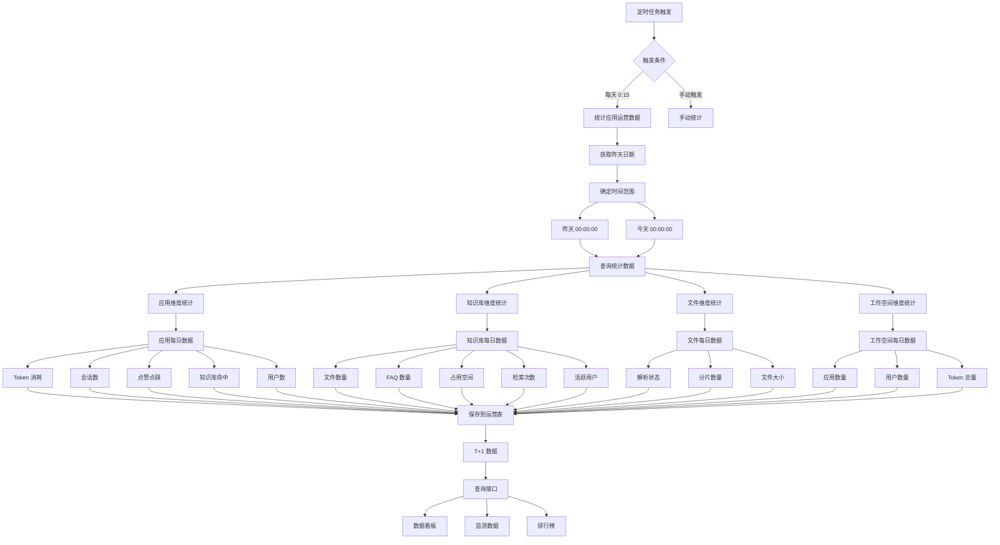

# 17、运营数据统计机制

## 一、核心统计流程图




## 二、核心数据表

### 1. agent_operation_app（应用运营数据表）

**作用**：存储应用维度的 T+1 统计数据

| 字段名                     | 类型        | 说明                       | 示例          |
| -------------------------- | ----------- | -------------------------- | ------------- |
| id                         | varchar(32) | 主键 ID                    | "1234567890"  |
| stat_date                  | date        | 统计日期                   | 2024-01-01    |
| workspace_id               | varchar(32) | 工作空间 ID                | "ws_001"      |
| app_id                     | varchar(32) | 应用 ID                    | "app_001"     |
| session_type               | varchar(32) | 渠道类型                   | "web" / "api" |
| app_token_usage            | bigint      | Token 消耗量               | 15000         |
| app_session_count          | int         | 会话数量                   | 100           |
| app_like_count             | int         | 点赞次数                   | 80            |
| app_dislike_count          | int         | 点踩次数                   | 5             |
| hit_count                  | int         | 知识库命中数               | 60            |
| repo_count                 | int         | 知识库搜索数               | 100           |
| channel_user_count         | int         | 当天渠道用户数             | 50            |
| app_user_count_all         | int         | app 维度历史用户总数       | 500           |
| workspace_user_count_all   | int         | workspace 维度历史用户总数 | 2000          |
| all_user_count_all         | int         | 所有历史用户总数           | 5000          |
| app_user_count_daily       | int         | 某天 app 维度用户数        | 50            |
| workspace_user_count_daily | int         | 某天 workspace 维度用户数  | 200           |
| run_count                  | int         | 运行次数                   | 100           |
| run_success_count          | int         | 运行成功次数               | 95            |

**统计维度**：
- **按日期**：每天一条记录（T+1）
- **按应用**：每个应用独立统计
- **按渠道**：web、api 等渠道分别统计
- **按工作空间**：归属的工作空间

---

### 2. agent_operation_knowledge（知识库运营数据表）

**作用**：存储知识库维度的 T+1 统计数据

| 字段名                       | 类型        | 说明              | 示例         |
| ---------------------------- | ----------- | ----------------- | ------------ |
| id                           | varchar(32) | 主键 ID           | "1234567890" |
| stat_date                    | date        | 统计日期          | 2024-01-01   |
| knowledge_id                 | varchar(32) | 知识库 ID         | "kb_001"     |
| file_count                   | int         | 文件数量          | 50           |
| file_count_change            | int         | 文件数量变化      | +5           |
| faq_count                    | int         | FAQ 数量          | 100          |
| faq_count_change             | int         | FAQ 数量变化      | +10          |
| occupy_space_size            | bigint      | 占用空间（字节）  | 104857600    |
| occupy_space_size_change     | bigint      | 空间变化          | +1048576     |
| search_count                 | int         | 检索次数          | 200          |
| search_count_change          | int         | 检索次数变化      | +20          |
| search_success_rate          | decimal     | 检索成功率        | 0.85         |
| active_user_count            | int         | 活跃用户数        | 30           |
| seven_days_active_user_count | int         | 近 7 日活跃用户数 | 150          |

---

### 3. agent_operation_file（文件运营数据表）

**作用**：存储文件维度的 T+1 统计数据

| 字段名       | 类型        | 说明             | 示例            |
| ------------ | ----------- | ---------------- | --------------- |
| id           | varchar(32) | 主键 ID          | "1234567890"    |
| stat_date    | date        | 统计日期         | 2024-01-01      |
| file_id      | varchar(32) | 文件 ID          | "file_001"      |
| parse_status | int         | 解析状态         | 1=成功 / 0=失败 |
| chunk_count  | int         | 分片数量         | 10              |
| file_size    | bigint      | 文件大小（字节） | 1048576         |
| parse_time   | bigint      | 解析耗时（毫秒） | 5000            |

---

## 三、核心代码流程

### 关键方法 1：应用运营数据统计（定时任务）

**位置**：`AgentOperationDashboardServiceImpl.statOperationAppData()` 第 180-200 行

**作用**：每天 0:15 自动统计昨天的应用运营数据

```java
@Override
@Scheduled(cron = "0 15 0 * * ?")  // 每天 0:15 执行
public void statOperationAppData() {
    // 1. 计算统计日期（T+1 模式）
    LocalDate today = LocalDate.now();
    LocalDate targetDate = today.minusDays(1);  // 统计昨天数据
    LocalDateTime startTime = targetDate.atStartOfDay();  // 昨天 00:00:00
    LocalDateTime endTime = targetDate.plusDays(1).atStartOfDay();  // 今天 00:00:00
    
    log.info("开始进行昨天工作空间运营数据统计，开始时间：{}，结束时间：{}", startTime, endTime);
    
    // 2. 获取应用每日分组统计数据
    List<AppBoardGroupedDailyDTO> dailyData = this.baseMapper.getAppGroupedDailyStats(startTime, endTime);
    
    // 3. 查询历史累计用户数
    Map<String, Integer> appAllUserMap = baseMapper.getAllUserCountByApp().stream()
            .collect(Collectors.toMap(AppBoardGroupedDailyDTO.KeyValue::getKey, 
                    AppBoardGroupedDailyDTO.KeyValue::getValue));
    
    Map<String, Integer> workspaceAllUserMap = baseMapper.getAllUserCountByWorkspace().stream()
            .collect(Collectors.toMap(AppBoardGroupedDailyDTO.KeyValue::getKey, 
                    AppBoardGroupedDailyDTO.KeyValue::getValue));
    
    Integer totalAllUserCount = baseMapper.getAllUserCount();
    
    // 4. 处理每条数据
    for (AppBoardGroupedDailyDTO dto : dailyData) {
        AgentOperationAppEntity operationApp = new AgentOperationAppEntity();
        operationApp.setStatDate(targetDate);
        operationApp.setWorkspaceId(dto.getWorkspaceId());
        operationApp.setAppId(dto.getAppId());
        operationApp.setSessionType(dto.getSessionType());
        
        // 5. 设置各项指标
        operationApp.setAppTokenUsage(dto.getTokenUsage());
        operationApp.setAppSessionCount(dto.getSessionCount());
        operationApp.setAppLikeCount(dto.getLikeCount());
        operationApp.setAppDislikeCount(dto.getDislikeCount());
        operationApp.setHitCount(dto.getHitCount());
        operationApp.setRepoCount(dto.getRepoCount());
        operationApp.setChannelUserCount(dto.getChannelUserCount());
        
        // 6. 设置用户统计数据
        operationApp.setAppUserCountAll(appAllUserMap.get(dto.getAppId()));
        operationApp.setWorkspaceUserCountAll(workspaceAllUserMap.get(dto.getWorkspaceId()));
        operationApp.setAllUserCountAll(totalAllUserCount);
        operationApp.setAppUserCountDaily(dto.getDailyUserCount());
        operationApp.setWorkspaceUserCountDaily(dto.getWorkspaceDailyUserCount());
        
        // 7. 保存数据
        this.save(operationApp);
    }
    
    log.info("工作空间运营数据统计完成");
}
```


**关键点**：
- **T+1 模式**：统计昨天的数据，避免今天数据不完整
- **定时执行**：每天凌晨 0:15 自动执行
- **多维度统计**：按应用、工作空间、渠道分别统计
- **累计 + 日增**：同时统计历史累计和当日新增

---

### 关键方法 2：获取应用每日分组统计数据

**位置**：`AgentOperationDashboardMapper.xml.getAppGroupedDailyStats`

**作用**：SQL 查询获取应用维度的每日统计数据

```xml
<select id="getAppGroupedDailyStats" resultType="com.yundingtech.agent.build.modules.operation.model.AppBoardGroupedDailyDTO">
    SELECT 
        aab.workspace_id,
        aab.id AS app_id,
        acs.session_type,
        
        -- Token 消耗量
        COALESCE(SUM(acm.token_usage), 0) AS token_usage,
        
        -- 会话数量
        COUNT(DISTINCT acs.id) AS session_count,
        
        -- 点赞次数
        SUM(CASE WHEN acmf.type = 'good' THEN 1 ELSE 0 END) AS like_count,
        
        -- 点踩次数
        SUM(CASE WHEN acmf.type = 'bad' THEN 1 ELSE 0 END) AS dislike_count,
        
        -- 知识库命中次数
        COUNT(DISTINCT CASE WHEN acm.hit_knowledge = 1 THEN acm.id END) AS hit_count,
        
        -- 知识库检索次数
        COUNT(DISTINCT CASE WHEN acm.search_knowledge = 1 THEN acm.id END) AS repo_count,
        
        -- 当日渠道用户数
        COUNT(DISTINCT acs.user_id) AS channel_user_count,
        
        -- 当日应用用户数
        COUNT(DISTINCT acs.user_id) AS daily_user_count
        
    FROM agent_app_base aab
    INNER JOIN agent_chat_session acs 
        ON aab.id = acs.app_id
    INNER JOIN agent_chat_message acm 
        ON acs.id = acm.session_id
    LEFT JOIN agent_chat_message_feedback acmf 
        ON acm.id = acmf.message_id
    WHERE acs.create_time >= #{startTime}
      AND acs.create_time &lt; #{endTime}
      AND aab.delete_flag = 0
    GROUP BY 
        aab.workspace_id,
        aab.id,
        acs.session_type
</select>
```


**统计逻辑**：
- 关联 `agent_app_base`（应用基础表）
- 关联 `agent_chat_session`（会话表）
- 关联 `agent_chat_message`（消息表）
- 关联 `agent_chat_message_feedback`（反馈表）
- 按工作空间、应用、渠道分组
- 聚合计算各项指标

---

### 关键方法 3：获取历史累计用户数

**位置**：`AgentOperationDashboardMapper.xml.getAllUserCountByApp`

**作用**：统计应用历史累计用户数（去重）

```xml
<select id="getAllUserCountByApp" resultType="com.yundingtech.agent.build.modules.operation.model.AppBoardGroupedDailyDTO$KeyValue">
    SELECT 
        app_id AS key,
        COUNT(DISTINCT user_id) AS value
    FROM agent_chat_session
    WHERE delete_flag = 0
    GROUP BY app_id
</select>
```


**统计逻辑**：
- 从 `agent_chat_session` 表查询
- 按 `app_id` 分组
- `COUNT(DISTINCT user_id)` 去重统计用户数
- 返回 Key-Value 结构便于 Map 转换

---

### 关键方法 4：知识库运营数据统计

**位置**：`AgentOperationDashboardServiceImpl.statOperationKnowledegeData()`

**作用**：统计知识库维度的 T+1 数据

```java
public void statOperationKnowledegeData() {
    // 1. 计算统计日期（T+1）
    LocalDate today = LocalDate.now();
    LocalDate targetDate = today.minusDays(1);
    LocalDateTime startTime = targetDate.atStartOfDay();
    LocalDateTime endTime = targetDate.plusDays(1).atStartOfDay();
    
    // 2. 查询所有知识库
    List<FileInfoEntity> knowledgeList = fileInfoService.list(
        new QueryWrapper<FileInfoEntity>().lambda()
            .eq(FileInfoEntity::getFileType, FileInfoConstants.FileTypeEnum.KNOWLEDGE.getType())
    );
    
    // 3. 遍历每个知识库统计
    for (FileInfoEntity knowledge : knowledgeList) {
        AgentOperationKnowledgeEntity operationKnowledge = new AgentOperationKnowledgeEntity();
        operationKnowledge.setStatDate(targetDate);
        operationKnowledge.setKnowledgeId(knowledge.getId());
        
        // 4. 统计文件数量
        String code = knowledge.getCode();
        long fileCount = fileMetadataService.count(
            new QueryWrapper<FileMetadataEntity>().lambda()
                .like(FileMetadataEntity::getCode, code)
                .eq(FileMetadataEntity::getDeleteFlag, 0)
        );
        operationKnowledge.setFileCount((int) fileCount);
        
        // 5. 统计 FAQ 数量
        long faqCount = fileMetadataService.count(
            new QueryWrapper<FileMetadataEntity>().lambda()
                .like(FileMetadataEntity::getCode, code)
                .eq(FileMetadataEntity::getDataType, "faq")
                .eq(FileMetadataEntity::getDeleteFlag, 0)
        );
        operationKnowledge.setFaqCount((int) faqCount);
        
        // 6. 统计占用空间
        List<FileMetadataEntity> fileMetadataList = fileMetadataService.list(
            new QueryWrapper<FileMetadataEntity>().lambda()
                .like(FileMetadataEntity::getCode, code)
                .eq(FileMetadataEntity::getDeleteFlag, 0)
        );
        List<String> fileIdList = fileMetadataList.stream()
            .map(FileMetadataEntity::getFileId)
            .collect(Collectors.toList());
        
        long occupySpace = fileInfoService.listByIds(fileIdList).stream()
            .mapToLong(FileInfoEntity::getSize)
            .sum();
        operationKnowledge.setOccupySpaceSize(occupySpace);
        
        // 7. 统计检索次数（从日志表）
        long searchCount = baseLogService.count(
            new QueryWrapper<BaseLogDBEntity>().lambda()
                .eq(BaseLogDBEntity::getCategory, 3)  // 知识库检索类别
                .eq(BaseLogDBEntity::getExt1, knowledge.getId())
                .ge(BaseLogDBEntity::getCreateTime, startTime)
                .lt(BaseLogDBEntity::getCreateTime, endTime)
        );
        operationKnowledge.setSearchCount((int) searchCount);
        
        // 8. 统计活跃用户数
        long activeUserCount = baseLogService.list(
            new QueryWrapper<BaseLogDBEntity>().lambda()
                .eq(BaseLogDBEntity::getCategory, 3)
                .eq(BaseLogDBEntity::getExt1, knowledge.getId())
        ).stream()
            .map(BaseLogDBEntity::getUserId)
            .distinct()
            .count();
        operationKnowledge.setActiveUserCount((int) activeUserCount);
        
        // 9. 保存数据
        this.save(operationKnowledge);
    }
}
```


**关键点**：
- 从 `file_info` 表获取知识库列表
- 从 `file_metadata` 表统计文件和 FAQ 数量
- 从 `base_log_db` 表统计检索次数
- 计算活跃用户数（去重）

---

### 关键方法 5：手动触发统计

**位置**：`AgentOperationController.manualStatAppData()` 第 427-439 行

**作用**：提供手动触发接口，用于调试和补数据

```java
@PostMapping("/manual/statAppData")
@Operation(summary = "手动触发 app 运营数据统计 (T+1)")
public CommonResult<String> manualStatAppData() {
    try {
        log.info("手动触发 app 运营数据统计，当前时间：{}", LocalDateTime.now());
        
        // 调用统计方法
        agentOperationDashboardService.statOperationAppData();
        
        log.info("app 运营数据统计完成");
        return CommonResult.success("✅ 统计完成！请查询 agent_operation_app 表验证昨天日期的数据");
    } catch (Exception e) {
        log.error("手动触发 app 运营数据统计失败:", e);
        return CommonResult.fail("❌ 统计失败：" + e.getMessage());
    }
}
```


**使用场景**：
- 定时任务未执行，手动补数据
- 调试统计逻辑
- 历史数据修复

---

## 四、统计指标详解

### 应用维度指标

| 指标名称           | 说明                     | 计算方式                                                   | 数据来源                    |
| ------------------ | ------------------------ | ---------------------------------------------------------- | --------------------------- |
| **Token 消耗量**   | 应用消耗的 Token 总数    | `SUM(token_usage)`                                         | agent_chat_message          |
| **会话数量**       | 应用会话总数             | `COUNT(DISTINCT session_id)`                               | agent_chat_session          |
| **点赞次数**       | 用户点赞次数             | `SUM(CASE WHEN type='good' THEN 1 ELSE 0 END)`             | agent_chat_message_feedback |
| **点踩次数**       | 用户点踩次数             | `SUM(CASE WHEN type='bad' THEN 1 ELSE 0 END)`              | agent_chat_message_feedback |
| **知识库命中数**   | 命中知识库的对话数       | `COUNT(DISTINCT CASE WHEN hit_knowledge=1 THEN id END)`    | agent_chat_message          |
| **知识库检索数**   | 检索知识库的次数         | `COUNT(DISTINCT CASE WHEN search_knowledge=1 THEN id END)` | agent_chat_message          |
| **渠道用户数**     | 当天渠道的活跃用户数     | `COUNT(DISTINCT user_id)`                                  | agent_chat_session          |
| **历史累计用户数** | 应用历史总用户数（去重） | `COUNT(DISTINCT user_id)`                                  | agent_chat_session          |

---

### 知识库维度指标

| 指标名称            | 说明               | 计算方式                                       | 数据来源      |
| ------------------- | ------------------ | ---------------------------------------------- | ------------- |
| **文件数量**        | 知识库包含的文件数 | `COUNT(*)`                                     | file_metadata |
| **FAQ 数量**        | 问答对数量         | `COUNT(*) WHERE data_type='faq'`               | file_metadata |
| **占用空间**        | 文件总大小（字节） | `SUM(size)`                                    | file_info     |
| **检索次数**        | 知识库被检索次数   | `COUNT(*) WHERE category=3`                    | base_log_db   |
| **检索成功率**      | 检索命中比例       | `hit_count / search_count`                     | 计算得出      |
| **活跃用户数**      | 使用知识库的用户数 | `COUNT(DISTINCT user_id)`                      | base_log_db   |
| **近 7 日活跃用户** | 近 7 天活跃用户数  | `COUNT(DISTINCT user_id) WHERE time >= now-7d` | base_log_db   |

---

### 工作空间维度指标

| 指标名称       | 说明                | 计算方式                     | 数据来源           |
| -------------- | ------------------- | ---------------------------- | ------------------ |
| **应用数量**   | 工作空间下的应用数  | `COUNT(*)`                   | agent_app_base     |
| **用户数量**   | 工作空间的用户数    | `COUNT(DISTINCT user_id)`    | work_space_user    |
| **Token 总量** | 所有应用 Token 消耗 | `SUM(token_usage)`           | agent_chat_message |
| **会话总量**   | 所有应用会话数      | `COUNT(DISTINCT session_id)` | agent_chat_session |

---

## 五、T+1 统计机制

### 为什么采用 T+1 模式？

**原因**：
1. **数据完整性**：避免当天数据未结束导致统计不准确
2. **性能考虑**：凌晨时段系统负载低，适合批量统计
3. **业务需求**：运营看板通常看历史趋势，不需要实时数据

**实现方式**：
```java
LocalDate today = LocalDate.now();
LocalDate targetDate = today.minusDays(1);  // 统计昨天
LocalDateTime startTime = targetDate.atStartOfDay();  // 昨天 00:00:00
LocalDateTime endTime = targetDate.plusDays(1).atStartOfDay();  // 今天 00:00:00
```


**时间范围**：
- **开始时间**：昨天 00:00:00
- **结束时间**：今天 00:00:00
- **统计周期**：完整的 24 小时

---

### 定时任务配置

**Cron 表达式**：`0 15 0 * * ?`

**执行时间**：每天凌晨 0:15

**配置位置**：
```java
@Scheduled(cron = "0 15 0 * * ?")
public void statOperationAppData() {
    // 统计逻辑
}
```


**执行流程**：
```
0:00  → 新的一天开始，数据开始积累
0:15  → 定时任务触发，统计昨天完整数据
0:20  → 统计完成，数据保存到 agent_operation_app
0:21  → 前端查询接口可获取最新统计数据
```


---

## 六、数据流转路径

```
[业务数据源]
  ├─ agent_chat_session（会话表）
  ├─ agent_chat_message（消息表）
  ├─ agent_chat_message_feedback（反馈表）
  ├─ agent_app_base（应用表）
  ├─ file_info（文件表）
  ├─ file_metadata（元数据表）
  ├─ base_log_db（日志表）
  └─ work_space_user（工作空间用户表）
  ↓
[定时任务扫描]
  └─ 每天 0:15 触发
  ↓
[统计计算层]
  ├─ 聚合计算（SUM/COUNT/DISTINCT）
  ├─ 分组统计（GROUP BY）
  ├─ 关联查询（JOIN）
  └─ 指标计算（成功率/变化率）
  ↓
[数据存储层]
  ├─ agent_operation_app（应用运营表）
  ├─ agent_operation_knowledge（知识库运营表）
  └─ agent_operation_file（文件运营表）
  ↓
[查询接口层]
  ├─ /operation/monitorData/app（应用监测数据）
  ├─ /operation/monitorData/knowledge（知识库监测数据）
  ├─ /operation/boardData（数据看板）
  └─ /operation/rank（排行榜）
  ↓
[前端展示层]
  ├─ 数据看板（趋势图、饼图、柱状图）
  ├─ 监测数据（卡片指标）
  └─ 排行榜（TOP10）
```


---

## 七、常见问题与解决方案

### Q1: 定时任务未执行

**问题原因**：
- 服务未启动或重启
- Cron 配置错误
- 数据库连接异常

**排查步骤**：
1. 查看服务日志，确认定时任务是否触发
2. 检查 `@Scheduled` 注解是否生效
3. 查看数据库连接池状态

**解决方案**：
```java
// 1. 确保开启定时任务支持
@EnableScheduling  // 启动类添加此注解

// 2. 查看日志确认执行
log.info("开始进行昨天工作空间运营数据统计，开始时间：{}，结束时间：{}", startTime, endTime);

// 3. 手动触发补数据
POST /operation/manual/statAppData
```


---

### Q2: 统计数据不准确

**问题原因**：
- 时间范围计算错误
- 数据表关联条件错误
- 去重逻辑问题

**排查步骤**：
1. 检查 `startTime` 和 `endTime` 计算
2. 验证 SQL 查询的 JOIN 条件
3. 对比源数据和统计结果

**解决方案**：
```java
// 验证时间范围
LocalDateTime startTime = targetDate.atStartOfDay();  // 昨天 00:00:00
LocalDateTime endTime = targetDate.plusDays(1).atStartOfDay();  // 今天 00:00:00

// 验证 SQL 查询
SELECT COUNT(*) FROM agent_chat_session 
WHERE create_time >= '2024-01-01 00:00:00' 
  AND create_time < '2024-01-02 00:00:00';

// 手动执行统计
agentOperationDashboardService.statOperationAppData();
```


---

### Q3: T+1 数据日期偏移

**问题原因**：
- 时区设置错误
- `LocalDate.now()` 使用不当

**排查步骤**：
1. 检查服务器时区
2. 确认日期计算逻辑

**解决方案**：
```java
// 确保使用正确的时区
LocalDate today = LocalDate.now(ZoneId.of("Asia/Shanghai"));
LocalDate targetDate = today.minusDays(1);

// 避免使用系统默认时区
LocalDateTime startTime = targetDate.atStartOfDay(ZoneId.of("Asia/Shanghai"));
```


---

### Q4: 统计性能慢

**问题原因**：
- 数据量大，全表扫描
- 缺少索引
- 关联查询过多

**优化方案**：
```java
// 1. 添加索引
CREATE INDEX idx_session_create_time ON agent_chat_session(create_time);
CREATE INDEX idx_message_session_id ON agent_chat_message(session_id);

// 2. 使用虚拟线程池并行统计
private final ExecutorService boardDataExecutor = Executors.newVirtualThreadPerTaskExecutor();

// 3. 分步骤统计，记录每步耗时
private void runWithCost(String stepName, Runnable task) {
    long start = System.nanoTime();
    task.run();
    long costMs = (System.nanoTime() - start) / 1_000_000;
    log.info("Step [{}] cost {} ms", stepName, costMs);
}
```


---

### Q5: 历史数据缺失

**问题原因**：
- 定时任务启动晚，历史数据未统计
- 服务宕机期间数据丢失

**解决方案**：
```java
// 手动触发补历史数据
@PostMapping("/manual/statAppData")
public CommonResult<String> manualStatAppData() {
    // 可以修改统计日期范围
    LocalDate targetDate = LocalDate.now().minusDays(7);  // 补 7 天前数据
    // ...
}

// 或者编写专门的补数据脚本
public void backfillHistoricalData() {
    LocalDate startDate = LocalDate.of(2024, 1, 1);
    LocalDate endDate = LocalDate.now().minusDays(1);
    
    while (!startDate.isAfter(endDate)) {
        statOperationAppDataByDate(startDate);
        startDate = startDate.plusDays(1);
    }
}
```


---

## 八、关键要点总结

### ✅ 统计模式
- **T+1 模式**：统计昨天完整数据
- **定时执行**：每天 0:15 自动执行
- **手动触发**：支持接口手动补数据

### ✅ 统计维度
- **应用维度**：Token、会话、反馈、命中、用户数
- **知识库维度**：文件、FAQ、空间、检索、活跃用户
- **工作空间维度**：应用数、用户数、Token 总量
- **文件维度**：解析状态、分片数、文件大小

### ✅ 数据来源
- **会话数据**：agent_chat_session
- **消息数据**：agent_chat_message
- **反馈数据**：agent_chat_message_feedback
- **日志数据**：base_log_db
- **文件数据**：file_info、file_metadata

### ✅ 核心指标
- **Token 消耗量**：`SUM(token_usage)`
- **会话数量**：`COUNT(DISTINCT session_id)`
- **点赞/点踩**：`SUM(CASE WHEN type='good/bad' THEN 1 END)`
- **知识库命中率**：`hit_count / search_count`
- **活跃用户数**：`COUNT(DISTINCT user_id)`

### ✅ 技术实现
- **@Scheduled**：Spring 定时任务
- **Cron 表达式**：`0 15 0 * * ?`
- **虚拟线程池**：并行统计提升性能
- **性能监控**：记录每步耗时

### ✅ 最佳实践
1. 采用 T+1 模式确保数据完整性
2. 定时任务失败时支持手动触发
3. 统计逻辑添加性能监控日志
4. 关键表添加索引优化查询
5. 定期验证统计数据准确性
