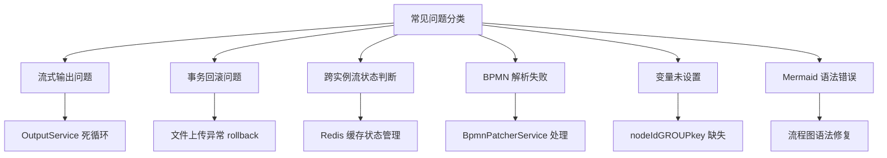
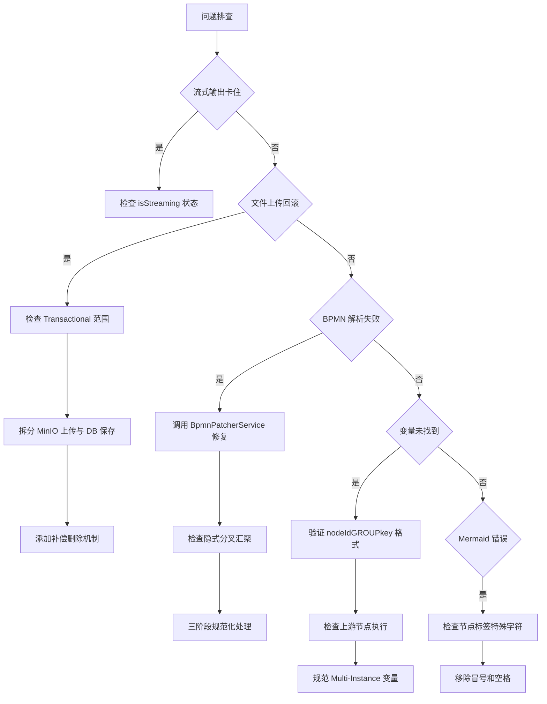

## 18、常见问题与解决方案

---

### **一、核心问题总览**




---

### **二、详细问题分析**

#### **1. 流式输出问题 (OutputService 死循环)**

##### **问题现象**
- 工作流执行卡在某个节点，持续输出流式数据
- SSE 连接不断开，前端一直显示"思考中"
- 日志中出现重复的流式推送记录

##### **根本原因**
1. **isStreaming 状态判断失效**: `LlmRedisMessageService.isStreaming` 使用 `ConcurrentHashMap<String, AtomicBoolean>` 维护流状态
2. **结束标志未触发**: `AgentLLmService` 的流式回调中，`onComplete` 未正确清理状态
3. **DirectReplyService 等待超时**: `checkWorkflowStop()` 方法判断条件不满足，导致无限轮询

##### **关键代码位置**
```java
// LlmRedisMessageService.java - 流状态管理
private static final Map<String, AtomicBoolean> isStreaming = new ConcurrentHashMap<>();

public boolean isStreaming(String businessKey, String variable) {
    String key = getRedisKey(businessKey, variable);
    return isStreaming.getOrDefault(key, new AtomicBoolean(false)).get();
}

// DirectReplyService.java - 停止判断逻辑
public static boolean checkWorkflowStop(String businessKey) {
    boolean reply = !(runningEndNode.containsKey(businessKey) && runningEndNode.get(businessKey) > 0);
    boolean llm = AgentLLmService.checkStop(businessKey);
    return reply && llm;
}

// OutputService.java - 流式输出处理
@Override
protected void doExecute(DelegateExecution delegateExecution) {
    String isStreamStr = (String) delegateExecution.getVariable("isStream");
    boolean isStream = Boolean.parseBoolean(isStreamStr);
    
    // 对于对话流，只发送流式数据，不发送带有 isOutput 标记的完整结果
    if (!"chatflow".equals(type)) {
        List<String> outputList = WorkflowUtil.transformStr2List(isStream, realOutput);
        WorkflowUtil.sendSseMessage(delegateExecution, outputList, true, delegateExecution.getCurrentActivityId(), false);
    }
}
```


##### **解决方案**
**方案 1: 修复流状态清理**
```java
// AgentLLmService.java - onComplete 回调中添加状态清理
.onComplete(response -> {
    log.info("流式输出已完成");
    // 清理流状态标记
    AgentLLmService.cleanupStreaming(businessKey, OUTPUT_PARAM);
    // 发送 [DONE] 结束标志
    emitter.send(SseEmitter.event().data("[DONE]"));
})
```


**方案 2: 添加超时保护**
```java
// DirectReplyService.java - 增加超时强制退出
long startTime = System.currentTimeMillis();
long timeoutMillis = 18000; // 最多等 18 秒

while (!checkWorkflowStop(businessKey)) {
    if (System.currentTimeMillis() - startTime > timeoutMillis) {
        log.warn("等待流结束超时，强制退出");
        break; // 超时强制退出
    }
    try {
        Thread.sleep(50);
    } catch (InterruptedException e) {
        Thread.currentThread().interrupt();
        break;
    }
}
```


**方案 3: 优化 OutputService 逻辑**
```java
// OutputService.java - 避免重复推送
if (!"chatflow".equals(type)) {
    List<String> outputList = WorkflowUtil.transformStr2List(isStream, realOutput);
    // 添加防重标记
    String pushFlagKey = "push_flag_" + businessKey + "_" + delegateExecution.getCurrentActivityId();
    if (!redisService.hasKey(pushFlagKey)) {
        WorkflowUtil.sendSseMessage(delegateExecution, outputList, true, delegateExecution.getCurrentActivityId(), false);
        redisService.set(pushFlagKey, "1", 300); // 5 分钟过期
    }
}
```


---

#### **2. 事务回滚问题 (文件上传异常)**

##### **问题现象**
- 文件上传成功后，数据库记录未保存
- 日志显示 `Transaction rolled back because exception`
- MinIO 中有文件，但 `agent_file_info` 表无记录

##### **根本原因**
1. **@Transactional 注解范围过大**: `FileInfoServiceImpl.upLoad()` 方法中，文件上传和数据库保存被包裹在同一个事务中
2. **检查逻辑抛出异常后未捕获**: `checkFileExist()` 返回 `true` 时直接抛异常，导致整个事务回滚
3. **MinIO 上传已完成但 DB 未提交**: 文件已上传到对象存储，但因后续校验失败导致事务回滚

##### **关键代码位置**
```java
// FileInfoServiceImpl.java - upLoad 方法
@Transactional(rollbackFor = Exception.class)
public void upLoad(BuildUpLoadFileInfoFO fileFO) {
    // 1. 检查文件是否存在 (可能抛异常)
    if (checkFileExist(fileFO.getCatalogId(), fileFO.getFileName(), fileType, null)) {
        throw new BusinessException(FileInfoConstants.FileExceptionEnum.FILE_EXIST);
    }
    
    // 2. 上传到 MinIO (已执行)
    minioClient.putObject(...);
    
    // 3. 保存数据库记录 (如果步骤 1 抛异常，这步不会执行)
    fileInfoMapper.insert(fileInfoEntity);
}
```


##### **解决方案**
**方案 1: 拆分事务边界**
```java
// 先执行非事务的文件上传
public void upLoad(BuildUpLoadFileInfoFO fileFO) {
    try {
        // 1. 检查文件存在性 (不在事务内)
        if (checkFileExist(fileFO.getCatalogId(), fileFO.getFileName(), fileType, null)) {
            throw new BusinessException(FileInfoConstants.FileExceptionEnum.FILE_EXIST);
        }
        
        // 2. 上传到 MinIO (无事务)
        uploadToMinio(fileFO);
        
        // 3. 保存数据库 (独立事务)
        saveToFileDB(fileFO);
        
    } catch (BusinessException e) {
        // 删除已上传的 MinIO 文件 (补偿机制)
        deleteFromMinio(fileFO);
        throw e;
    }
}

@Transactional(rollbackFor = Exception.class)
public void saveToFileDB(BuildUpLoadFileInfoFO fileFO) {
    fileInfoMapper.insert(fileInfoEntity);
}
```


**方案 2: 调整异常处理时机**
```java
@Transactional(rollbackFor = Exception.class)
public void upLoad(BuildUpLoadFileInfoFO fileFO) {
    try {
        // 前置校验放在最前面
        validateFileUpload(fileFO);
        
        // 上传流程
        String minioPath = uploadToMinio(fileFO);
        saveToFileDB(fileFO, minioPath);
        
    } catch (BusinessException e) {
        // 业务异常不回滚，记录日志即可
        log.error("文件校验失败：{}", e.getMessage());
        throw e; // 继续抛出但不回滚事务
    }
}
```


---

#### **3. 跨实例流状态判断 (Redis 缓存)**

##### **问题场景**
- 多实例部署时，A 实例发起的流式请求，B 实例无法判断状态
- 用户刷新页面后，新请求无法继承之前的流状态
- 并行会话之间流状态互相干扰

##### **技术方案**
**当前实现:** `LlmRedisMessageService` 使用本地 `ConcurrentHashMap`,不支持跨实例共享

**优化方案：引入 Redis 缓存**
```java
@Service
public class LlmRedisMessageService {
    @Autowired
    private RedisTemplate<String, String> redisTemplate;
    
    private static final String STREAMING_PREFIX = "streaming:";
    private static final long EXPIRE_SECONDS = 300;
    
    /**
     * 开始流式处理
     */
    public void startStreaming(String businessKey, String variable) {
        String key = STREAMING_PREFIX + businessKey + ":" + variable;
        redisTemplate.opsForValue().set(key, "1", EXPIRE_SECONDS, TimeUnit.SECONDS);
        log.info("开始流式处理：{}", key);
    }
    
    /**
     * 判断是否正在处理流
     */
    public boolean isStreaming(String businessKey, String variable) {
        String key = STREAMING_PREFIX + businessKey + ":" + variable;
        Boolean hasKey = redisTemplate.hasKey(key);
        return Boolean.TRUE.equals(hasKey);
    }
    
    /**
     * 结束流式处理
     */
    public void endStreaming(String businessKey, String variable) {
        String key = STREAMING_PREFIX + businessKey + ":" + variable;
        redisTemplate.delete(key);
        log.info("结束流式处理：{}", key);
    }
}
```


**优势:**
- ✅ 支持跨实例共享状态
- ✅ 自动过期清理，防止内存泄漏
- ✅ 支持会话隔离 (businessKey + variable 组合键)

---

#### **4. BPMN 解析失败 (BpmnPatcherService)**

##### **问题现象**
- 发布工作流时报错:`BPMN parse error`
- 前端绘制的 BPMN 图无法部署
- 隐式分叉/汇聚导致流程执行异常

##### **根本原因**
1. **隐式分叉**: StartEvent 或 Task 直接分出多条线，未通过网关
2. **隐式汇聚**: EndEvent 或 Task 直接汇入多条线，未通过网关
3. **DI 图形信息丢失**: BPMNDiagram 坐标与实际节点不匹配

##### **核心修复逻辑**
```java
// BpmnPatcherService.java - 三阶段修复
public void patchGraph(BpmnModelInstance model) {
    splitGatewayTypes.clear();
    List<FlowNode> allNodes = new ArrayList<>(model.getModelElementsByType(FlowNode.class));
    
    // 阶段 1: 处理分叉 (Split) - 正向处理
    for (FlowNode node : allNodes) {
        if (node instanceof Gateway || node instanceof EndEvent) continue;
        
        List<SequenceFlow> outgoingFlows = resolveOutgoingFlows(node);
        if (outgoingFlows.size() > 1) {
            if (shouldKeepConditionalSplit(node, outgoingFlows)) {
                splitGatewayTypes.putIfAbsent(node.getId(), "EXCLUSIVE");
            } else {
                handleSplit(model, node, outgoingFlows); // 插入分叉网关
            }
        }
    }
    
    // 阶段 2: 处理汇聚 (Join) - 逆向处理
    registerExplicitSplitGateways(model);
    List<FlowNode> nodesToCheck = new ArrayList<>(model.getModelElementsByType(FlowNode.class));
    
    for (FlowNode node : nodesToCheck) {
        if (node instanceof Gateway) continue;
        
        if (resolveIncomingFlows(node).size() > 1) {
            fixJoinLogic(model, node); // 插入汇聚网关
        }
    }
    
    // 阶段 3: 清理图形信息
    rebuildDiagram(model);
}
```


##### **网关类型判断规则**
```java
// 判断是否需要保留条件分叉
private boolean shouldKeepConditionalSplit(FlowNode node, List<SequenceFlow> outgoingFlows) {
    if (!isBusinessRuleTask(node)) return false;
    // BusinessRuleTask 的"菱形线"视为隐式互斥分叉
    return outgoingFlows.size() > 1;
}

// 创建网关类型
boolean hasCondition = originalEdges.stream()
    .anyMatch(flow -> flow.getConditionExpression() != null);

if (hasCondition) {
    gateway = model.newInstance(ExclusiveGateway.class); // 排他网关
    type = "EXCLUSIVE";
} else {
    gateway = model.newInstance(ParallelGateway.class); // 并行网关
    type = "PARALLEL";
}
```


---

#### **5. 变量未设置 (nodeIdGROUPkey)**

##### **问题现象**
- 流程执行报错:`Variable '${node_abc123GROUPllmText}' not found`
- 节点配置中引用了变量，但运行时提示不存在
- 输入映射配置正确，但变量未被设置

##### **变量命名规则**
```java
// WorkflowUtil.java
public static String getTargetNodeVariableName(String nodeId, String variableName) {
    return nodeId + "GROUP" + variableName;  // 格式：nodeIdGROUPvariableName
}

// 示例：
// nodeId = "node_abc123", variableName = "llmText"
// 最终变量名 = "node_abc123GROUPllmText"
```


##### **常见原因**
1. **上游节点未执行**: 目标节点的变量还未生成
2. **作用域错误**: 在多实例子流程中，elementVariable 未正确传递
3. **BPMN 配置不一致**: Config JSON 中的引用与 BPMN 实际变量名不匹配

##### **解决方案**
**方案 1: 检查变量设置时机**
```java
// AgentBaseAbstractDelegate.java - 设置节点变量
public void saveVar(DelegateExecution execution, String varName, String content, String fillType) {
    BpmProcVariableEntity bpmProcVariableEntity = BpmProcVariableEntity.builder()
        .procDefId(execution.getProcessDefinitionId())
        .procInstId(execution.getProcessInstanceId())
        .nodeId(execution.getCurrentActivityId())
        .varName(varName)
        .varValue(content.toString())
        .fillType(BpmConstant.NODE_START_TAG.equals(fillType) 
            ? BpmConstant.NODE_START_TAG : BpmConstant.NODE_END_TAG)
        .build();
    
    bpmProcVariableService.saveNewTx(bpmProcVariableEntities);
}
```


**方案 2: 规范化 Multi-Instance 变量引用**
```java
// BpmnPatcherService.java - 新增方法
public String normalizeMultiInstanceElementVariableRefs(String bpmn) {
    BpmnModelInstance model = Bpmn.readModelFromStream(
        new ByteArrayInputStream(bpmn.getBytes(StandardCharsets.UTF_8))
    );
    
    Collection<SubProcess> subProcesses = model.getModelElementsByType(SubProcess.class);
    Map<String, String> refMapping = new LinkedHashMap<>();
    
    for (SubProcess subProcess : subProcesses) {
        LoopCharacteristics loopChar = subProcess.getLoopCharacteristics();
        if (!(loopChar instanceof MultiInstanceLoopCharacteristics mi)) continue;
        
        String subProcessId = subProcess.getId();
        String elementVariable = mi.getCamundaElementVariable();
        
        // 将 ${subProcessIdGROUPelementVariable} 替换为 ${elementVariable}
        String legacyRef = "${" + subProcessId + "GROUP" + elementVariable + "}";
        String standardRef = "${" + elementVariable + "}";
        
        if (bpmn.contains(legacyRef)) {
            refMapping.put(legacyRef, standardRef);
        }
    }
    
    // 批量替换
    for (Map.Entry<String, String> entry : refMapping.entrySet()) {
        bpmn = bpmn.replace(entry.getKey(), entry.getValue());
    }
    
    return bpmn;
}
```


---

#### **6. Mermaid 语法错误修复**

##### **常见错误类型**

**错误 1: 节点标签包含特殊字符**
```mermaid
graph TB
    Node1[开始：初始化] --> Node2[处理：数据]    
✅ 正确写法
graph TB
    Node1[开始初始化] --> Node2[处理数据]
```

**错误 2: 连线文字格式错误**

```mermaid
❌ 错误写法
graph TB
    A --> |是：确认 | B
    A --> |否：取消 | C
    
✅ 正确写法
graph TB
    A --> |是确认 | B
    A --> |否取消 | C
```

**错误 3: 条件分支未用花括号**

```mermaid
❌ 错误写法
graph TB
    Check{是否登录？}
    Check --> |是 | Login
    Check --> |否 | Register
    
✅ 正确写法
graph TB
    Check{是否登录}
    Check --> |是 | Login
    Check --> |否 | Register
```


**错误 4: 节点 ID 包含空格**
```mermaid
❌ 错误写法
graph TB
    Start Node --> Process Data
    
✅ 正确写法
graph TB
    StartNode --> ProcessData
```


##### **语法规则总结**
| 元素         | 规则                   | 示例                  |
| ------------ | ---------------------- | --------------------- |
| **节点 ID**  | 不能包含空格和特殊字符 | `Node1`, `StartEvent` |
| **节点标签** | 用 `[]` 包裹，不含冒号 | `Node1[开始节点]`     |
| **条件节点** | 用 `{}` 包裹           | `Check{条件判断}`     |
| **连线文字** | 用 \|包裹，不含标点    | `A --> \|是 \| B`     |
| **方向声明** | `graph TB/LR/BT/RL`    | `graph TB`            |

---

### **三、问题排查流程图**




---

### **四、关键要点总结**

| 问题类型           | 核心原因                    | 解决方案                             | 预防机制             |
| ------------------ | --------------------------- | ------------------------------------ | -------------------- |
| **流式输出死循环** | isStreaming 状态未清理      | 添加 onComplete 清理 + 超时保护      | Redis 跨实例状态管理 |
| **事务回滚**       | @Transactional 范围过大     | 拆分事务边界 + 补偿机制              | 先校验后上传         |
| **跨实例状态**     | 本地 ConcurrentHashMap 限制 | Redis 缓存共享                       | 统一状态管理接口     |
| **BPMN 解析**      | 隐式分叉/汇聚               | BpmnPatcherService 三阶段修复        | 前端绘图规范         |
| **变量未设置**     | nodeIdGROUPkey 命名不规范   | 统一变量命名 + Multi-Instance 规范化 | 变量映射检查         |
| **Mermaid 错误**   | 标签含特殊字符              | 移除冒号/空格/标点                   | 语法检查工具         |

---

### **五、最佳实践建议**

#### **1. 流式输出规范**
```java
// ✅ 推荐做法
.onComplete(response -> {
    cleanupStreaming(businessKey);  // 清理状态
    sendDoneMarker();               // 发送结束标志
    log.info("流式完成");
})
.onError(error -> {
    cleanupStreaming(businessKey);  // 异常也要清理
    sendErrorMarker(error);
    log.error("流式异常", error);
})

// ❌ 错误做法
// 只发送数据不清理状态
// 不调用 onComplete 回调
// 没有超时保护机制
```


#### **2. 文件上传事务控制**
```java
// ✅ 推荐做法
public void uploadFile() {
    validate();           // 1. 校验 (无事务)
    uploadToMinio();      // 2. 上传 (无事务)
    saveToDB();           // 3. 保存 (独立事务)
}

// ❌ 错误做法
@Transactional
public void uploadFile() {
    validate();           // 抛异常会导致后面不执行
    uploadToMinio();      // 已上传但可能回滚
    saveToDB();           // 回滚后数据丢失
}
```


#### **3. BPMN 绘图规范**
```
✅ 显式使用网关表达分叉/汇聚
Start --> ExclusiveGateway --> Task1/Task2
Task1/Task2 --> ParallelGateway --> End

❌ 避免隐式直连
Start --> Task1
Start --> Task2  (未通过网关)
```
