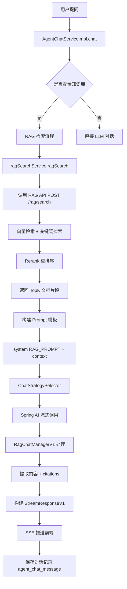

##  知识问答深度分析

> app_type =0

### **一、核心架构图**



### **二、核心代码流程**

#### **1️⃣ 入口：AgentChatServiceImpl.chat()**

**位置**: [`AgentChatServiceImpl.chat()`](file:///D:/工作资料/code/仓颉智能体/nlp-agent/agent-builder/agent-build-core/src/main/java/com/yundingtech/agent/build/modules/agent/service/impl/AgentChatServiceImpl.java#L100-L214)

**关键步骤**:

```java
// 第 158-164 行：判断是否有 RAG 检索
int ragSize = Optional.ofNullable(chatRequestDTO.getDialogConfig().getKnowledgeConfig().getRepos())
    .map(List::size)
    .orElse(0);

if (ragSize > 0) {
    // 执行 RAG 检索
    SearchData ragSearchResult = ragSearchService.ragSearch(chatRequestDTO);
    List<RagSearchData> ragSearchData = ragSearchResult.getDocuments();
    List<FaqSearchData> faqSearchData = ragSearchResult.getFaqs();
    
    // 第 166-177 行：未命中且禁闲聊时的固定回复
    if (CollectionUtils.isEmpty(ragSearchData) && CollectionUtils.isEmpty(faqSearchData)
            && Boolean.TRUE.equals(chatProcessingContext.getChatModelEnabled())) {
        String chatModelPrompt = resolveChatModelPrompt(chatProcessingContext);
        return Flux.just(HttpApiUtil.buildChatMessage(chatProcessingContext, chatModelPrompt));
    }
    
    // 第 181-197 行：构建 Prompt 模板
    String dialogTemplate = buildDialogTemplate(chatProcessingContext);
    promptVariables.put("context", buildIndexedRagContext(ragSearchData, faqSearchData, chatProcessingContext));
    String render = promptTemplate.render(promptVariables);
    chatMessageList.addFirst(AgentMessage.builder().role("system").content(render).build());
}

// 第 204-213 行：流式调用 LLM
ChatStrategySelector strategySelector = new ChatStrategySelector();
ChatStrategy chatStrategy = strategySelector.createChatStrategy(ProviderConstant.SPRING_AI);
Flux<String> stringFlux = chatStrategy.chatWithStream(modelParamDto);

return stringFlux
    .concatMap(response -> Mono.just(ragChatManagerV1.buildStreamingResponse(response, chatProcessingContext)))
    .doFinally(out -> {
        httpApiUtil.saveMessages(chatProcessingContext, userInfo); // 保存对话
    });
```


---

#### **2️⃣ RAG 检索：RagSearchServiceImpl.ragSearch()**

**位置**: [`RagSearchServiceImpl.ragSearch()`](file:///D:/工作资料/code/仓颉智能体/nlp-agent/agent-builder/agent-build-core/src/main/java/com/yundingtech/agent/build/modules/file/service/impl/RagSearchServiceImpl.java#L85-L118)

**完整流程**:

```java
@Override
public SearchData ragSearch(RagSearchBuildFO ragSearchBuildFo) {
    // 1. 构建 RAG 请求体
    SearchKnowledgeDTO ragSearchRequestV3 = fileInfoAPI.getRagSearchRequestV3(
        ragSearchBuildFo.getKnowledgeConfigs(),
        ragSearchBuildFo.getExternalRetrievalModel(),
        ragSearchBuildFo.getPrompt()
    );
    
    String requestBody = JSON.toJSONString(ragSearchRequestV3);
    String url = ragUrl + "/rag/search";
    
    // 2. HTTP POST 调用 RAG API
    HttpRequest httpRequest = HttpRequest.post(url);
    httpRequest.header("x-api-key", ragKey);
    httpRequest.header("Content-Type", "application/json");
    httpRequest.body(requestBody);
    
    // 3. 解析响应
    String result = httpRequest.execute().body();
    SearchResponse searchResponse = JSON.parseObject(result, SearchResponse.class);
    
    if (!searchResponse.isSuccess()) {
        throw new BusinessException(AgentExceptionEnum.RAG_ERROR);
    }
    
    return searchResponse.getData(); // SearchData 包含 documents 和 faqs
}
```


**请求数据结构** (第 121-143 行):
```java
// 从 ChatRequestDTOV3 提取配置
ChatRequestDTOV3.KnowledgeConfig knowledgeConfig = dtov3.getDialogConfig().getKnowledgeConfig();
AgentExternalRetrievalModel agentExternalRetrievalModel = JsonUtil.getJsonToBean(knowledgeConfig, AgentExternalRetrievalModel.class);

// 组装知识库配置
for (ChatRequestDTOV3.Repo repo : knowledgeConfig.getRepos()) {
    knowledgeConfigBase.setKnowledgeId(repo.getId()); // 知识库 ID
    knowledgeConfigBase.setTopK(String.valueOf(first.getTopK())); // TopK
    knowledgeConfigBase.setScore(String.valueOf(first.getScoreThreshold())); // 阈值
}

// 获取 Embedding 模型
ModelInfo embeddingFn = languageModelMapper.getDefaultModelInfoByTypeByWorker("embedding");
```


---

#### **3️⃣ Prompt 模板构建**

**位置**: [`AgentChatServiceImpl.buildDialogTemplate()`](file:///D:/工作资料/code/仓颉智能体/nlp-agent/agent-builder/agent-build-core/src/main/java/com/yundingtech/agent/build/modules/agent/service/impl/AgentChatServiceImpl.java#L265-L270)

**双模式 Prompt**:

```java
// 第 62-87 行：基础 RAG_PROMPT
private static final String RAG_PROMPT = """
    你是一个全能且乐于助人的智能 AI 助手...
    
    # 【已知信息 (文档片段和参考 QA)】:
    {{context}}
    
    # 【回答策略（意图分流）】:
    1. **调用工具（MCP/Function Calling）**: 如果用户的问题涉及你所具备的工具能力...
    2. **基于知识库（RAG）**: 如果【已知信息】中包含了能解答用户问题的内容，请严格依据已知信息作答...
    3. **日常对话与通用知识（兜底策略）**: 当用户进行日常闲聊...请**直接使用你的通用常识自然作答**...
    
    # 【引用与格式要求（仅在基于知识库作答时生效）】:
    1. **严格使用纯数字角标**: 凡是引用了【已知信息】的内容，必须在句末使用角标标注。角标格式必须为<cite>纯数字</cite>
    2. **自然表达**: 答案中不要直接使用"文档片段 x"等字眼指代资料
    3. **保留图片标签**: 若引用的文本内容中包含图片信息<img_loc>xxxx</img_loc>，回答时必须在合适的位置保留该标签
    """;

// 第 89-97 行：禁闲聊模式追加
private static final String CHAT_MODEL_STRICT_PROMPT = """
    # 【知识库兜底限制】:
    1. 当本规则生效时，忽略上文"日常对话与通用知识（兜底策略）"。
    2. 你必须拒绝闲聊、寒暄、情感陪伴...
    3. 只有【已知信息】中存在与用户问题直接相关的内容时，才允许基于【已知信息】回答。
    4. 如果【已知信息】中没有与用户问题直接相关的信息，必须原样只返回以下固定内容：
    {{fixedReply}}
    """;

// 第 265-270 行：根据配置选择模板
private String buildDialogTemplate(ChatProcessingContextV1 chatProcessingContext) {
    if (Boolean.TRUE.equals(chatProcessingContext.getChatModelEnabled())) {
        return RAG_PROMPT + CHAT_MODEL_STRICT_PROMPT; // 禁闲聊模式
    }
    return RAG_PROMPT; // 普通模式
}
```


---

#### **4️⃣ RAG 上下文构建**

**位置**: [`AgentChatServiceImpl.buildIndexedRagContext()`](file:///D:/工作资料/code/仓颉智能体/nlp-agent/agent-builder/agent-build-core/src/main/java/com/yundingtech/agent/build/modules/agent/service/impl/AgentChatServiceImpl.java#L219-L263)

**数据结构**:

```java
private String buildIndexedRagContext(List<RagSearchData> ragSearchData, List<FaqSearchData> faqSearchData,
        ChatProcessingContextV1 chatContext) {
    StringBuilder contextBuilder = new StringBuilder();
    AtomicInteger index = new AtomicInteger(0);
    
    // 1. 文档片段
    for (RagSearchData doc : ragSearchData) {
        int currentIndex = index.incrementAndGet();
        RagSearchData.Metadata metadata = doc.getMetadata();
        
        contextBuilder
            .append("文档片段[").append(currentIndex).append("]\n")
            .append("source: ").append(metadata.getSource()).append("\n")
            .append("file_id: ").append(metadata.getFile_id()).append("\n")
            .append("file_path: ").append(metadata.getFile_path()).append("\n")
            .append("code: ").append(metadata.getCode()).append("\n")
            .append("score: ").append(doc.getScore()).append("\n")
            .append("content: ").append(doc.getPage_content()).append("\n\n");
        
        // 记录引用源
        chatContext.addSource(source, filePath, code, currentIndex, score, pageContent, fileId);
    }
    
    // 2. FAQ 问答对（无需角标引用）
    if (!CollectionUtils.isEmpty(faqSearchData)) {
        contextBuilder.append("参考 QA（无需角标引用）").append("\n");
        for (FaqSearchData faq : faqSearchData) {
            contextBuilder
                .append("question: ").append(faq.getQuestion()).append("\n")
                .append("answer: ").append(faq.getAnswer()).append("\n")
                .append("score: ").append(faq.getScore()).append("\n\n");
        }
    }
    
    return contextBuilder.toString();
}
```


---

#### **5️⃣ 流式响应处理：RagChatManagerV1**

**位置**: [`RagChatManagerV1.ydRagChat()`](file:///D:/工作资料/code/仓颉智能体/nlp-agent/agent-common/agent-rag-adapter/src/main/java/com/yundingtech/agent/adapter/ragchat/RagChatManagerV1.java#L52-L91)

**核心职责**:

1. **流式转换**: 将 LLM 的 SSE 流转换为前端可用的格式
2. **引用提取**: 从 `citations` 中提取文档引用
3. **Token 统计**: 记录 prompt_tokens、completion_tokens、total_tokens
4. **思考时间**: 记录 reasoning_content 的耗时

**关键方法**:

```java
// 第 52-91 行：流式处理管道
public ChatProcessingContextV1 ydRagChat(Flux<String> flux, ChatProcessingContextV1 chatContext) {
    AtomicBoolean referenceChunkSent = new AtomicBoolean(false);
    
    Flux<String> stringFlux = flux
        .timeout(Duration.ofSeconds(40)) // 超时保护
        .onErrorResume(TimeoutException.class, e -> Flux.just(buildErrorCompletionBody("超时")))
        .onErrorResume(e -> Flux.just(buildErrorCompletionBody("异常")))
        .concatMap(response -> transformStreamingResponse(response, chatContext, referenceChunkSent))
        .concatWith(Mono.defer(() -> {
            // 兜底：如果 LLM 没返回引用，但 chatContext 中有，则补发
            if (referenceChunkSent.get() || chatContext.getSources().isEmpty()) {
                return Mono.empty();
            }
            return Mono.just(buildReferenceOnlyResponse(chatContext, time));
        }));
    
    chatContext.setResponseFlux(stringFlux);
    return chatContext;
}

// 第 220-296 行：提取内容、Token、引用
private void extractContent(JsonNode rootNode, ChatProcessingContextV1 chatContext) {
    // 1. 提取回答内容
    JsonNode deltaNode = safeGet(rootNode, "choices", "0", "delta");
    if (deltaNode.has(CONTENT)) {
        String context = deltaNode.path(CONTENT).asText();
        chatContext.getContent().append(context);
        chatContext.setAnswer(context);
    }
    
    // 2. 提取 Token 用量
    JsonNode usageNode = safeGet(rootNode, "usage");
    chatContext.getPromptTokens().set(usageNode.path("prompt_tokens").asInt(0));
    chatContext.getTotalTokens().set(usageNode.path("total_tokens").asInt(0));
    chatContext.getCompletionTokens().set(usageNode.path("completion_tokens").asInt(0));
    
    // 3. 提取思考内容（DeepSeek 等模型）
    if (deltaNode.has(REASONING_CONTENT)) {
        String reasoningText = deltaNode.path(REASONING_CONTENT).asText();
        chatContext.getReasoningContent().append(reasoningText);
        chatContext.setReason(reasoningText);
    }
    
    // 4. 提取引用（citations）
    JsonNode referenceNode = safeGet(rootNode, "citations", "documents");
    if (referenceNode.isArray()) {
        for (JsonNode ref : referenceNode) {
            chatContext.addSource(
                ref.path("metadata").path("source").asText(),
                ref.path("metadata").path("file_path").asText(),
                ref.path("metadata").path("code").asText(),
                index, ref.path("score").asDouble(),
                ref.path("page_content").asText(),
                ref.path("metadata").path("file_id").asText()
            );
        }
    }
}
```


---

### **三、关键配置参数**

#### **前端配置项** (对应截图)

| 配置项           | 字段名                       | 默认值      | 说明                 |
| ---------------- | ---------------------------- | ----------- | -------------------- |
| **模型选择**     | `llmConfig.chatModelId`      | DeepSeek-V3 | 对话大模型           |
| **关联知识库**   | `dataset.repos[]`            | []          | 知识库 ID 列表       |
| **会话记忆轮数** | `dialogConfig.historyLimit`  | 2           | 历史对话轮数         |
| **支持上传文件** | `fileUpload.enabled`         | false       | 是否允许用户上传文件 |
| **最大文件数**   | `fileUpload.maxFiles`        | 5           | 单次最多上传文件数   |
| **Top K**        | `dataset.rag.topK`           | 8           | RAG 检索返回数量     |
| **Score 阈值**   | `dataset.rag.scoreThreshold` | 0.2         | 检索分数阈值         |

---

### **四、数据流转路径**

```
1. 用户提问 (前端)
   ↓
2. ArrangeChatQO (包含 appId, sessionId, content, appConfig)
   ↓
3. AgentChatServiceImpl.chat()
   ├─ 创建 ChatProcessingContextV1
   ├─ 生成 messageId, parentId
   ├─ 检查黑名单
   └─ 构建 ChatRequestDTOV3
   ↓
4. ragSearchService.ragSearch()
   ├─ 构建 SearchKnowledgeDTO
   │   ├─ knowledgeConfig.repos[] (知识库 ID)
   │   ├─ knowledgeConfig.topK (8)
   │   ├─ knowledgeConfig.scoreThreshold (0.2)
   │   ├─ externalRetrievalModel.rerank_fn (Rerank 模型)
   │   └─ externalRetrievalModel.rerank_enabled (true/false)
   └─ HTTP POST {ragUrl}/rag/search
   ↓
5. RAG API 响应
   ├─ SearchData.documents[] (文档片段)
   │   ├─ page_content (文本内容)
   │   ├─ metadata.source (文件名)
   │   ├─ metadata.file_id
   │   ├─ metadata.file_path
   │   └─ score (相关度分数)
   └─ SearchData.faqs[] (FAQ 问答对)
       ├─ question
       ├─ answer
       └─ score
   ↓
6. buildIndexedRagContext() → 构建 Prompt 的{{context}}
   ↓
7. PromptTemplate.render() → 替换{{question}}、{{context}}、{{history}}
   ↓
8. ChatStrategySelector → Spring AI 流式调用 LLM
   ↓
9. LLM SSE 流式响应
   data: {"choices":[{"delta":{"content":"回答内容"},"citations":{"documents":[...]}}]}
   ↓
10. RagChatManagerV1.transformStreamingResponse()
    ├─ extractContent() 提取内容、Token、引用
    ├─ buildStreamingResponse() 构建 StreamResponseV1
    └─ 提取<cite>N</cite>角标，过滤未使用的引用
    ↓
11. Flux<String> 推送前端 (SSE)
    data: {"messageId":"xxx","sessionId":"xxx","role":"assistant","context":"回答","citations":[{...}]}}
    ↓
12. httpApiUtil.saveMessages() 保存数据库
    ├─ agent_chat_message (user 角色)
    └─ agent_chat_message (assistant 角色)
        ├─ content (回答内容)
        ├─ thinking_content (思考内容)
        ├─ prompt_tokens
        ├─ completion_tokens
        ├─ total_tokens
        └─ citations (引用 JSON)
```


---

### **五、核心数据表**

#### **agent_app_config** (应用配置表)
```sql
id                  -- 配置 ID
app_id              -- 应用 ID
llm_model_id        -- 大模型 ID
prompt              -- Prompt 模板 (JSON)
dataset             -- 知识库配置 (JSON)
  {
    "repos": [
      {
        "id": "knowledgeId",
        "scope": [{"topK": 8, "scoreThreshold": 0.2}]
      }
    ],
    "externalRetrievalModel": {
      "rerankModelEnabled": true,
      "rerankModelId": "xxx",
      "topK": "8",
      "scoreThreshold": "0.2",
      "chatModelEnabled": false,  // 是否开启禁闲聊
      "chatModelPrompt": "根据已知信息无法回答。"
    }
  }
file_upload         -- 文件上传配置
  {
    "enabled": true,
    "maxFiles": 5
  }
```


#### **agent_chat_message** (对话消息表)
```sql
id                  -- 消息 ID
session_id          -- 会话 ID
app_id              -- 应用 ID
role                -- user/assistant
content             -- 回答内容
thinking_content    -- 思考内容
prompt_tokens       -- 输入 Token 数
completion_tokens   -- 输出 Token 数
total_tokens        -- 总 Token 数
citations           -- 引用文档 JSON
  [
    {
      "index": 1,
      "source": "文档.pdf",
      "file_id": "xxx",
      "file_path": "/path",
      "code": "knowledgeCode",
      "score": 0.85,
      "pageContent": "片段内容"
    }
  ]
```


---

### **六、关键特性**

#### **1. 引用角标机制**
- LLM 输出：`根据文档内容<cite>1</cite>，仓颉是一个智能体平台...`
- RagChatManagerV1 提取：`Pattern.compile("<cite>(\\d+)</cite>")`
- 只保留实际引用的文档，过滤未使用的引用

#### **2. 禁闲聊模式**
```java
if (Boolean.TRUE.equals(chatProcessingContext.getChatModelEnabled())) {
    // 使用 RAG_PROMPT + CHAT_MODEL_STRICT_PROMPT
    // 未命中知识库时返回固定话术
    if (CollectionUtils.isEmpty(ragSearchData) && CollectionUtils.isEmpty(faqSearchData)) {
        return Flux.just(chatModelPrompt); // "根据已知信息无法回答。"
    }
}
```


#### **3. FAQ 优先策略**
```java
// AgentChatServiceImpl 第 164 行
List<FaqSearchData> faqSearchData = ragSearchResult.getFaqs();
// FAQ 无需角标引用，直接展示在 Prompt 中
contextBuilder.append("参考 QA（无需角标引用）").append("\n");
```


#### **4. 图片引用保留**
```java
// RAG_PROMPT 第 76-79 行
3. **保留图片标签**: 若引用的文本内容中包含图片信息<img_loc>xxxx</img_loc>，
   回答时必须在合适的位置保留该标签
4. **解析图片 Source**: 若引用的内容 metaData 中的 source 字段为 png、jpg 等图片格式时，
   回答的内容需要在适合的位置添加该图片，格式为<img_loc>图片名称</img_loc>
```


---

### **七、异常处理**

1. **RAG 检索失败** → 抛出 `BusinessException(AgentExceptionEnum.RAG_ERROR)`
2. **LLM 连接失败** → 返回 `"大模型连接失败:{apiBase}"`
3. **Token 超限** → 返回 `"你输入的内容过长，请减少问题内容"`
4. **超时保护** → `timeout(Duration.ofSeconds(40))`
5. **黑名单检查** → `agentChatMessageService.checkAndHandleBlacklistIfNeeded()`

---

**无代码变更** - 本次为纯分析梳理。

---

## ✅ 核心目标对齐确认

知识问答的核心流程已分析完毕，涉及：
- ✅ RAG 检索流程 (调用外部 RAG API)
- ✅ Prompt 模板构建 (双模式：普通/禁闲聊)
- ✅ 流式响应处理 (引用提取、Token 统计)
- ✅ 对话记录保存 (agent_chat_message)
