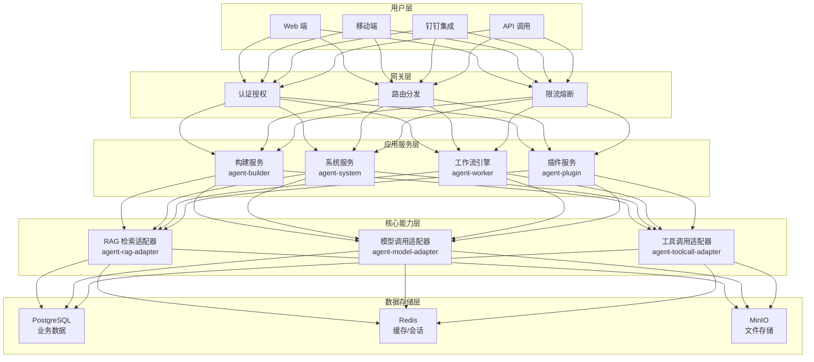
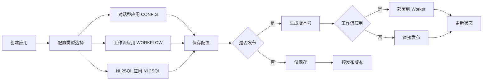
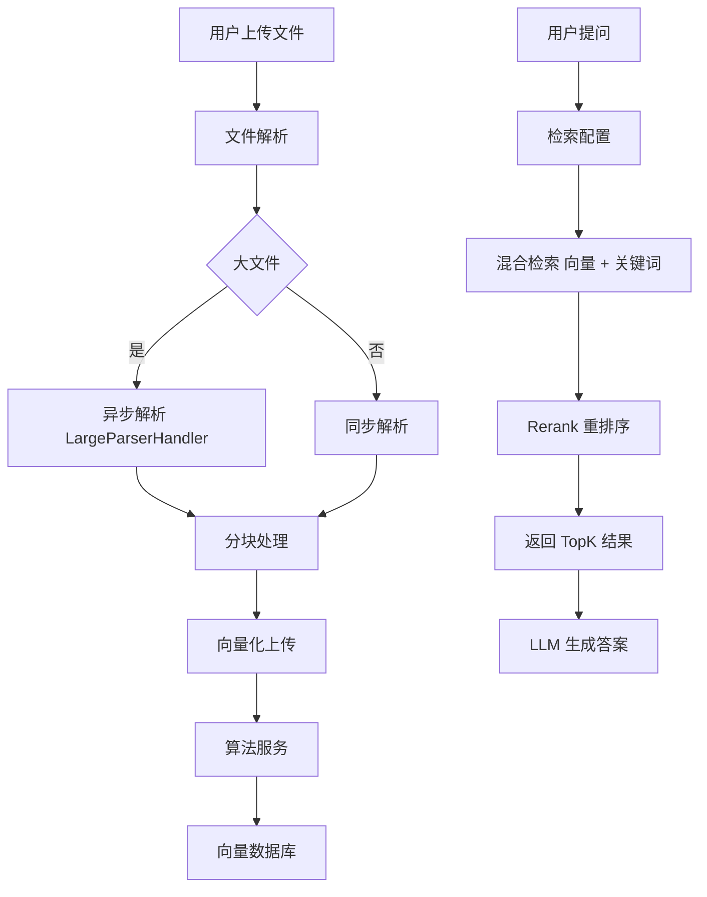
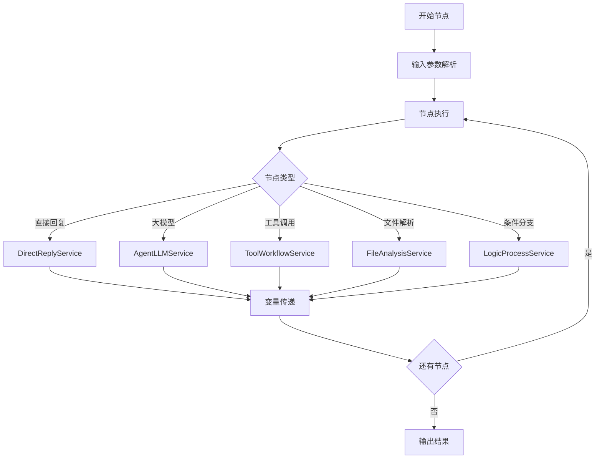
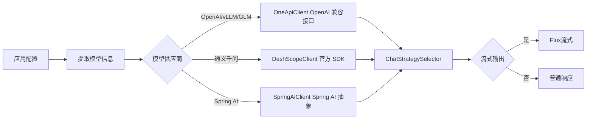
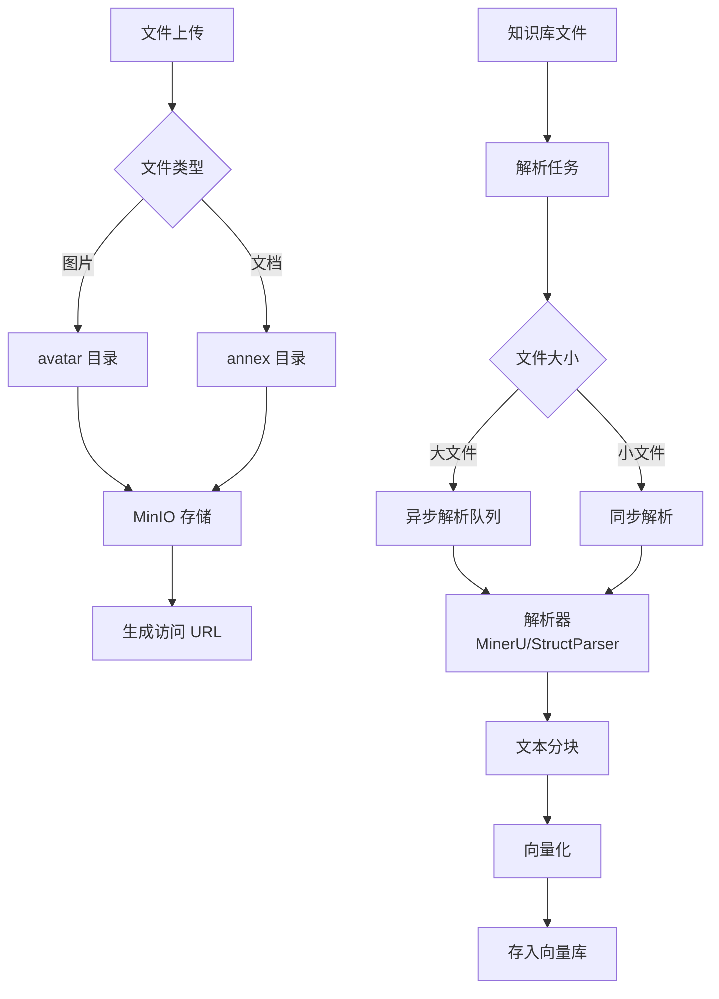
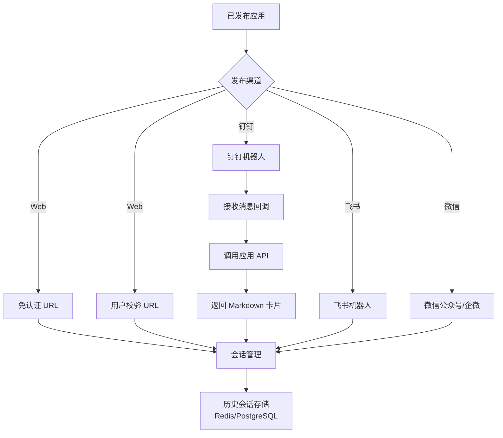

## 仓颉智能体平台核心功能架构图

> 好的，我已经对项目有了全面的了解。现在我将为你梳理仓颉智能体项目的核心功能，并绘制详细的图表和说明。

### 一、整体架构概览




### 二、核心功能模块详解

#### 1. **应用编排与发布流程**




**关键代码位置：**
- [`AgentAppConfigServiceImpl.savePublish()`](file:///D:/工作资料/code/仓颉智能体/nlp-agent/agent-builder/agent-build-core/src/main/java/com/yundingtech/agent/build/modules/appconfig/service/impl/AgentAppConfigServiceImpl.java#L345-L434) - 应用保存发布核心逻辑
- [`AgentAppVersionServiceImpl`](file:///D:/工作资料/code/仓颉智能体/nlp-agent/agent-builder/agent-build-core/src/main/java/com/yundingtech/agent/build/modules/appversion/service/impl/AgentAppVersionServiceImpl.java#L31-L180) - 版本管理服务

**版本管理策略：**
- 预发布版本：v1.0（时间戳版本）
- 正式发布版本：v0.1, v0.2...（递增版本）
- `is_current` 字段标识当前使用版本

---

#### 2. **知识库 RAG 检索流程**




**关键组件：**
- [`RagProviderAdapter`](file:///D:/工作资料/code/仓颉智能体/nlp-agent/agent-common/agent-rag-adapter/src/main/java/com/yundingtech/agent/adapter/provider/RagProviderAdapter.java#L16-L212) - RAG 接口适配器
- [`LargeParserHandler`](file:///D:/工作资料/code/仓颉智能体/nlp-agent/agent-builder/agent-build-core/src/main/java/com/yundingtech/agent/build/modules/parser/execute/service/impl/LargeParserHandler.java#L47-L557) - 大文件解析处理器
- [`FileInfoService`](file:///D:/工作资料/code/仓颉智能体/nlp-agent/agent-builder/agent-build-core/src/main/java/com/yundingtech/agent/build/modules/file/service/FileInfoService.java#L27-L420) - 文件管理服务

**检索配置参数：**
```java
KnowledgeConfig {
    knowledgeId: "知识库 ID"
    topK: 5                    // 返回数量
    score: 0.9                 // 阈值
    embedding_fn: {...}        // 嵌入模型配置
}
```


---

#### 3. **工作流/对话流执行引擎**




**核心执行器：**
- [`AgentBaseAbstractDelegate`](file:///D:/工作资料/code/仓颉智能体/nlp-agent/agent-worker/src/main/java/com/yundingtech/agent/work/modules/workflow/service/delegate/AgentBaseAbstractDelegate.java#L52-L487) - 节点执行基类
- [`DirectReplyService`](file:///D:/工作资料/code/仓颉智能体/nlp-agent/agent-worker/src/main/java/com/yundingtech/agent/work/modules/workflow/service/delegate/DirectReplyService.java#L48-L522) - 直接回复节点
- [`ToolWorkflowService`](file:///D:/工作资料/code/仓颉智能体/nlp-agent/agent-worker/src/main/java/com/yundingtech/agent/work/modules/workflow/service/delegate/ToolWorkflowService.java#L28-L136) - 工具/子流程调用

**流式响应数据结构：**

```java
WorkerStreamResponseV1 {
    messageId: "消息 ID"
    sessionId: "会话 ID"
    role: "assistant"
    think: "思考过程"
    context: "回答内容"
    totalTokens: 1500
    times: 2.5  // 思考时间 (秒)
}
```


---

#### 4. **LLM 模型调用策略**




**关键实现：**
- [`ChatStrategySelector`](file:///D:/工作资料/code/仓颉智能体/nlp-agent/agent-common/agent-model-adapter/src/main/java/com/yundingtech/agent/sdk/common/ChatStrategySelector.java) - 策略选择器
- 支持供应商：OpenAI、GLM、vLLM、通义千问、Spring AI

**模型配置示例：**
```json
{
  "provider": "openai",
  "apiBase": "https://api.openai.com/v1",
  "apiKey": "sk-xxx",
  "model": "gpt-4",
  "completionParams": {
    "temperature": 0.6,
    "topP": 0.9,
    "maxTokens": 2000,
    "stream": true
  }
}
```


---

#### 5. **文件管理与解析系统**




**文件服务接口：**
- [`FileAppController`](file:///D:/工作资料/code/仓颉智能体/nlp-agent/agent-system/sheno-system-core/src/main/java/com/yundingtech/sheno/system/appmodules/file/controller/FileAppController.java#L69-L631) - 文件上传/下载 API
- 支持分片上传、批量下载、预览

**文件类型限制：**
- 允许上传：pdf, docx, txt, md, excel 等
- PDF XSS 检测开关：`systemProperties.getPdfXssEnabled()`

---

#### 6. **多渠道发布与集成**




**钉钉集成示例：**
- [`DingTalkQASendExecutor`](file:///D:/工作资料/code/仓颉智能体/nlp-agent/agent-builder/agent-build-core/src/main/java/com/yundingtech/agent/build/modules/chatapplication/executor/DingTalkQASendExecutor.java#L44-L252) - 钉钉问答执行器
- 支持群聊/私聊两种场景
- Markdown 卡片消息展示

---

### 三、关键技术特性

#### 1. **流式响应机制 (SSE)**
```java
// SSE 推送流程
SseEmitter emitter = SseFactory.getSse(businessKey);
emitter.send(SseEmitter.event().data(streamResponseV1));

// 流式数据处理
while (streamMessageService.isStreaming(businessKey, varname)) {
    List<String> chunks = streamMessageService.getAllChunks(...);
    for (String chunk : chunks) {
        // 逐条推送思考和回答内容
    }
}
```


#### 2. **工作流变量管理**
```java
// 基础变量名 + 节点变量名
delegateExecution.setVariable(key, value);  // 全局变量
delegateExecution.setVariable(
    WorkflowUtil.getCurrentNodeVariableName(delegateExecution, key), 
    value
);  // 节点局部变量
```


#### 3. **权限控制体系**
- JWT Token 认证
- 组织/用户两级权限
- 知识库权限隔离（私有/公开/临时）
- 应用访问权限控制

#### 4. **多环境配置**
```yaml
# application.yml 配置项
sheno:
  minio:
    endpoint: http://minio:9000
  file:
    bucket-name: sheno
  pdfXss:
    enabled: true  # PDF XSS 检测开关
```


---

### 四、数据库设计（核心表）

| 表名                    | 用途         | 关键字段                                                   |
| ----------------------- | ------------ | ---------------------------------------------------------- |
| `agent_app_base`        | 应用基本信息 | id, app_name, app_type, status, latest_version             |
| `agent_app_config`      | 应用配置     | id, app_id, llm_model_id, prompt, dataset(llm 配置/知识库) |
| `agent_app_version`     | 应用版本     | id, app_id, config_version, is_current, workflow_config_id |
| `agent_workflow_config` | 工作流配置   | id, bpmn, config, config_v2                                |
| `file_info`             | 文件信息     | id, file_name, file_type, status, code                     |
| `file_metadata`         | 文件元数据   | id, file_id, metadata(json), state                         |
| `language_model`        | 模型配置     | id, name, provider_id, config                              |
| `agent_chat_message`    | 对话消息     | id, session_id, role, content, thinking_content            |

---

### 五、典型业务场景

#### 场景 1：创建并发布一个工作流应用
1. 前端调用 `IBuildAppAPI.saveApp()` 保存应用配置
2. 后端执行 [`AgentAppConfigServiceImpl.savePublish()`](file:///D:/工作资料/code/仓颉智能体/nlp-agent/agent-builder/agent-build-core/src/main/java/com/yundingtech/agent/build/modules/appconfig/service/impl/AgentAppConfigServiceImpl.java#L345-L434)
   - 保存配置到 `agent_app_config`
   - 保存 BPMN 到 `agent_workflow_config`
   - 生成版本号到 `agent_app_version`
   - 调用 Worker 部署接口 `workflowClient.deployWorkflow()`
   - 更新应用状态为已发布

#### 场景 2：对话流执行过程
1. 用户发送问题 → 创建 `agent_chat_message`（user 角色）
2. 工作流引擎启动 → 执行各个节点
3. 大模型节点 → 流式输出 → SSE 推送到前端
4. 直接回复节点 → 变量替换 → 推送静态/动态内容
5. 所有节点完成 → 更新 `agent_chat_message`（assistant 角色）→ 关闭 SSE 连接

#### 场景 3：知识库文件解析
1. 上传文件 → MinIO 存储 → 创建 `file_info` 记录
2. 提交解析任务 → [`LargeParserHandler.handle()`](file:///D:/工作资料/code/仓颉智能体/nlp-agent/agent-builder/agent-build-core/src/main/java/com/yundingtech/agent/build/modules/parser/execute/service/impl/LargeParserHandler.java#L89-L126)
3. PARSING 阶段 → 调用外部解析器 API → 返回分块数据
4. UPLOAD 阶段 → 构建向量化参数 → 调用 RAG API → 存入向量库
5. 更新文件状态为 OPEN → 可被检索

---

这份文档涵盖了仓颉智能体平台的核心功能模块、架构设计、关键流程和技术实现细节。如需深入了解某个具体模块，我可以进一步展开说明！