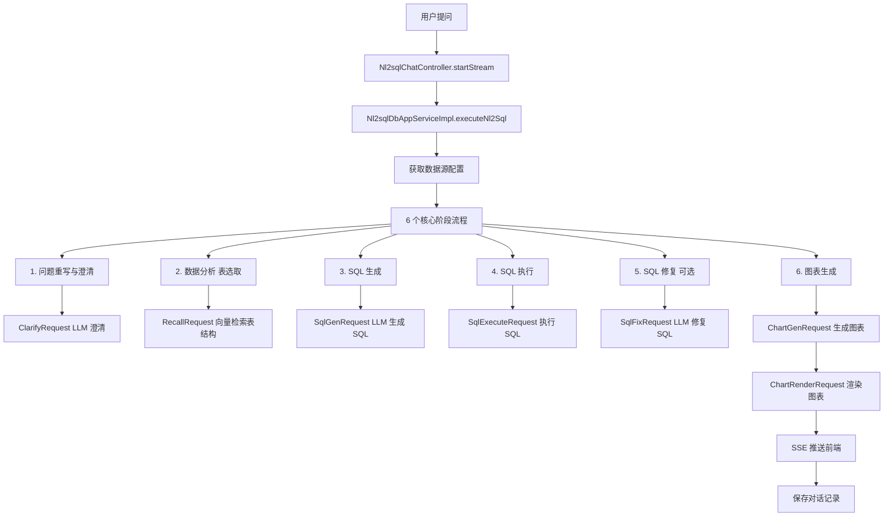

### 智能问数深度分析

> app_type=4

### **一、核心架构图**




---

### **二、核心代码流程**

#### **1️⃣ 入口：Nl2sqlChatController.startStream()**

**位置**: [`Nl2sqlChatController.startStream()`](file:///D:/工作资料/code/仓颉智能体/nlp-agent/agent-builder/agent-build-core/src/main/java/com/yundingtech/agent/build/modules/nl2sql/controller/Nl2sqlChatController.java#L40-L47)

```java
@PostMapping({"/start"})
public SseEmitter startStream(@RequestBody @Valid Nl2sqlChatQO nl2sqlChatQO) {
    try {
        return nl2sqlDbAppService.executeNl2Sql(nl2sqlChatQO);
    } catch (Exception e) {
        log.error("流程启动失败", e);
        throw new CommonException(500, "nl2sql 对话异常，请检查");
    }
}
```


**请求参数**: [`Nl2sqlChatQO`](file:///D:/工作资料/code/仓颉智能体/nlp-agent/agent-builder/agent-build-core/src/main/java/com/yundingtech/agent/build/modules/nl2sql/model/Nl2sqlChatQO.java#L1-L23)
```java
@Data
public class Nl2sqlChatQO extends ArrangeChatQO {
    private Nl2sqlDbAppFO nl2sqlDbAppFO;  // 智能问数配置
    private LLMConfig llm_config;  // 统一 LLM 配置
    
    // 阶段化大模型配置（优先级高于统一配置）
    private LLMConfig rewriteClarifyLlmConfig;  // 问题改写
    private LLMConfig schemaRecallLlmConfig;    // 数据表检索
    private LLMConfig sqlGenLlmConfig;          // SQL 生成
    private LLMConfig sqlFixLlmConfig;          // SQL 修复
    private LLMConfig chartGenLlmConfig;        // 图表生成
}
```


---

#### **2️⃣ 核心实现：Nl2sqlDbAppServiceImpl.executeNl2Sql()**

**位置**: [`Nl2sqlDbAppServiceImpl.executeNl2Sql()`](file:///D:/工作资料/code/仓颉智能体/nlp-agent/agent-builder/agent-build-core/src/main/java/com/yundingtech/agent/build/modules/nl2sql/service/impl/Nl2sqlDbAppServiceImpl.java#L140-L333)

**完整 6 阶段流程**：

```java
// 第 142-144 行：获取数据源信息
CommonResult<DataSourceConnectionModel> dataSourceCommonResult = 
    dataSourceClient.getDataSourceConnection(datasourceConnId);
DataSourceConnectionModel sourceConnection = dataSourceCommonResult.getData();
String dbType = sourceConnection.getDbType().toLowerCase(); // mysql/postgresql等

// 第 165 行开始：异步执行 6 个阶段
this.agentExecutor.execute(() -> {
    try {
        // ========== 1. 问题重写与澄清 ==========
        Nl2sqlStageEnum rewriteClarify = Nl2sqlStageEnum.REWRITE_CLARIFY;
        LLMConfig rewriteClarifyLlmConfig = getLLMConfigV1(...);
        ClarifyRequest clarifyRequest = getClarifyRequest(...);
        clarifyRequest.setPrompt_template(nl2sqlChatQO.getNl2sqlDbAppFO().getRewritePrompt());
        
        ClarifyResponse clarifyResponse = getClarifyResponse(rewriteClarify, nl2sqlDelegateDTO);
        messageList.add(clarifyResponse);
        
        // 第 185-187 行：如果用户需要澄清，则中断并等待
        if (clarifyResponseNotAnalysis(...)) {
            return; // 等待用户补充信息
        }
        
        String query = clarifyResponse.getDemand_content(); // 澄清后的问题
        
        // ========== 2. 数据分析（表结构检索） ==========
        Nl2sqlStageEnum schemaRecall = Nl2sqlStageEnum.SCHEMA_RECALL;
        RecallRequest recallRequest = getRecallRequest(query, vdbConfig);
        // 设置 TopK 和分数阈值
        recallRequest.getRepo().getScope().get(0).setTop_k(nl2sqlDbAppFO.getTop_k());
        recallRequest.getRepo().getScope().get(0).setScore_threshold(nl2sqlDbAppFO.getScore_threshold());
        
        RecallResponse recallResponse = getRecallResponse(...);
        String mSchema = recallResponse.getMSchema(); // 检索到的表结构
        
        // ========== 3. SQL 生成 ==========
        Nl2sqlStageEnum sqlGeneEnum = Nl2sqlStageEnum.SQL_GENE;
        LLMConfig sqlGenLlmConfig = getLLMConfigV1(...);
        SqlGenRequest sqlGenRequest = getSqlGenRequest(query, sqlGenLlmConfig, mSchema, dbType);
        sqlGenRequest.setSql_gen_template(nl2sqlChatQO.getNl2sqlDbAppFO().getSqlGenPrompt());
        
        log.info("=== 阶段：SQL 生成 ===");
        log.info("请求对象：{}", JsonUtil.getObjectToString(sqlGenRequest));
        
        SqlGenResponse sqlGenResponse = getSqlGenResponse(...);
        String sql = sqlGenResponse.getSql();
        
        // ========== 4. SQL 执行 ==========
        Nl2sqlStageEnum sqlExecute = Nl2sqlStageEnum.SQL_EXECUTE;
        SqlExecuteRequest sqlExecuteRequest = getSqlExecuteRequest(..., sql);
        SqlExecuteResponse sqlExecuteResponse = getSqlQueryResponse(...);
        
        // ========== 5. SQL 修复（可选） ==========
        LLMConfig sqlFixLlmConfig = getLLMConfigV1(...);
        if (!sqlExecuteResponse.getSuccess()) {
            String errorMessage = sqlExecuteResponse.getErrorMessage();
            SqlFixRequest sqlFixRequest = getSqlFixRequest(sql, errorMessage, mSchema, sqlFixLlmConfig, dbType);
            sqlFixRequest.setSql_fix_template(nl2sqlChatQO.getNl2sqlDbAppFO().getSqlFixPrompt());
            
            SqlFixResponse sqlFixResponse = getSqlFixResponse(...);
            if (sqlFixResponse instanceof SqlGenResponse) {
                sql = sqlFixResponse.getSql(); // 使用修复后的 SQL
                // 重新执行 SQL
                sqlExecuteResponse = getSqlQueryResponse(...);
            }
        }
        
        // ========== 6. 图表生成 ==========
        List<Map<String, Object>> originDataResult = sqlExecuteResponse.getOriginDataResult();
        Nl2sqlStageEnum chartGene = Nl2sqlStageEnum.CHART_GENE;
        LLMConfig chartGenLlmConfig = getLLMConfigV1(...);
        ChartGenRequest chartGenRequest = getChartGenRequest(query, originDataResult, sql, chartGenLlmConfig);
        chartGenRequest.setPrompt_template(nl2sqlChatQO.getNl2sqlDbAppFO().getChartGenPrompt());
        
        ChartGenResponse chartGenResponse = getChartGenResponse(...);
        ParsedRes parsedResp = chartGenResponse.getChart_result();
        Data data = parsedResp.getData();
        String analysis = parsedResp.getAnalysis();
        
        // ========== 7. 图表渲染 ==========
        Nl2sqlStageEnum chartRender = Nl2sqlStageEnum.CHART_RENDER;
        String type = parsedResp.getType(); // table/bar/line/pie等
        Nl2sqlChartTypeEnum nl2sqlChartTypeEnum = getNl2sqlChartTypeEnum(type, ...);
        
        if (Arrays.asList(TABLE, Nl2sqlChartTypeEnum.ERROR).contains(nl2sqlChartTypeEnum)) {
            // 表格或错误处理
            ChartRenderResponse chartRenderResponse = new ChartRenderResponse();
            chartRenderResponse.setType(nl2sqlChartTypeEnum.getAlgoType());
            chartRenderResponse.setContent("表格数据显示");
        } else {
            // 图表渲染
            ChartTypeDetailEnum sdkType = nl2sqlChartTypeEnum.getSdkType();
            ChartRenderRequest chartRenderRequest = getChartRenderRequest(...);
            ChartRenderResponse chartRenderResponse = getChartRenderResponse(...);
        }
        
        // 第 322 行：关闭 SSE 并保存历史消息
        closeSSEAndSaveHistoryMessage(nl2sqlChatQO, emitter, messageList, userInfo, chatProcessingContextV1);
        
    } catch (Exception e) {
        log.error("问数执行过程中出现错误，信息为：{}", e.getMessage());
        streamResponseBase.setErrorMessage(AbstractBaseDelegate.extractErrInfo(e.getMessage()));
        closeSSEAndSaveHistoryMessage(...);
    }
});
```


---

### **三、6 个核心阶段详解**

#### **阶段 1: 问题重写与澄清 (REWRITE_CLARIFY)**

**目的**：理解用户真实意图，必要时追问澄清

**请求**：
```java
ClarifyRequest {
    query: "查询上个月销售额",
    llm_config: {...},  // LLM 配置
    prompt_template: "请分析用户问题，如需澄清请追问..."
}
```


**响应**：
```java
ClarifyResponse {
    demand_content: "查询 2024 年 2 月 1 日 -2 月 29 日的销售总额",  // 澄清后的问题
    is_need_clarify: false,  // 是否需要追问
    clarify_question: "请问您想查询哪个时间段？"  // 如需追问
}
```


---

#### **阶段 2: 数据分析/表结构检索 (SCHEMA_RECALL)**

**目的**：从向量库中检索相关的数据库表结构

**请求**：
```java
RecallRequest {
    query: "查询 2024 年 2 月销售额",
    repo: {
        collection_name: "knowledgeCode",
        scope: [{
            repo_type: "db_table",
            top_k: 5,  // 返回 Top5 表
            score_threshold: 0.5  // 分数阈值
        }]
    },
    vdb_config: {  // 向量库配置
        base_url: "...",
        api_key: "...",
        model: "embedding-model"
    }
}
```


**响应**：
```java
RecallResponse {
    mSchema: "CREATE TABLE sales (\n  id INT,\n  amount DECIMAL,\n  sale_date DATE,\n  ...)",
    tables: ["sales", "products", "customers"]  // 相关表名
}
```


---

#### **阶段 3: SQL 生成 (SQL_GENE)**

**目的**：基于表结构和用户问题生成 SQL

**请求**：
```java
SqlGenRequest {
    query: "查询 2024 年 2 月销售额",
    m_schema: "CREATE TABLE sales (...)",  // 表结构
    llm_config: {...},
    dialect: "mysql",  // 数据库类型
    sql_gen_template: "请根据表结构生成 SQL..."
}
```


**响应**：
```java
SqlGenResponse {
    sql: "SELECT SUM(amount) FROM sales WHERE sale_date BETWEEN '2024-02-01' AND '2024-02-29'",
    usage: {
        prompt_tokens: 150,
        completion_tokens: 50,
        total_tokens: 200
    }
}
```


---

#### **阶段 4: SQL 执行 (SQL_EXECUTE)**

**目的**：执行 SQL 获取数据

**请求**：
```java
SqlExecuteRequest {
    datasource_conn_id: "xxx",
    sql: "SELECT SUM(amount) FROM sales ..."
}
```


**响应**：
```java
SqlExecuteResponse {
    success: true,
    originDataResult: [{
        "SUM(amount)": 125000.00
    }],
    columns: ["SUM(amount)"]
}
```


---

#### **阶段 5: SQL 修复 (SQL_FIX) [可选]**

**触发条件**：SQL 执行失败

**请求**：
```java
SqlFixRequest {
    sql: "SELECT SUM(amount) FROM sales ...",
    error_message: "Table 'sales' doesn't exist",
    m_schema: "CREATE TABLE sales (...)",
    llm_config: {...},
    sql_fix_template: "请修复 SQL 错误..."
}
```


**响应**：
```java
SqlFixResponse extends SqlGenResponse {
    sql: "SELECT SUM(amount) FROM t_sales ..."  // 修复后的 SQL
}
```


---

#### **阶段 6: 图表生成 (CHART_GENE)**

**目的**：根据数据生成图表建议

**请求**：
```java
ChartGenRequest {
    query: "查询 2024 年 2 月销售额",
    data: [{ "SUM(amount)": 125000.00 }],
    sql: "SELECT SUM(amount) ...",
    llm_config: {...},
    prompt_template: "请分析数据并推荐图表类型..."
}
```


**响应**：
```java
ChartGenResponse {
    chart_result: {
        type: "bar",  // 推荐柱状图
        data: { ... },
        analysis: "建议使用柱状图展示销售额对比..."
    }
}
```


---

### **四、核心数据表**

#### **agent_nl2sql_db_app** (智能问数配置表)
```sql
id                      -- 配置 ID
app_id                  -- 应用 ID
datasource_conn_id      -- 数据源连接 ID
llm_config              -- 大模型配置 (JSON)
metadata                -- 表结构元数据 (JSON)
vdb_info                -- 向量库配置 (JSON)
prologue                -- 开场白
suggested_questions     -- 开场问题引导 (JSON)
is_show_detail          -- 是否显示详细执行信息

-- 5 个阶段配置
rewrite_clarify_config  -- 问题改写配置
schema_recall_config    -- 表检索配置
sql_gen_config          -- SQL 生成配置
sql_fix_config          -- SQL 修复配置
chart_gen_config        -- 图表生成配置
```


#### **agent_app_version** (应用版本表)
```sql
app_id                  -- 应用 ID
config_id               -- 指向 agent_nl2sql_db_app.id
config_type             -- 'nl2sql'
config_version          -- 时间戳版本
app_version             -- 'v0.1'
is_current              -- '1' 当前版本
```


---

### **五、关键特性**

#### **1. 阶段化执行**
```java
enum Nl2sqlStageEnum {
    REWRITE_CLARIFY("问题重写与澄清"),
    SCHEMA_RECALL("表结构检索"),
    SQL_GENE("SQL 生成"),
    SQL_EXECUTE("SQL 执行"),
    SQL_FIX("SQL 修复"),
    SQL_REPAIR_EXECUTE("修复后执行"),
    CHART_GENE("图表生成"),
    CHART_RENDER("图表渲染");
}
```


每个阶段都会推送 SSE 消息到前端，显示执行进度。

---

#### **2. 优先级 LLM 配置**
```java
private LLMConfig getPriorityLlmConfig(
    LLMConfig frontendConfig,  // 前端传入
    String dataConfig,         // 应用配置
    LLMConfig defaultConfig    // 系统默认
) {
    // 优先级：前端 > 应用配置 > 系统默认
    if (frontendConfig != null) return frontendConfig;
    if (dataConfig != null) return JSON.parseObject(dataConfig, LLMConfig.class);
    return defaultConfig;
}
```


---

#### **3. 向量检索表结构**
```java
// 使用 RAG 技术检索相关表结构
RecallRequest {
    repo: {
        collection_name: "knowledgeCode",  // 知识库编码
        scope: [{
            repo_type: "db_table",  // 检索数据库表
            top_k: 5,
            score_threshold: 0.5
        }]
    }
}
```


---

#### **4. 错误处理与 SQL 修复**
```java
if (!sqlExecuteResponse.getSuccess()) {
    // SQL 执行失败，触发修复流程
    SqlFixRequest sqlFixRequest = getSqlFixRequest(sql, errorMessage, mSchema, ...);
    SqlFixResponse sqlFixResponse = getSqlFixResponse(...);
    
    // 使用修复后的 SQL 重新执行
    sql = sqlFixResponse.getSql();
    sqlExecuteResponse = getSqlQueryResponse(...);
}
```


---

#### **5. 图表类型识别**
```java
enum Nl2sqlChartTypeEnum {
    TABLE("表格"),
    BAR("柱状图"),
    LINE("折线图"),
    PIE("饼图"),
    SCATTER("散点图"),
    RADAR("雷达图"),
    ERROR("错误");
}
```


---

### **六、数据流转路径**

```
1. 用户提问 (前端)
   ↓
2. Nl2sqlChatQO (包含 appId, content, nl2sqlDbAppFO)
   ↓
3. Nl2sqlDbAppServiceImpl.executeNl2Sql()
   ├─ 获取数据源配置 (datasource_conn_id)
   ├─ 获取 LLM 配置 (优先级：前端 > 应用 > 默认)
   └─ 启动异步任务
   ↓
4. 阶段 1: 问题重写与澄清
   ├─ ClarifyRequest → LLM
   ├─ ClarifyResponse (澄清后的问题)
   └─ SSE 推送前端
   ↓
5. 阶段 2: 表结构检索
   ├─ RecallRequest (向量检索)
   ├─ RecallResponse (mSchema 表结构)
   └─ SSE 推送前端
   ↓
6. 阶段 3: SQL 生成
   ├─ SqlGenRequest (query + mSchema + dialect)
   ├─ SqlGenResponse (生成的 SQL)
   └─ SSE 推送前端
   ↓
7. 阶段 4: SQL 执行
   ├─ SqlExecuteRequest (通过 plugin 服务)
   ├─ SqlExecuteResponse (查询结果)
   └─ SSE 推送前端
   ↓
8. 阶段 5: SQL 修复 (可选)
   ├─ 如果执行失败 → SqlFixRequest
   ├─ SqlFixResponse (修复后的 SQL)
   └─ 重新执行 SQL
   ↓
9. 阶段 6: 图表生成
   ├─ ChartGenRequest (数据 + SQL)
   ├─ ChartGenResponse (图表类型建议)
   └─ SSE 推送前端
   ↓
10. 阶段 7: 图表渲染
    ├─ ChartRenderRequest
    ├─ ChartRenderResponse (ECharts 配置)
    └─ SSE 推送前端
    ↓
11. closeSSEAndSaveHistoryMessage()
    ├─ 保存对话到 agent_chat_message
    └─ 关闭 SSE 连接
```


---

### **七、与知识问答的区别**

| 对比项       | 知识问答 (app_type=0) | 智能问数 (app_type=4) |
| ------------ | --------------------- | --------------------- |
| **数据源**   | 知识库文档 (RAG)      | 数据库表 (NL2SQL)     |
| **核心流程** | RAG 检索 → LLM 回答   | 6 阶段流程            |
| **返回结果** | 文本回答 + 引用       | SQL + 数据 + 图表     |
| **向量检索** | 文档片段              | 表结构元数据          |
| **错误处理** | 固定话术兜底          | SQL 自动修复          |
| **配置表**   | agent_app_config      | agent_nl2sql_db_app   |

---

### ✅ 核心目标对齐确认

智能问数的核心流程已分析完毕，涉及：
- ✅ 6 阶段执行流程 (澄清→检索→生成→执行→修复→图表)
- ✅ 向量检索表结构 (RAG 技术)
- ✅ SQL 自动生成与修复
- ✅ 图表智能推荐
- ✅ 与知识问答的差异对比
