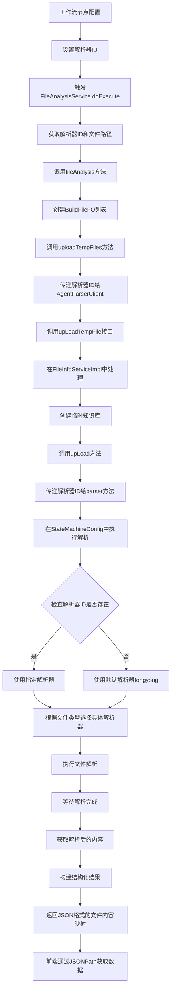

对话流文件解析的完整流程：

详细步骤说明：

1. **工作流节点配置**：用户在工作流节点中配置文件解析任务，并可选择特定的解析器ID。

2. **设置解析器ID**：在工作流变量中设置[parserId](file://F:\Code\nlp-agent\agent-builder\agent-build-core\src\main\java\com\yundingtech\agent\build\modules\file\model\fo\UpLoadFileInfoFO.java#L34-L35)参数。

3. **触发FileAnalysisService.doExecute**：当工作流执行到文件解析节点时，调用[FileAnalysisService](file://F:\Code\nlp-agent\agent-worker\src\main\java\com\yundingtech\agent\work\workflow\delegate\FileAnalysisService.java#L34-L323)的[doExecute](file://F:\Code\nlp-agent\agent-worker\src\main\java\com\yundingtech\agent\work\workflow\delegate\OutputService.java#L30-L49)方法。

4. **获取解析器ID和文件路径**：从工作流变量中获取[parserId](file://F:\Code\nlp-agent\agent-builder\agent-build-core\src\main\java\com\yundingtech\agent\build\modules\file\model\fo\UpLoadFileInfoFO.java#L34-L35)和[filePath](file://F:\Code\nlp-agent\agent-system\sheno-system-core\src\main\java\com\yundingtech\sheno\system\modules\file\entity\FileEntity.java#L23-L24)。

5. **调用fileAnalysis方法**：开始文件解析流程。

6. **创建BuildFileFO列表**：将文件路径转换为文件对象列表。

7. **调用uploadTempFiles方法**：上传文件并传递解析器ID。

8. **传递解析器ID给AgentParserClient**：通过Feign客户端调用远程服务。

9. **调用upLoadTempFile接口**：在[FileInfoServiceImpl](file://F:\Code\nlp-agent\agent-builder\agent-build-core\src\main\java\com\yundingtech\agent\build\modules\file\service\impl\FileInfoServiceImpl.java#L98-L5173)中处理文件上传请求。

10. **创建临时知识库**：如果需要，创建临时知识库用于存储解析结果。

11. **调用upLoad方法**：实际执行文件上传操作。

12. **传递解析器ID给parser方法**：将解析器ID传递给解析方法。

13. **在StateMachineConfig中执行解析**：状态机引擎根据解析器ID执行相应的解析器。

14. **检查解析器ID是否存在**：
    - 如果存在，使用指定的解析器
    - 如果不存在，使用默认解析器"tongyong"

15. **根据文件类型选择具体解析器**：系统根据文件类型（如PDF、TXT等）选择合适的解析器。

16. **执行文件解析**：实际执行文件解析操作。

17. **等待解析完成**：异步等待文件解析完成。

18. **获取解析后的内容**：从解析结果中提取内容。

19. **构建结构化结果**：将每个文件的内容与文件ID关联，构建结构化的JSON响应。

20. **返回JSON格式的文件内容映射**：返回包含所有文件信息的结构化数据。

21. **前端通过JSONPath获取数据**：前端或后续节点可以通过JSONPath表达式轻松访问特定文件的内容。

这个流程确保了文件解析的完整性、可追溯性和易用性，使前端能够方便地获取和处理每个文件的内容。