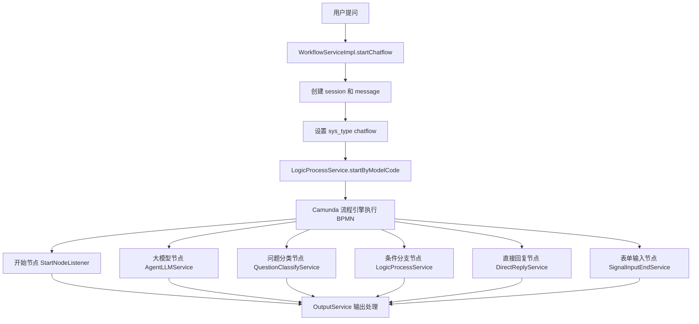

## 对话流深度分析

>  app_type=3

### **一、核心架构图**




---

### **二、核心代码流程**

#### **1️⃣ 入口：WorkflowServiceImpl.startChatflow()**

**位置**: [`WorkflowServiceImpl.startChatflow()`](file:///D:/工作资料/code/仓颉智能体/nlp-agent/agent-worker/src/main/java/com/yundingtech/agent/work/modules/workflow/service/impl/WorkflowServiceImpl.java#L442-L611)

```java
@Override
public SseEmitter startChatflow(WorkFlowStartRequest startRequest) {
    log.info("【运行】开始运行对话流，开始参数：{}", startRequest);
    String appId = startRequest.getAppId();
    String defId = startRequest.getDefId();
    String type = "chatflow";  // 关键：标记为对话流
    
    // 第 470-476 行：创建或复用会话
    AgentChatSessionEntity sessionEntity;
    if (StringUtils.isBlank(startRequest.getSessionId())) {
        sessionEntity = createSession(appId, startRequest.getStartType(), title, ...);
    } else {
        sessionEntity = agentChatSessionMapper.selectById(startRequest.getSessionId());
    }
    
    // 第 483 行：创建用户消息
    AgentChatMessageEntity messageEntity = createMessage(appId, sessionEntity.getId(), 
        userMessageContent, type, "user", "1", "0", refrence);
    
    // 第 499-501 行：关键系统变量设置
    startRequest.getStartParams().put("sys_workflowId", workflowId);
    startRequest.getStartParams().put("sys_sessionId", sessionEntity.getId());
    startRequest.getStartParams().put("sys_appId", appId);
    startRequest.getStartParams().put("sys_type", "chatflow");  // 标记对话流
    startRequest.getStartParams().put("sys_messageHis", otherDataService.getChatHis(...));
    
    // 第 507 行：创建 SSE 连接
    SseEmitter emitter = SseFactory.getSse(businessKey);
    
    // 第 509-609 行：异步执行流程
    this.taskPoolExecutor.submit(() -> {
        Long startTime = System.currentTimeMillis();
        try {
            // 启动 Camunda 流程
            ProcInstRequest request = getProcInstRequest(businessKey, defId, startRequest, appId);
            TaskResponse taskResponse = logicProcessService.startByModelCode(request);
            procInstId.set(taskResponse.getProcInstId());
            
            // 第 519-537 行：更新消息表（流程状态、Token 等）
            AgentLogicTrackProcVO logicTrackVOList = getProcessTrack(taskResponse.getProcInstId());
            if (exceptionMap.containsKey(businessKey)) {
                logicTrackVOList.setProcState("error");
            }
            
            // 查询并更新助手消息
            List<AgentChatMessageEntity> assistantMessageEntitys = ...;
            if (CollectionUtils.isNotEmpty(assistantMessageEntitys)) {
                assistantMessageEntity.setProcess(JSON.toJSONString(logicTrackVOList));
                assistantMessageEntity.setTotalTokens(tokenMap.get(businessKey));
                assistantMessageEntity.setThinkingTime(thinkTimeMap.get(businessKey));
                assistantMessageEntity.setStatus("COMPLETED");
                agentChatMessageMapper.updateById(assistantMessageEntity);
            }
            
            // 第 563-570 行：等待流式数据完成（轮询检查）
            long timeout = 60000; // 60 秒超时
            while (!DirectReplyService.checkWorkflowStop(businessKey) &&
                   System.currentTimeMillis() - timeoutCheckStartTime < timeout) {
                Thread.sleep(100); // 每 100ms 检查一次
            }
            
        } catch (Exception var3) {
            // 异常处理
            WorkerStreamResponseV1 streamResponseV1 = new WorkerStreamResponseV1(..., errorMessage, ...);
            emitter.send(SseEmitter.event().data(streamResponseV1));
        } finally {
            // 发送结束标志
            emitter.send(SseEmitter.event().data("[DONE]"));
            emitter.complete();
        }
    });
    
    return emitter;
}
```


---

### **三、对话流 vs 工作流的核心区别**

#### **对比表**

| 对比项         | 对话流 (chatflow)              | 工作流 (workflow)       |
| -------------- | ------------------------------ | ----------------------- |
| **类型标记**   | `sys_type = "chatflow"`        | `sys_type = "workflow"` |
| **用户消息**   | 必须有用户提问内容             | 固定"工作流启动"        |
| **会话标题**   | 使用用户提问前 30 字           | 固定"新的对话"          |
| **历史消息**   | 传递 `sys_messageHis`          | 不传递                  |
| **输出处理**   | 只推送流式数据                 | 推送完整结果 + isOutput |
| **变量等待**   | 阻塞等待流完成                 | 立即获取变量            |
| **结束检查**   | 轮询检查 `checkWorkflowStop()` | 无等待                  |
| **Token 统计** | 实时累计                       | 结束后统计              |

---

### **四、核心节点服务**

#### **2️⃣ 大模型节点：AgentLLmService**

**位置**: [`AgentLLmService`](file:///D:/工作资料/code/仓颉智能体/nlp-agent/agent-worker/src/main/java/com/yundingtech/agent/work/modules/workflow/service/delegate/AgentLLmService.java#L130-L791)

**流式处理关键代码**：

```java
// 第 130 行：流式调用
chatOneApiStream(delegateExecution, nodeState);

// 第 446-535 行：非流式模式处理
completionParams.setStream(false);
modelParamDto.getLlm().setCompletionParams(completionParams);
String response = chatStrategySelector.chat(modelParamDto);

// 解析回答内容和思考内容
String result = HandleChatResult.getChatContent(response);
String think = HandleChatResult.getChatThinkContent(response);
if (StringUtil.isNullOrEmpty(think)) {
    think = HandleChatResult.getReasonContent(response);
}

// 统计 Token
Usage usage = HandleChatResult.getTokenUsage(response);
int totalTokens = usage.getTotalTokens();
execution.setVariable("totalTokens", totalTokens);
WorkflowServiceImpl.setToken(execution.getBusinessKey(), totalTokens);

// 设置输出变量
Map<String, Object> resultMap = new HashMap<>();
resultMap.put("llmText", result);
resultMap.put("llmThinkText", think);
execution.setVariable(OUTPUT_PARAM, resultMap);

// 第 480-533 行：推送结果（对话流特殊处理）
if ("chatflow".equals(type)) {
    // 对话流：不设置 think 字段（如果为空）
    if (StringUtil.isNullOrEmpty(think)) {
        nonStreamResponse = new WorkerStreamResponseV1(
            ..., null, result, ...);  // think 设为 null，前端不显示思考框
    } else {
        nonStreamResponse = new WorkerStreamResponseV1(
            ..., think, result, ...);
    }
    push(null, nonStreamResponse, execution);  // 推送完整结果
}

// 推送节点结束状态
nodeState.setState(LogicNodeTag.END);
push(null, nodeState, execution);
```


---

#### **3️⃣ 输出处理：OutputService**

**位置**: [`OutputService`](file:///D:/工作资料/code/仓颉智能体/nlp-agent/agent-worker/src/main/java/com/yundingtech/agent/work/modules/workflow/service/delegate/OutputService.java#L33-L40)

**对话流特殊处理**：

```java
// 对于对话流，只发送流式数据，不发送带有 isOutput 标记的完整结果
if (!"chatflow".equals(type)) {
    List<String> outputList = WorkflowUtil.transformStr2List(isStream, realOutput);
    WorkflowUtil.sendSseMessage(delegateExecution, outputList, true, 
        delegateExecution.getCurrentActivityId(), false);
}

// 设置变量
WorkflowUtil.setDefaultAndNodeVariables(delegateExecution, OUTPUT_PARAM, realOutput);
```


**关键点**：
- 对话流 (`chatflow`) **不调用** `sendSseMessage` 推送完整结果
- 因为大模型节点已经通过流式推送了内容
- 避免重复推送

---

#### **4️⃣ 变量处理：AgentBaseAbstractDelegate**

**位置**: [`AgentBaseAbstractDelegate.handleLlmMessage()`](file:///D:/工作资料/code/仓颉智能体/nlp-agent/agent-worker/src/main/java/com/yundingtech/agent/work/modules/workflow/service/delegate/AgentBaseAbstractDelegate.java#L256-L304)

**阻塞等待流完成**：

```java
public void handleLlmMessage(DelegateExecution delegateExecution, 
        String businessKey, String varname) {
    StringBuilder contentBuilder = new StringBuilder();
    StringBuilder thinkBuilder = new StringBuilder();
    long startTime = System.currentTimeMillis();
    long timeoutMillis = 50000; // 最多等 5 秒
    
    // 第 263-274 行：等待流开始
    while (!streamMessageService.isStreaming(businessKey, varname)) {
        if (System.currentTimeMillis() - startTime > timeoutMillis) {
            log.warn("等待流开始超时");
            break;
        }
        Thread.sleep(50);
    }
    
    // 第 280-297 行：从缓存队列获取大模型数据
    long count = 0L;
    long thinkStartTime = System.currentTimeMillis();
    long thinkEndTime = thinkStartTime;
    
    while (streamMessageService.isStreaming(businessKey, varname)) {
        List<String> chunks = streamMessageService.getAllChunks(businessKey, varname, count);
        count = count + chunks.size();
        
        for (String chunk : chunks) {
            Boolean endThink = handleMessage(chunk, new AtomicBoolean(false), 
                contentBuilder, thinkBuilder);
            if (endThink) {
                thinkEndTime = System.currentTimeMillis();
            }
        }
        Thread.sleep(10); // 控制轮询频率
    }
    
    // 设置变量值
    delegateExecution.setVariable(varname, contentBuilder.toString());
    
    // 统计 Token 和思考时间
    WorkflowServiceImpl.setToken(businessKey, contentBuilder.toString().length());
    WorkflowServiceImpl.setThinkTime(businessKey, (double) (thinkEndTime - thinkStartTime));
}
```


---

#### **5️⃣ 问题分类节点：QuestionClassifyService**

**位置**: [`QuestionClassifyService`](file:///D:/工作资料/code/仓颉智能体/nlp-agent/agent-worker/src/main/java/com/yundingtech/agent/work/modules/workflow/service/delegate/QuestionClassifyService.java#L177-L195)

**LLM 分类逻辑**：

```java
@Deprecated
private CategoryItem executeLlmClassifyOld(LlmDto llmConfig, String question, 
        List<CategoryItem> categoryItemList, String instruction) {
    
    String SYS_PROMPT = """
        ### 职位描述
        你是一个 agent 智能体开发平台的分类器节点，可以读取知识库内容，根据用户输入或自动获取的类别分析文本数据并分配类别。
        
        ### 任务
        你的任务是为输入文本分配一个类别，并且只能在输出中返回一个类别。此外，您需要从文本中提取与分类相关的关键词。
        如果用户自己输入了指令和背景信息，则同时需要参考用户的指令和背景信息。
        
        ### 格式
        用户需要分类的输入文本在变量 question 中。类别被指定为一个类别列表，格式为：
        [{"index":1, "className":"吃饭"},{"index":2, "className":"睡觉"}]。
        
        你必须以 JSON 格式返回，格式如下：
        {"index":1,"className":"吃饭","keywords":["早餐","午餐"]}
        """;
    
    // 调用 LLM 进行分类
    ChatStrategySelector chatStrategySelector = new ChatStrategySelector();
    String response = chatStrategySelector.chat(modelParamDto);
    
    // 解析分类结果
    CategoryItem categoryItem = JSONObject.parseObject(response, CategoryItem.class);
    return categoryItem;
}
```


---

### **五、核心数据表**

#### **agent_app_base** (应用基本信息表)
```sql
id                      -- 应用 ID
app_name                -- 应用名称
app_type                -- '3' = 对话流
workspace_id            -- 空间 ID
```


#### **agent_app_version** (应用版本表)
```sql
app_id                  -- 应用 ID
config_id               -- 指向 agent_app_config.id
config_type             -- 'workflow' (对话流也使用 workflow 类型)
workflow_config_id      -- 工作流配置 ID
config_version          -- 时间戳版本
app_version             -- 'v0.1'
is_current              -- '1' 当前版本
```


#### **agent_chat_message** (对话消息表)
```sql
id                      -- 消息 ID
app_id                  -- 应用 ID
session_id              -- 会话 ID
role                    -- 'user' / 'assistant'
biz_type                -- 'chatflow' (对话流标识)
content                 -- 消息内容
parent_id               -- 父消息 ID (用于追问)
is_available            -- '1' 可用 / '0' 已删除
status                  -- 'COMPLETED' / 'ERROR'
process                 -- 流程执行轨迹 (JSON)
total_tokens            -- Token 总数
thinking_time           -- 思考时间 (毫秒)
```


#### **agent_chat_session** (会话表)
```sql
id                      -- 会话 ID
app_id                  -- 应用 ID
session_type            -- 会话类型
title                   -- 会话标题 (用户提问前 30 字)
user_id                 -- 用户 ID
terminal                -- 'web' / 'mobile'
variable                -- 会话变量 (JSON)
```


---

### **六、关键特性详解**

#### **1. 流式输出与变量等待机制**

**问题**：对话流中，后续节点需要使用大模型节点的输出，但大模型是流式输出，如何保证变量可用？

**解决方案**：
```java
// 1. 大模型节点流式输出时，同时缓存到内存队列
streamMessageService.addChunk(businessKey, varname, chunk);

// 2. 后续节点获取变量时，如果为空则阻塞等待
public Object getVariable(DelegateExecution delegateExecution, String key) {
    if (key.endsWith("GROUPllmText") && "chatflow".equals(type)) {
        varValue = delegateExecution.getVariable(key);
        if (varValue == null || varValue.toString().isEmpty()) {
            handleLlmMessage(delegateExecution, businessKey, key);  // 阻塞等待
        }
    }
    return delegateExecution.getVariable(key);
}

// 3. 等待流完成的标志
public static boolean checkWorkflowStop(String businessKey) {
    // 检查是否还有节点在运行
    // 检查是否还有流式数据在推送
    return !isStreaming && allNodesCompleted;
}
```


---

#### **2. 对话流特殊输出处理**

**对话流**：
```java
// OutputService.java 第 33-37 行
if (!"chatflow".equals(type)) {
    // 非对话流才推送完整结果
    List<String> outputList = WorkflowUtil.transformStr2List(isStream, realOutput);
    WorkflowUtil.sendSseMessage(delegateExecution, outputList, true, ...);
}
// 对话流不推送 isOutput 标记，因为大模型已经流式推送了
```


**工作流**：
```java
// 推送完整结果 + isOutput 标记
List<String> outputList = WorkflowUtil.transformStr2List(isStream, realOutput);
WorkflowUtil.sendSseMessage(delegateExecution, outputList, true, ...);
```


---

#### **3. 思考时间统计**

```java
// 开始记录思考时间
long thinkStartTime = System.currentTimeMillis();

// 解析到 <think> 标签
if (chunk.contains("<think>")) {
    think.set(true);
} else if (chunk.contains("</think>")) {
    think.set(false);
    thinkEndTime = System.currentTimeMillis();
}

// 保存思考时间
WorkflowServiceImpl.setThinkTime(businessKey, (double) (thinkEndTime - thinkStartTime));

// 更新到数据库
assistantMessageEntity.setThinkingTime(thinkTimeMap.get(businessKey));
```


---

#### **4. 追问与重新生成**

**追问**：
```java
// 创建新消息，parent_id 指向用户消息
AgentChatMessageEntity messageEntity = createMessage(...);
messageEntity.setParentId(userMessageId);  // 追问标记
```


**重新生成**：
```java
// 第 486-496 行：重新生成逻辑
if (StringUtils.isNotBlank(startRequest.getParentId()) && "1".equals(startRequest.getIsRegenerate())) {
    // 查询用户消息（最初的流程实例）
    AgentChatMessageEntity parentWorkflow = agentChatMessageMapper.selectById(startRequest.getParentId());
    workflowId = parentWorkflow.getId();
    
    // 废弃之前的回答
    List<AgentChatMessageEntity> oldAnswerList = agentChatMessageMapper.selectList(
        new QueryWrapper<AgentChatMessageEntity>()
            .eq("parent_id", messageEntity.getId())
    );
    for (AgentChatMessageEntity oldAnswer : oldAnswerList) {
        oldAnswer.setIsAvailable("0");  // 标记为不可用
        agentChatMessageMapper.updateById(oldAnswer);
    }
}
```


---

### **七、数据流转路径**

```
1. 用户提问 (前端)
   ↓
2. WorkflowServiceImpl.startChatflow()
   ├─ 创建 session (标题=提问前 30 字)
   ├─ 创建 user message
   ├─ 设置 sys_type="chatflow"
   ├─ 设置 sys_messageHis (历史对话)
   └─ 创建 SSE 连接
   ↓
3. LogicProcessService.startByModelCode()
   └─ Camunda 流程引擎执行 BPMN
   ↓
4. 节点执行 (按 BPMN 顺序)
   ├─ 开始节点 → 推送开始状态
   ├─ 大模型节点 → 流式输出 + 缓存 chunks
   ├─ 问题分类 → LLM 分类 + 返回类别
   ├─ 条件分支 → 根据分类结果选择路径
   ├─ 直接回复 → 固定回答
   └─ 表单输入 → 等待用户输入
   ↓
5. OutputService 输出处理
   ├─ chatflow: 不推送 isOutput
   └─ workflow: 推送完整结果
   ↓
6. 变量传递
   ├─ 后续节点读取变量
   ├─ 如果为空 → handleLlmMessage() 阻塞等待
   ├─ 从缓存队列获取 chunks
   └─ 拼接完整内容后设置变量
   ↓
7. 流程完成检查
   ├─ 轮询 checkWorkflowStop()
   ├─ 等待所有流完成
   └─ 60 秒超时保护
   ↓
8. 更新消息表
   ├─ 设置 process (流程轨迹)
   ├─ 设置 total_tokens
   ├─ 设置 thinking_time
   └─ 设置 status="COMPLETED"
   ↓
9. SSE 推送 [DONE]
   └─ 关闭连接
```


---

### **八、与知识问答/智能问数的区别**

| 对比项       | 知识问答          | 智能问数            | 对话流                         |
| ------------ | ----------------- | ------------------- | ------------------------------ |
| **核心流程** | RAG 检索→LLM 回答 | 6 阶段 NL2SQL       | BPMN 流程编排                  |
| **节点类型** | 无 (固定流程)     | 无 (固定流程)       | 多种 (大模型/分类/条件/回复等) |
| **流程配置** | agent_app_config  | agent_nl2sql_db_app | BPMN XML                       |
| **变量传递** | 无                | 无                  | 节点间变量传递                 |
| **分支逻辑** | 无                | 无                  | 问题分类 + 条件判断            |
| **用户交互** | 单轮/多轮         | 单轮/多轮           | 表单输入 + 多轮                |
| **执行引擎** | Spring AI         | Spring AI + Plugin  | Camunda BPMN                   |

---

## ✅ 核心目标对齐确认

对话流的核心流程已分析完毕，涉及：
- ✅ Camunda BPMN 流程引擎执行
- ✅ 对话流特殊标记 (`sys_type="chatflow"`)
- ✅ 流式输出与变量等待机制
- ✅ 问题分类与条件分支
- ✅ 追问与重新生成逻辑
- ✅ 思考时间统计

**接下来分析哪个类型？工作流/智能体？**