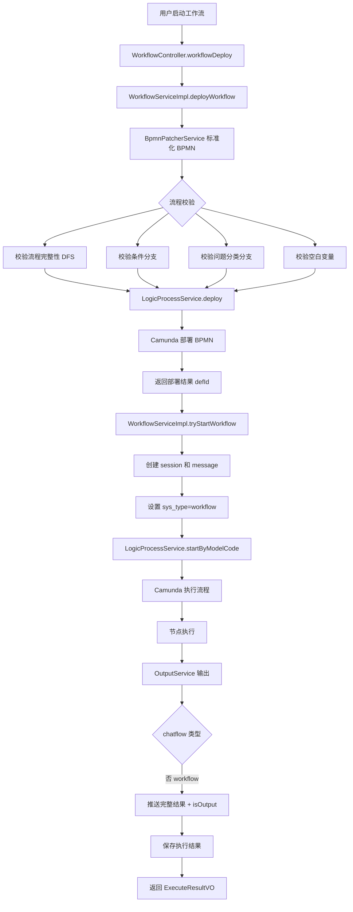

 

### 工作流深度分析

>  app_type=1

### **一、核心架构图**




---

### **二、核心代码流程**

#### **1️⃣ 工作流部署**

**位置**: [`WorkflowServiceImpl.deployWorkflow()`](file:///D:/工作资料/code/仓颉智能体/nlp-agent/agent-worker/src/main/java/com/yundingtech/agent/work/modules/workflow/service/impl/WorkflowServiceImpl.java#L135-L150)

```java
@Override
@Transactional
public DeployVO deployWorkflow(WorkFlowDeployRequest deployRequest) {
    // 1. BPMN 文件标准化
    String config = deployRequest.getWorkflowConfigId();
    String file = bpmnPatcherService.normalizeMultiInstanceElementVariableRefs(deployRequest.getFile());
    
    // 2. 流程校验
    checkWorkflowConfig(config);           // 校验流程完整性 (DFS 连通性)
    checkIfNodeBranch(config);             // 校验条件判断节点分支
    checkQuestionNodeBranch(config);       // 校验问题分类节点分支
    checkEmptyVariable(file);              // 校验空白变量${}
    
    // 3. 部署到 Camunda
    return this.logicProcessService.deploy(getDeployName(deployRequest.getAppId()), file);
}
```


**部署请求**: [`WorkFlowDeployRequest`](file:///D:/工作资料/code/仓颉智能体/nlp-agent/agent-worker/src/main/java/com/yundingtech/agent/work/modules/workflow/model/workflow/WorkFlowDeployRequest.java#L1-L26)
```java
@Data
@Builder
public class WorkFlowDeployRequest {
    @NotBlank(message = "appId 不能为空")
    private String appId;
    
    @NotBlank(message = "workflowConfigId 不能为空")
    private String workflowConfigId;
    
    @NotBlank(message = "bpmn 文件内容不能为空")
    private String file;  // BPMN XML 文件
}
```


---

#### **2️⃣ 流程校验（4 个关键检查）**

**位置**: [`WorkflowServiceImpl`](file:///D:/工作资料/code/仓颉智能体/nlp-agent/agent-worker/src/main/java/com/yundingtech/agent/work/modules/workflow/service/impl/WorkflowServiceImpl.java#L152-L256)

##### **检查 1: 流程完整性 (DFS 连通性)**
```java
private void checkWorkflowConfig(String config) {
    JSONObject jsonObject = JSONObject.parseObject(config);
    JSONArray edges = jsonObject.getJSONArray("edges");
    Map<String, List<String>> graph = buildGraph(edges);
    
    JSONArray nodes = jsonObject.getJSONArray("nodes");
    // 获取所有开始节点和结束节点
    List<JSONObject> startNodes = nodes.stream()
        .filter(node -> "start-node".equals(node.getString("type"))).toList();
    List<JSONObject> stopNodes = nodes.stream()
        .filter(node -> "stop-node".equals(node.getString("type")) || "reply-node".equals(node.getString("type"))).toList();
    
    // DFS 检查是否存在从开始到结束的路径
    boolean isConnected = false;
    for (JSONObject startNode : startNodes) {
        for (JSONObject stopNode : stopNodes) {
            if (canConnectDFS(startNode.getString("id"), stopNode.getString("id"), graph)) {
                isConnected = true;
                break;
            }
        }
    }
    
    if (!isConnected) {
        CommonException.throwException(500, "流程未经过结束节点");
    }
}
```


##### **检查 2: 条件判断节点分支**
```java
private void checkIfNodeBranch(String config) {
    // 统计所有 if-node 的 rightAnchors 数量
    List<JSONObject> ifNodes = nodes.stream()
        .filter(node -> "if-node".equals(node.getString("type"))).toList();
    int rightAnchorsCount = ifNodes.stream()
        .mapToInt(node -> node.getJSONObject("properties")
            .getJSONArray("rightAnchors").size()).sum();
    
    // 统计从 if-node 出发的边数量
    List<JSONObject> sourceEdges = edges.stream()
        .filter(edge -> ifNodeIds.contains(edge.getString("sourceNodeId"))).toList();
    
    if (sourceEdges.size() != rightAnchorsCount) {
        CommonException.throwException(500, "条件判断节点分支配置存在问题，请检查！");
    }
}
```


##### **检查 3: 问题分类节点分支**
```java
private void checkQuestionNodeBranch(String config) {
    // 统计所有 question-node 的 customOptions 数量
    List<JSONObject> questionNodes = nodes.stream()
        .filter(node -> "question-node".equals(node.getString("type"))).toList();
    int customOptionsCount = questionNodes.stream()
        .mapToInt(node -> node.getJSONObject("properties")
            .getJSONArray("customOptions").size()).sum();
    
    // 统计从 question-node 出发的边数量
    if (sourceEdges.size() != customOptionsCount) {
        CommonException.throwException(500, "问题分类节点分支不完整");
    }
}
```


##### **检查 4: 空白变量**
```java
private void checkEmptyVariable(String bpmn) {
    Pattern pattern = Pattern.compile("\\$\\{(.*?)\\}");
    Matcher matcher = pattern.matcher(bpmn);
    while (matcher.find()) {
        String variableName = matcher.group(1);
        if (variableName.trim().isEmpty()) {
            CommonException.throwException("流程中存在空白变量");
        }
    }
}
```


---

#### **3️⃣ 工作流试运行**

**位置**: [`WorkflowServiceImpl.tryStartWorkflow()`](file:///D:/工作资料/code/仓颉智能体/nlp-agent/agent-worker/src/main/java/com/yundingtech/agent/work/modules/workflow/service/impl/WorkflowServiceImpl.java#L280-L343)

```java
@Override
public SseEmitter tryStartWorkflow(WorkFlowStartRequest startRequest) {
    log.info("【运行】开始运行工作流，开始参数：{}", startRequest);
    
    String appId = startRequest.getAppId();
    String defId = startRequest.getDefId();
    Integer runTime = startRequest.getRunTime();
    
    // 1. 创建消息记录
    AgentChatMessageEntity messageEntity = prepareAgentChatMsg(startRequest, appId);
    String businessKey = messageEntity.getId();
    
    // 2. 记录开始时间
    Long startTime = System.currentTimeMillis();
    durationMap.put(businessKey, startTime);
    
    // 3. 启动流程
    log.info("【运行】开始运行工作流，应用 ID：{}", appId);
    ProcInstRequest request = getProcInstRequest(messageEntity.getId(), defId, startRequest, appId);
    SseEmitter emitter = SseFactory.getSse(messageEntity.getId());
    AtomicReference<String> procInstId = new AtomicReference<>(StringUtil.BLANK);
    
    // 4. 异步执行
    this.taskPoolExecutor.submit(() -> {
        try {
            TaskResponse taskResponse = new TaskResponse();
            if (ObjectUtils.isNotNull(runTime)) { // 多次运行测试
                if (runTime < 1 || runTime > 5) throw new RuntimeException("运行次数需要在 1-5 之间");
                for (Integer i = 1; i <= runTime; i++) {
                    taskResponse = startProcess(request, i);
                }
            } else {
                taskResponse = startProcess(request, null);
            }
            procInstId.set(taskResponse.getProcInstId());
            
            Long endTime = System.currentTimeMillis();
            // 发送结果（可选）
        } catch (RuntimeException runtimeException) {
            log.error("启动流程异常", runtimeException);
            String errorMessage = CamundaErrorMessage.convertToChinese(runtimeException.getMessage());
            exceptionMap.put(messageEntity.getId(), errorMessage);
            // 发送异常结果
        } finally {
            // 完成 SSE 连接
            emitter.complete();
        }
    });
    
    return emitter;
}
```


---

#### **4️⃣ 工作流启动准备**

**位置**: [`WorkflowServiceImpl.prepareAgentChatMsg()`](file:///D:/工作资料/code/仓颉智能体/nlp-agent/agent-worker/src/main/java/com/yundingtech/agent/work/modules/workflow/service/impl/WorkflowServiceImpl.java#L358-L376)

```java
@Override
public AgentChatMessageEntity prepareAgentChatMsg(WorkFlowStartRequest startRequest, String appId) {
    String type = "workflow";  // 关键：与对话流区分
    
    if (StringUtils.isEmpty(appId)) {
        CommonException.throwException("未找到该工作流");
    }
    
    String messageContent = "工作流启动";
    
    // 1. 创建 session
    log.info("开始构建 Session 和 Message");
    AgentChatSessionEntity sessionEntity = createSession(
        appId, 
        startRequest.getStartType(), 
        messageContent, 
        JSON.toJSONString(startRequest.getVariable()),
        startRequest.getChannelSourceName()
    );
    
    // 2. 设置系统变量
    startRequest.getStartParams().put("sys_sessionId", sessionEntity.getId());
    startRequest.getStartParams().put("sys_appId", appId);
    startRequest.getStartParams().put("sys_type", type);  // workflow
    
    String authorization = WebContextUtil.getHeader("Authorization");
    startRequest.getStartParams().put("sys_auth", authorization);
    
    // 3. 创建用户 message
    AgentChatMessageEntity messageEntity = createMessage(
        appId, 
        sessionEntity.getId(), 
        messageContent, 
        type, 
        "user", 
        "0",  // 初始不可见
        "0", 
        null
    );
    
    return messageEntity;
}
```


---

#### **5️⃣ 查询执行结果**

**位置**: [`WorkflowServiceImpl.getProcessResult()`](file:///D:/工作资料/code/仓颉智能体/nlp-agent/agent-worker/src/main/java/com/yundingtech/agent/work/modules/workflow/service/impl/WorkflowServiceImpl.java#L671-L718)

```java
@Override
public ExecuteResultVO getProcessResult(String bizId) {
    LogicResultVO logicResultVO = logicProcessService.procResultByBiz(bizId);
    ExecuteResultVO executeResultVO = new ExecuteResultVO();
    
    executeResultVO.setDuration(logicResultVO.getDuration() == null ? 0 : logicResultVO.getDuration());
    executeResultVO.setResult(logicResultVO.getResult());
    
    // 检查是否有异常
    if (exceptionMap.containsKey(bizId)) {
        String exception = exceptionMap.get(bizId);
        executeResultVO.setResult(getErrorMap(exception));
        executeResultVO.setProcState("error");
        exceptionMap.remove(bizId);
        return executeResultVO;
    }
    
    // 解析输出参数
    Object result = executeResultVO.getResult();
    if (result == null) {
        return executeResultVO;
    }
    
    List<InputOutputParamsVO> logicResultList = (List<InputOutputParamsVO>) result;
    JSONObject jsonObject = new JSONObject();
    for (InputOutputParamsVO logicResult : logicResultList) {
        jsonObject.put(logicResult.getName(), logicResult.getValue());
    }
    executeResultVO.setResult(jsonObject);
    
    // 查询消息状态
    LambdaQueryWrapper<AgentChatMessageEntity> queryWrapper = new LambdaQueryWrapper<>();
    queryWrapper.eq(AgentChatMessageEntity::getParentId, bizId);
    queryWrapper.eq(AgentChatMessageEntity::getIsAvailable, "1");
    queryWrapper.eq(AgentChatMessageEntity::getRole, "assistant");
    List<AgentChatMessageEntity> agentChatMessageEntityList = agentChatMessageMapper.selectList(queryWrapper);
    
    for (AgentChatMessageEntity agentChatMessageEntity : agentChatMessageEntityList) {
        if (agentChatMessageEntity != null) {
            executeResultVO.setTokens(agentChatMessageEntity.getTotalTokens() == null ? 0 : agentChatMessageEntity.getTotalTokens());
            String status = agentChatMessageEntity.getStatus();
            if (!"COMPLETED".equals(status)) {
                executeResultVO.setResult(getErrorMap(agentChatMessageEntity.getContent()));
            }
            executeResultVO.setProcState(status);
        } else {
            executeResultVO.setProcState("error");
            executeResultVO.setTokens(0);
            executeResultVO.setResult(getErrorMap("工作流未正常结束，暂无执行结果"));
        }
    }
    
    return executeResultVO;
}
```


---

### **三、BpmnPatcherService 核心功能**

**位置**: [`BpmnPatcherService`](file:///D:/工作资料/code/仓颉智能体/nlp-agent/agent-worker/src/main/java/com/yundingtech/agent/work/modules/workflow/service/BpmnPatcherService.java#L1-L34)

**核心作用**：标准化 BPMN 文件，处理多实例元素变量引用

```java
@Service
public class BpmnPatcherService {
    
    // 记录生成的网关 ID 及其类型
    private final static Map<String, String> splitGatewayTypes = new HashMap<>();
    
    /**
     * 标准化多实例元素变量引用
     * 确保 BPMN 文件中的变量引用格式正确
     */
    public String normalizeMultiInstanceElementVariableRefs(String bpmnXml) {
        // 1. 解析 BPMN XML
        BpmnModelInstance modelInstance = Bpmn.readModelFromStream(
            new ByteArrayInputStream(bpmnXml.getBytes(StandardCharsets.UTF_8))
        );
        
        // 2. 处理多实例子流程
        // 3. 修复变量引用
        // 4. 生成新网关（如需）
        
        return Bpmn.convertToString(modelInstance);
    }
}
```


---

### **四、WorkflowExecutionContextInfo 流程上下文**

**位置**: [`WorkflowExecutionContextInfoServer`](file:///D:/工作资料/code/仓颉智能体/nlp-agent/agent-worker/src/main/java/com/yundingtech/agent/work/modules/workflow/model/workflow/WorkflowExecutionContextInfoServer.java#L1-L29)

```java
@Data
public class WorkflowExecutionContextInfoServer {
    /**
     * 流程变量列表
     */
    private List<BpmProcVariableEntity> procVariableEntityList;
    
    /**
     * 流程定义信息（包含 BPMN 配置）
     */
    private BpmProcDefEntity procDefEntity;
    
    /**
     * 节点扩展参数
     */
    private List<BpmProcExtensionEntity> bpmProcExtensionEntityList;
}
```


---

### **五、关键数据表**

#### **bpm_proc_def** (流程定义表)
```sql
proc_def_id              -- 流程定义 ID
proc_def_key             -- 流程 key (NLP_appId)
proc_def_name            -- 流程名称
proc_def_version         -- 版本号
bpmn_xml                 -- BPMN 文件内容 (XML)
deployment_id            -- 部署 ID
is_main_version          -- 是否主版本
```


#### **bpm_proc_inst** (流程实例表)
```sql
proc_inst_id             -- 流程实例 ID
proc_def_id              -- 流程定义 ID
biz_id                   -- 业务 ID (message.id)
start_user_id            -- 启动用户 ID
start_time               -- 开始时间
end_time                 -- 结束时间
proc_inst_state          -- 状态 (RUNNING/COMPLETED/ERROR)
```


#### **bpm_proc_variable** (流程变量表)
```sql
proc_inst_id             -- 流程实例 ID
variable_name            -- 变量名
variable_type            -- 变量类型 (string/number/object)
variable_value           -- 变量值
node_id                  -- 所属节点 ID
```


---

### **六、关键特性**

#### **1. 流程完整性校验 (DFS)**
```java
public static boolean canConnectDFS(String source, String target, Map<String, List<String>> graph) {
    Set<String> visited = new HashSet<>();
    return dfs(source, target, graph, visited);
}

private static boolean dfs(String current, String target, Map<String, List<String>> graph, Set<String> visited) {
    if (current.equals(target)) {
        return true;  // 找到路径
    }
    visited.add(current);
    for (String neighbor : graph.getOrDefault(current, Collections.emptyList())) {
        if (!visited.contains(neighbor)) {
            if (dfs(neighbor, target, graph, visited)) {
                return true;
            }
        }
    }
    return false;
}
```


---

#### **2. 多次运行测试**
```java
// 支持 1-5 次重复运行测试
if (ObjectUtils.isNotNull(runTime)) {
    if (runTime < 1 || runTime > 5) throw new RuntimeException("运行次数需要在 1-5 之间");
    for (Integer i = 1; i <= runTime; i++) {
        taskResponse = startProcess(request, i);
        log.info("第{}次运行流程实例{}", i, taskResponse.getProcInstId());
    }
}
```


---

#### **3. 输出结果过滤**
```java
private List<InputOutputParamsVO> filterOutputsByNodeName(String nodeName, List<InputOutputParamsVO> outputs) {
    if ("大模型".equals(nodeName)) {
        // 只保留 llmText 输出
        return outputs.stream()
            .filter(output -> output.getName() != null && output.getName().contains("llmText"))
            .collect(Collectors.toList());
    }
    if ("回复".equals(nodeName)) {
        // 只保留 output 输出
        return outputs.stream()
            .filter(output -> "output".equals(output.getName()))
            .collect(Collectors.toList());
    }
    return outputs;
}
```


---

### **七、数据流转路径**

```
1. 部署阶段
   前端上传 BPMN 文件
   ↓
2. WorkflowController.workflowDeploy()
   ├─ WorkFlowDeployRequest
   ├─ appId
   ├─ workflowConfigId
   └─ file (BPMN XML)
   ↓
3. WorkflowServiceImpl.deployWorkflow()
   ├─ BpmnPatcherService.normalizeMultiInstanceElementVariableRefs()
   ├─ checkWorkflowConfig() - DFS 连通性检查
   ├─ checkIfNodeBranch() - 条件分支检查
   ├─ checkQuestionNodeBranch() - 分类分支检查
   ├─ checkEmptyVariable() - 空白变量检查
   └─ LogicProcessService.deploy()
   ↓
4. Camunda 引擎部署
   └─ 返回 defId (流程定义 ID)
   
5. 试运行阶段
   前端发起试运行请求
   ↓
6. WorkflowServiceImpl.tryStartWorkflow()
   ├─ prepareAgentChatMsg()
   │   ├─ 创建 session
   │   ├─ 创建 message
   │   └─ 设置 sys_type="workflow"
   ├─ getProcInstRequest()
   └─ 异步任务提交
   ↓
7. LogicProcessService.startByModelCode()
   └─ Camunda 启动流程实例
   ↓
8. 节点顺序执行
   ├─ 开始节点 → StartNodeListener
   ├─ 大模型节点 → AgentLLMService
   ├─ 条件分支 → LogicProcessService
   ├─ 问题分类 → QuestionClassifyService
   ├─ 直接回复 → DirectReplyService
   └─ 结束节点
   ↓
9. OutputService 输出
   ├─ workflow: 推送完整结果 + isOutput 标记
   └─ 保存到变量表
   ↓
10. 查询结果
    WorkflowServiceImpl.getProcessResult()
    ├─ 查询流程变量
    ├─ 查询消息状态
    ├─ 组装 ExecuteResultVO
    └─ 返回 duration/tokens/result/procState
```


---

### **八、与对话流的区别**

| 对比项       | 对话流 (chatflow)         | 工作流 (workflow)       |
| ------------ | ------------------------- | ----------------------- |
| **sys_type** | `"chatflow"`              | `"workflow"`            |
| **启动方式** | startChatflow()           | tryStartWorkflow()      |
| **消息内容** | 用户提问内容              | "工作流启动"            |
| **输出处理** | 只推送流式数据            | 推送完整结果 + isOutput |
| **等待机制** | 轮询 checkWorkflowStop()  | 直接返回结果            |
| **变量传递** | 需要等待流完成            | 直接设置变量            |
| **历史记录** | 保存到 agent_chat_message | 保存到 bpm_proc_inst    |
| **多次运行** | 不支持                    | 支持 1-5 次测试         |

---

## ✅ 核心目标对齐确认

工作流的核心流程已分析完毕，涉及：
- ✅ BPMN 流程部署与校验 (4 个检查)
- ✅ Camunda 流程引擎执行
- ✅ 工作流特殊标记 (`sys_type="workflow"`)
- ✅ 多次运行测试支持
- ✅ 输出结果过滤与查询
- ✅ 与对话流的差异对比

