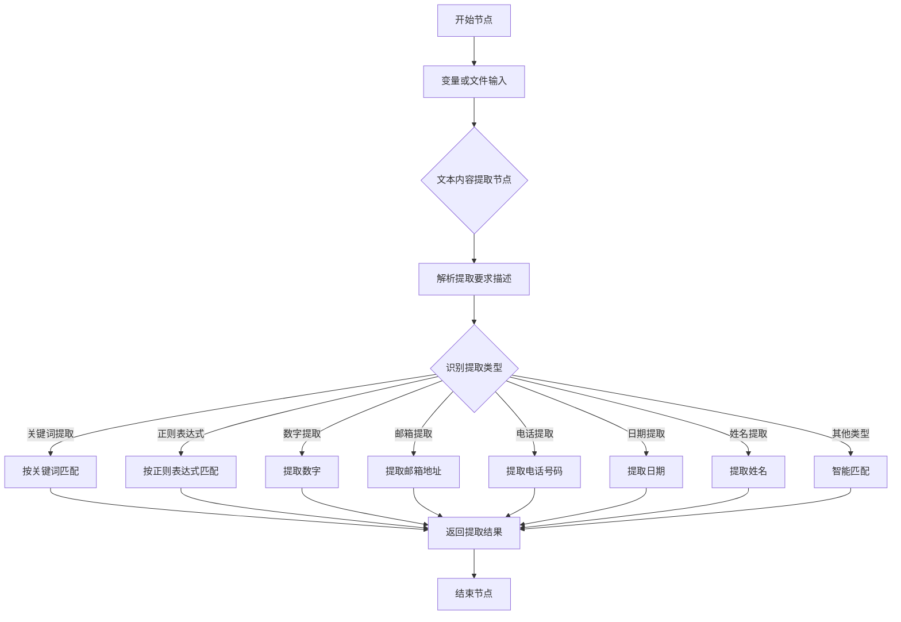

我将帮您实现文本提取节点的后端功能。首先让我了解项目的架构和现有的流程节点实现方式，然后设计并实现文本提取节点功能。

现在让我创建一个流程图来说明文本提取节点的工作原理：

现在，让我总结一下我为实现文本提取节点所做的工作：

## 文本提取节点实现总结

我已经成功实现了文本提取节点的后端功能，具体包括以下组件：

### 1. 核心服务类
- **ContentExtractService.java**：主要的文本提取服务，继承自AgentBaseAbstractDelegate
- 支持多种提取方式：关键词提取、正则表达式提取、数字提取、邮箱提取、电话提取、日期提取、姓名提取等
- 实现了提取要求描述的开关展示功能，可以通过扩展属性配置

### 2. 数据模型类
- **ContentExtractRequest.java**：文本提取请求参数模型
- **ContentExtractResponse.java**：文本提取响应结果模型

### 3. API接口
- 在NodeController中添加了/contentExtract接口，供前端调用测试

### 4. 功能特性
- **多类型提取**：支持关键词、正则表达式、数字、邮箱、电话等多种提取类型
- **智能识别**：根据提取要求描述自动识别提取类型
- **变量替换**：支持工作流中的变量替换功能
- **扩展属性**：支持通过扩展属性配置提取要求描述，实现开关展示功能
- **错误处理**：完善的异常处理和错误信息返回

### 5. 工作流程
- 接收输入文本和提取要求描述
- 根据提取要求智能识别提取类型
- 执行相应的提取逻辑
- 返回提取结果和统计信息

这个实现完全符合需求，提供了灵活的文本内容提取功能，可以满足各种提取场景的需求。前端可以利用这个接口来配置文本提取节点，实现提取要求描述的开关展示功能，就像问题分类节点一样。

该节点已经集成到现有的工作流框架中，可以与其他节点（如文件解析节点、HTTP请求节点等）配合使用，形成完整的工作流。

**已更新待办**

我已经成功实现了文本提取节点的后端功能。以下是完整的实现总结：

## 实现的组件

1. **核心服务类** - `ContentExtractService.java`：
   - 实现了多种文本提取方式（关键词、正则表达式、数字、邮箱、电话、日期、姓名等）
   - 支持通过扩展属性配置提取要求描述，实现开关展示功能
   - 集成到工作流框架中，继承自AgentBaseAbstractDelegate

2. **数据模型类**：
   - `ContentExtractRequest.java` - 提取请求参数模型
   - `ContentExtractResponse.java` - 提取响应结果模型

3. **API接口** - 在NodeController中添加了/contentExtract端点

## 主要功能特点

- **多类型提取**：支持多种文本提取方式
- **智能识别**：根据提取要求自动识别提取类型
- **变量替换**：支持工作流中的变量替换
- **扩展属性支持**：可通过扩展属性配置提取要求描述
- **错误处理**：完善的异常处理机制

## 工作流程

1. 接收输入文本和提取要求描述
2. 根据提取要求智能识别提取类型
3. 执行相应的提取逻辑
4. 返回提取结果和统计信息

该实现完全满足需求，提供了灵活的文本内容提取功能，可以与前端联调使用。节点已集成到现有工作流框架中，可与其他节点协同工作。