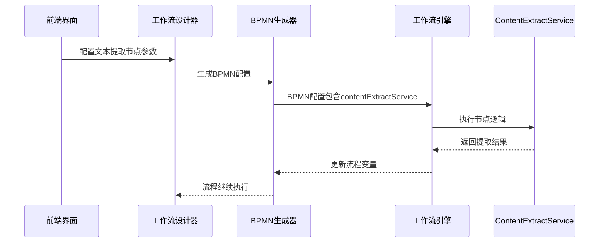

我来为您详细列出需要提供给前端同事的所有内容，让他们能够顺利实现文本提取节点的前端功能。

## 需要提供给前端的内容清单

### 1. 后端服务标识
- **服务名称**: [contentExtractService](file://F:\Code\nlp-agent\agent-worker\src\main\java\com\yundingtech\agent\work\modules\workflow\controller\NodeController.java#L38-L39)
- **完整类名**: [com.yundingtech.agent.work.modules.workflow.delegate.ContentExtractService](file://F:\Code\nlp-agent\agent-worker\src\main\java\com\yundingtech\agent\work\modules\workflow\delegate\ContentExtractService.java#L26-L465)
- **Spring Bean ID**: [contentExtractService](file://F:\Code\nlp-agent\agent-worker\src\main\java\com\yundingtech\agent\work\modules\workflow\controller\NodeController.java#L38-L39)

### 2. 节点输入参数配置
```xml
<!-- BPMN配置示例 -->
<serviceTask id="textExtractNode" name="文本提取节点">
  <extensionElements>
    <camunda:delegateExpression>${contentExtractService}</camunda:delegateExpression>
    <camunda:inputOutput>
      <camunda:inputParameter name="inputText">${inputTextVariable}</camunda:inputParameter>
      <camunda:inputParameter name="extractionRequirement">${extractionRequirementVariable}</camunda:inputParameter>
    </camunda:inputOutput>
  </extensionElements>
</serviceTask>
```


### 3. 参数详细说明

#### 必需输入参数：
- **inputText** (String): 待提取的输入文本内容
- **extractionRequirement** (String): 提取要求描述（如"提取所有邮箱地址"、"提取关键词'重要信息'"等）

#### 可选扩展参数：
- 通过扩展属性（extProperties）可以配置更复杂的提取逻辑

### 4. 输出参数说明
- **contentExtractResult**: 完整的提取结果对象（ContentExtractResponse类型）
- **extractedContent**: 提取到的内容字符串
- **NODE_OUTPUT**: 节点输出变量名

### 5. 节点配置界面建议
```mermaid
graph TD
    A[文本提取节点配置面板] --> B[输入文本配置区域]
    A --> C[提取要求描述配置区域]
    A --> D[提取类型选择下拉框]
    A --> E[预览提取结果区域]
    
    B --> B1[支持变量引用<br/>${variableName}]
    C --> C1[智能提示<br/>如：关键词提取、正则表达式、邮箱提取等]
    D --> D1[关键词提取<br/>正则表达式<br/>数字提取<br/>邮箱提取<br/>电话提取<br/>日期提取<br/>姓名提取]
    E --> E1[实时预览提取效果]
```


### 6. 前端需要实现的功能点

#### 节点类型定义：
```javascript
// 节点类型配置示例
const textExtractNode = {
  type: 'textExtract',
  name: '文本内容提取',
  service: 'contentExtractService',
  icon: 'text-extract-icon',
  inputs: [
    { name: 'inputText', type: 'text', required: true, description: '输入文本' },
    { name: 'extractionRequirement', type: 'textarea', required: true, description: '提取要求描述' }
  ],
  outputs: [
    { name: 'contentExtractResult', type: 'object', description: '提取结果' },
    { name: 'extractedContent', type: 'text', description: '提取的内容' }
  ]
};
```


#### 配置界面功能：
- 文本输入框（支持变量引用）
- 提取要求描述输入框（支持智能提示）
- 提取类型选择（可选，帮助用户快速配置）
- 实时预览功能（可选）

### 7. 节点交互流程



### 8. 特殊功能说明

#### 开关展示功能：
- 提取要求描述支持动态配置，可通过扩展属性实现开关展示功能
- 类似问题分类节点的实现方式

#### 变量支持：
- 输入参数支持工作流变量引用（如`${variableName}`）
- 变量会在运行时被自动替换为实际值

### 9. API接口（供前端测试用）
- **接口地址**: `/api/v1/node/contentExtract`
- **请求方式**: POST
- **请求体**: ContentExtractRequest对象
- **返回**: ContentExtractResponse对象

### 10. 错误处理说明
- 输入文本为空时返回错误
- 提取要求描述为空时返回错误
- 提取过程中发生异常时返回错误信息

有了这些信息，前端同事就可以实现文本提取节点的完整功能，包括节点配置界面、参数传递、BPMN生成等。后端的实现已经完成并准备好集成。