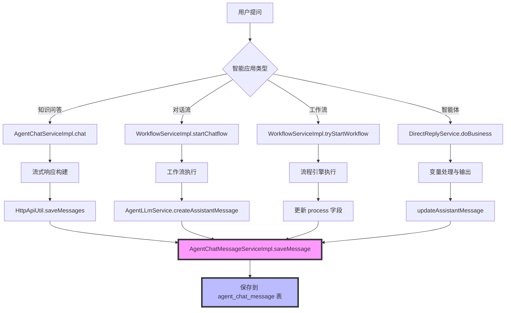

## 四类智能应用大模型回复内容存储机制分析

---

### **一、核心存储表：agent_chat_message**

**所有类型智能应用的大模型回复都统一存储在这张表中！**

#### **表结构关键字段**
**文件**: [AgentChatMessageEntity.java](file://D:\工作资料\code\仓颉智能体\nlp-agent\agent-builder\agent-build-core\src\main\java\com\yundingtech\agent\build\modules\chatapplication\entity\AgentChatMessageEntity.java)

```java
@Data
@TableName("agent_chat_message")
public class AgentChatMessageEntity extends BaseEntity {
    @TableId
    private String id;                      // 主键 ID
    
    private String appId;                   // 应用 ID
    private String sessionId;               // 会话 ID
    private String role;                    // 角色 (user/assistant)
    private String content;                 // ⭐ 大模型回复内容（正文）
    private String thinkingContent;         // ⭐ 深度思考内容
    private Double thinkingTime;            // 思考时长（秒）
    private String status;                  // 消息状态 (FINISHED/STOP)
    private String bizType;                 // ⭐ 业务类型 (chat/workflow/dialog)
    private String parentId;                // 上个消息 ID
    private String isAvailable;             // 是否可用
    private Integer promptTokens;           // 输入 token 数
    private Integer totalTokens;            // 总 token 数
    private Integer completionTokens;       // 输出 token 数
    private String configReferences;        // 引用信息 (JSON)
    private String repos;                   // 检索知识库 ID
    private String process;                 // 执行过程 (JSON)
}
```


---

### **二、四类智能应用的存储实现**

#### **1️⃣ 知识问答 (Knowledge QA)**

**核心类**: [AgentChatServiceImpl.java](file://D:\工作资料\code\仓颉智能体\nlp-agent\agent-builder\agent-build-core\src\main\java\com\yundingtech\agent\build\modules\agent\service\impl\AgentChatServiceImpl.java)

**存储流程**:
```java
// 1. 流式响应构建
Flux<String> stringFlux = chatStrategy.chatWithStream(modelParamDto);
return stringFlux
    .concatMap(response -> 
        Mono.just(ragChatManagerV1.buildStreamingResponse(response, chatProcessingContext))
    )
    .publishOn(Schedulers.boundedElastic())
    .doFinally(out -> {
        // ⭐ 最终保存到数据库
        httpApiUtil.saveMessages(chatProcessingContext, userInfo);
    });
```


**保存方法**: [HttpApiUtil.saveMessages()](file://D:\工作资料\code\仓颉智能体\nlp-agent\agent-builder\agent-build-core\src\main\java\com\yundingtech\agent\build\modules\chatapplication\utils\HttpApiUtil.java#L106-L125)
```java
// 存储此轮会话语句
agentChatMessageService.saveMessage(chatContext, userInfo);
```


**关键数据**:
- `bizType = "chat"` (知识问答类型)
- `role = "assistant"` (机器人回复)
- `content` = 大模型完整回复内容
- `thinkingContent` = 思考过程内容

---

#### **2️⃣ 对话流 (Dialog Flow)**

**核心类**: [WorkflowServiceImpl.startChatflow()](file://D:\工作资料\code\仓颉智能体\nlp-agent\agent-worker\src\main\java\com\yundingtech\agent\work\modules\workflow\service\impl\WorkflowServiceImpl.java#L440-L610)

**存储流程**:
```java
// 1. 创建用户消息
AgentChatMessageEntity messageEntity = createMessage(
    appId, sessionId, userMessageContent, "chatflow", "user", "1", "0", refrence
);

// 2. 工作流执行过程中，由 AgentLLmService 创建 assistant 消息
AgentLLmService.getHistoryList() // 获取历史消息
AgentLLmService.createAssistantMessage() // 创建大模型回复

// 3. 工作流结束后更新消息状态
LambdaQueryWrapper<AgentChatMessageEntity> queryWrapper = new LambdaQueryWrapper<>();
queryWrapper.eq(AgentChatMessageEntity::getParentId, finalWorkflowId);
queryWrapper.eq(AgentChatMessageEntity::getIsAvailable, "1");
queryWrapper.eq(AgentChatMessageEntity::getRole, "assistant");
List<AgentChatMessageEntity> assistantMessageEntitys = agentChatMessageMapper.selectList(queryWrapper);

// 更新执行过程和状态
assistantMessageEntity.setProcess(JSON.toJSONString(logicTrackVOList));
assistantMessageEntity.setStatus("COMPLETED");
agentChatMessageMapper.updateById(assistantMessageEntity);
```


**关键数据**:
- `bizType = "chatflow"` (对话流类型)
- `process` = 工作流执行轨迹 (JSON)
- `configReferences` = 节点配置引用

---

#### **3️⃣ 工作流 (Workflow)**

**核心类**: [WorkflowServiceImpl.tryStartWorkflow()](file://D:\工作资料\code\仓颉智能体\nlp-agent\agent-worker\src\main\java\com\yundingtech\agent\work\modules\workflow\service\impl\WorkflowServiceImpl.java#L279-L343)

**存储流程**:
```java
// 1. 准备工作流消息
AgentChatMessageEntity messageEntity = prepareAgentChatMsg(startRequest, appId);
String businessKey = messageEntity.getId();

// 2. 流程执行完成后保存结果
sendProcessResult(taskResponse, messageEntity.getId(), endTime - startTime, emitter, false);

// 3. 更新消息表
AgentLogicTrackProcVO logicTrackVOList = getProcessTrack(taskResponse.getProcInstId());
if (exceptionMap.containsKey(businessKey)) {
    logicTrackVOList.setProcState("error");
}

// 查询并更新 assistant 消息
LambdaQueryWrapper<AgentChatMessageEntity> queryWrapper = new LambdaQueryWrapper<>();
queryWrapper.eq(AgentChatMessageEntity::getParentId, finalWorkflowId);
queryWrapper.eq(AgentChatMessageEntity::getRole, "assistant");
AssistantMessageEntity.setProcess(JSON.toJSONString(logicTrackVOList));
agentChatMessageMapper.updateById(assistantMessageEntity);
```


**关键数据**:
- `bizType = "workflow"` (工作流类型)
- `process` = 完整的工作流执行轨迹
- `status` = "COMPLETED" 或 "error"

---

#### **4️⃣ 智能体 (Agent)**

**核心类**: [DirectReplyService.doBusiness()](file://D:\工作资料\code\仓颉智能体\nlp-agent\agent-worker\src\main\java\com\yundingtech\agent\work\modules\workflow\service\delegate\DirectReplyService.java#L235-L341)

**存储流程**:
```java
// 1. 创建 assistant 消息
AgentChatMessageEntity agentChatMessageEntity = createAssistantMessage(
    appId, sessionId, input_reply, "", workflowId
);

// 2. 处理变量替换和流式输出
handleVariables(input_reply, businessKey, sessionId, contentBuilder, thinkBuilder, 
                agentChatMessageEntity, delegateExecution, workflowId);

// 3. 更新最终回复内容
String finalContent = appendStr.toString() + llmContent;
updateAssistantMessage(
    messageId, finalContent, thinkBuilder.toString(), 
    JsonUtil.getObjectToString(processTrack), 999, duration
);

// 4. 保存变量执行记录
BpmProcVariableEntity bpmProcVariableEntity = BpmProcVariableEntity.builder()
    .varName("output")
    .varValue(evaluate.toString())
    .build();
bpmProcVariableService.saveNewTx(bpmProcVariableEntities);
```


**关键数据**:
- `bizType` 根据智能体类型确定
- `content` = 大模型最终回复
- `thinkingContent` = 思考内容
- `process` = 执行过程跟踪

---

### **三、统一保存入口：AgentChatMessageServiceImpl.saveMessage()**

**文件**: [AgentChatMessageServiceImpl.java#L290-L324](file://D:\工作资料\code\仓颉智能体\nlp-agent\agent-builder\agent-build-core\src\main\java\com\yundingtech\agent\build\modules\chatapplication\service\impl\AgentChatMessageServiceImpl.java#L290-L324)

```java
@Override
@Transactional
public void saveMessage(ChatProcessingContextV1 chatContext, UserInfo userInfo) {
    AgentChatMessageEntity agentChatMessageEntity = new AgentChatMessageEntity();
    
    // 基础信息
    agentChatMessageEntity.setCreateUserId(userInfo.getUserId());
    agentChatMessageEntity.setCreateOrgId(userInfo.getOrganizeId());
    agentChatMessageEntity.setId(chatContext.getMessageId());
    agentChatMessageEntity.setAppId(chatContext.getAppId());
    agentChatMessageEntity.setSessionId(chatContext.getSessionId());
    
    // 角色和内容
    agentChatMessageEntity.setRole(ASSISTANT);  // assistant
    agentChatMessageEntity.setContent(handleThinkLabel(chatContext.getContent().toString()));
    agentChatMessageEntity.setThinkingContent(handleThinkLabel(chatContext.getReasoningContent().toString()));
    
    // 状态信息
    agentChatMessageEntity.setThinkingEnabled("1");
    agentChatMessageEntity.setThinkingTime(chatContext.getThinkDuration().doubleValue());
    agentChatMessageEntity.setStatus(chatContext.getStatus());
    agentChatMessageEntity.setBizType(chatContext.getBizType() == null ? "chat" : chatContext.getBizType());
    
    // Token 统计
    agentChatMessageEntity.setPromptTokens(chatContext.getPromptTokens().get());
    agentChatMessageEntity.setTotalTokens(chatContext.getTotalTokens().get());
    agentChatMessageEntity.setCompletionTokens(chatContext.getCompletionTokens().get());
    
    // 引用和文件
    agentChatMessageEntity.setConfigReferences(chatContext.getConfigReferencesJson());
    agentChatMessageEntity.setRepos(objectMapper.writeValueAsString(chatContext.getRepos()));
    agentChatMessageEntity.setTempFiles(chatContext.getTempFiles());
    
    // 保存或更新
    this.saveOrUpdate(agentChatMessageEntity);
}
```


---

### **四、数据流转全景图**




---

### **五、关键要点总结**

| 维度         | 知识问答                 | 对话流              | 工作流              | 智能体             |
| ------------ | ------------------------ | ------------------- | ------------------- | ------------------ |
| **bizType**  | `chat`                   | `chatflow`          | `workflow`          | 根据类型           |
| **创建时机** | 流式完成后               | 工作流启动时        | 流程实例创建        | 节点执行时         |
| **更新时机** | 一次性保存               | 流程结束后更新      | 流程结束后更新      | 节点执行中更新     |
| **核心字段** | content                  | process             | process             | content+process    |
| **保存入口** | HttpApiUtil.saveMessages | WorkflowServiceImpl | WorkflowServiceImpl | DirectReplyService |

---

### **六、SQL 查询示例**

#### **查询某应用的所有大模型回复**
```sql
SELECT 
    id, 
    session_id, 
    content, 
    thinking_content, 
    biz_type,
    create_time
FROM agent_chat_message
WHERE app_id = '应用 ID'
  AND role = 'assistant'
  AND delete_flag = '0'
  AND is_available = '1'
ORDER BY create_time DESC;
```


#### **按类型统计回复数量**
```sql
SELECT 
    biz_type,
    COUNT(*) as count,
    SUM(total_tokens) as total_tokens
FROM agent_chat_message
WHERE role = 'assistant'
GROUP BY biz_type;
```


---

**✅ 核心结论**：
1. **统一存储**: 所有类型的大模型回复都存储在 `agent_chat_message` 表
2. **字段区分**: 通过 `bizType` 字段区分智能应用类型
3. **保存时机**: 知识问答在流式完成后保存，其他类型在工作流/流程执行中或执行后保存
4. **内容完整**: 包含正文 (`content`)、思考内容 (`thinkingContent`)、执行过程 (`process`) 等完整信息

