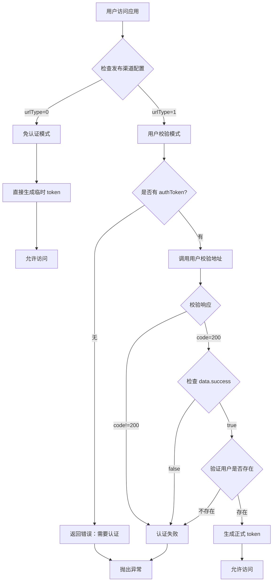
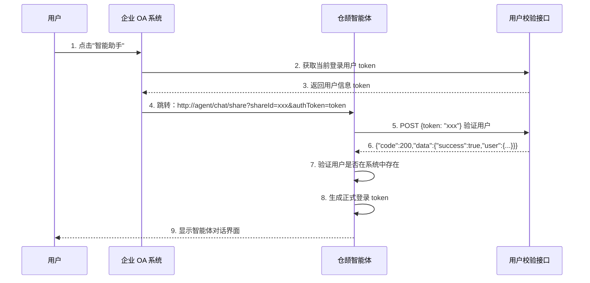

深度思考
```用户需要了解发布渠道中用户校验 URL 的功能，我需要先搜索相关的代码实现来梳理完整的功能流程。
```
我来详细梳理"发布渠道"中的"用户校验 URL"功能。让我先查看相关的服务实现代码。


**已检索仓库** *IAgentAppAssembleService AgentAppAssembleServiceImpl* 2 个结果


现在让我查看相关的模型类和认证登录服务:


**已检索文件** *`**/AgentAppAssembleEntity.java`* 1 个结果

**已检索文件** *`**/IAuthLoginService.java`* 1 个结果

**已查看文件** *AgentAppAssembleEntity.java*

**已查看文件** *IAuthLoginService.java*


现在让我查看前端的调用逻辑，搜索相关的 API 调用:


**已检索代码** *authLogin|用户校验|authorizationUri* 0 个结果


让我查看数据库表结构相关的 mapper:


**已检索文件** *`**/AgentAppAssembleMapper.java`* 1 个结果

**已查看文件** *AgentAppAssembleMapper.java*


现在让我查看 FO 和 VO 相关的模型类:


**已检索文件** *`**/AgentAppAssembleFO.java`* 1 个结果

**已检索文件** *`**/AgentAppAssembleVO.java`* 1 个结果

**已查看文件** *AgentAppAssembleFO.java*

**已查看文件** *AgentAppAssembleVO.java*


现在我已经完全理解了这个功能。让我为你整理详细的功能说明文档:

---

# 📋 发布渠道 - 用户校验 URL 功能详解

## 一、功能概述

**发布渠道**是仓颉智能体平台提供的应用对外发布和访问的授权管理机制。它支持三种访问模式:

1. **免认证 URL** - 无需用户认证即可访问 (仅适用于使用公开知识库的应用)
2. **用户校验 URL** ✅ - 通过身份校验服务器进行认证后访问 (**本次重点**)
3. **后端服务 API** - 通过 API Key 进行鉴权后获取应用相关信息

---

## 二、用户校验 URL 功能详解

### 2.1 核心概念

**用户校验 URL** 是一种**需要外部身份认证系统配合**的访问授权方式。当用户尝试通过该渠道访问智能体应用时，系统会调用配置的"用户校验地址"来验证用户身份，只有认证通过的用户才能访问应用。

### 2.2 应用场景

适用于以下场景:
- ✅ 企业内部系统已有统一身份认证 (OA、SSO、LDAP 等)
- ✅ 需要将智能体应用嵌入到第三方系统
- ✅ 要求访问用户必须是已注册用户
- ✅ 需要记录访问者的真实身份信息

---

## 三、数据库设计

### 3.1 核心表：`agent_app_assemble`

```sql
CREATE TABLE agent_app_assemble (
    id                  VARCHAR(64) PRIMARY KEY,      -- 主键 ID
    app_id              VARCHAR(64),                   -- 应用 ID
    url_type            VARCHAR(1),                    -- URL 类型：0=免认证，1=用户校验
    url_name            VARCHAR(255),                  -- URL 名称
    share_id            VARCHAR(64),                   -- 分享 ID(用于访问标识)
    authorization_uri   VARCHAR(500),                  -- 【核心】用户校验地址
    expiry_time         TIMESTAMP,                     -- 过期时间
    last_use_time       TIMESTAMP,                     -- 最后使用时间
    status              VARCHAR(1),                    -- 状态：0=停用，1=启用
    channel             VARCHAR(50),                   -- 发布渠道：web/微信/飞书
    limit_config        TEXT,                          -- 配置与限额 (JSON)
    extra_config        TEXT,                          -- 额外配置 (JSON)
    show_history        VARCHAR(1),                    -- 是否显示历史会话
    create_user_id      VARCHAR(64),                   -- 创建人 ID
    create_time         TIMESTAMP,                     -- 创建时间
    update_user_id      VARCHAR(64),                   -- 更新人 ID
    update_time         TIMESTAMP,                     -- 更新时间
    delete_flag         INTEGER                        -- 删除标志
);
```


### 3.2 关键字段说明

| 字段名              | 类型         | 说明             | 示例值                                                   |
| ------------------- | ------------ | ---------------- | -------------------------------------------------------- |
| `url_type`          | VARCHAR(1)   | 区分认证方式     | `0`=免认证，`1`=用户校验                                 |
| `authorization_uri` | VARCHAR(500) | **用户校验地址** | `http://localhost:7003/api/workflow/external/user/check` |
| `share_id`          | VARCHAR(64)  | 分享标识         | 与 `id` 相同，用于 URL 参数传递                          |
| `status`            | VARCHAR(1)   | 启用状态         | `0`=停用，`1`=启用                                       |
| `expiry_time`       | TIMESTAMP    | 过期时间         | `NULL`=无限制                                            |

---

## 四、核心实现逻辑

### 4.1 认证流程图




### 4.2 核心代码分析

#### **入口：`AgentAppAssembleController.authLogin()`**

```java
@GetMapping("/authLogin")
@Operation(summary = "免认证/认证登录")
public CommonResult<AgentAppAssembleAuthVO> authLogin(
    @RequestParam String shareId,           // 分享 ID
    @RequestParam(required = false) String authToken  // 认证 token(用户校验模式需要)
) {
    AgentAppAssembleAuthVO agentAppAssembleAuthVO = agentAppAssembleService.authLogin(shareId, authToken);
    return CommonResult.success(agentAppAssembleAuthVO);
}
```


#### **核心实现：`AgentAppAssembleServiceImpl.authLogin()`**

**步骤 1: 校验发布渠道信息** (第 240-255 行)
```java
// 根据 shareId 查询发布渠道配置
AgentAppAssembleEntity agentAppAssembleEntity = this.getOne(
    new QueryWrapper<AgentAppAssembleEntity>().lambda()
        .eq(AgentAppAssembleEntity::getShareId, shareId)
        .eq(AgentAppAssembleEntity::getDeleteFlag, ZERO)
);

// 校验 1: 渠道是否存在
if (ObjectUtils.isEmpty(agentAppAssembleEntity)) {
    throw new BusinessException(AppBaseConstants.APPBaseExceptionEnum.ASSEMBLE_SHARE_ID_ERROR);
}

// 校验 2: 应用是否已发布
if (ZERO.equals(agentAppBaseVO.getStatus())) {
    throw new BusinessException(AppBaseConstants.APPBaseExceptionEnum.APP_NOT_PUBLISH_VISIT);
}

// 校验 3: 是否过期
if (!ObjectUtils.isEmpty(agentAppAssembleEntity.getExpiryTime()) 
    && agentAppAssembleEntity.getExpiryTime().toLocalDate().isBefore(LocalDate.now())) {
    throw new BusinessException(AppBaseConstants.APPBaseExceptionEnum.ASSEMBLE_TIME_IS_EXPIRY);
}

// 校验 4: 是否停用
if (ZERO.equals(agentAppAssembleEntity.getStatus())) {
    throw new BusinessException(AppBaseConstants.APPBaseExceptionEnum.ASSEMBLE_STATUS_IS_STOP);
}
```


**步骤 2: 根据 urlType 选择认证方式** (第 276-344 行)

```java
// 免认证登录 (urlType = 0)
if (ZERO.equals(agentAppAssembleEntity.getUrlType())) {
    // 检查是否有关联知识库 (有知识库则不允许免认证)
    if (hasKnowledgeBase()) {
        throw new BusinessException(APPBaseExceptionEnum.ASSEMBLE_KNOWLEDGE_NOT_USE);
    }
    // 生成临时 token
    String token = authLoginService.authLogin(
        ASSEMBLE + shareId + System.currentTimeMillis(), 
        ASSEMBLE + shareId + System.currentTimeMillis()
    );
    agentAppAssembleAuthVO.setToken(token);
}
// 认证登录 (urlType = 1) ⭐ 重点
else {
    // 检查是否配置了用户校验地址
    if (ObjectUtils.isEmpty(agentAppAssembleEntity.getAuthorizationUri())) {
        throw new BusinessException(AppBaseConstants.APPBaseExceptionEnum.ASSEMBLE_USER_CHECK_ADDRESS);
    }
    
    // 检查是否有 authToken
    if (ObjectUtils.isEmpty(authToken)) {
        throw new BusinessException(AppBaseConstants.APPBaseExceptionEnum.ASSEMBLE_AUTH_LOGIN_TOKEN);
    }
    
    // 调用用户校验地址
    String url = agentAppAssembleEntity.getAuthorizationUri();
    Map<String, String> param = new HashMap<>();
    param.put(TOKEN, authToken);
    
    try {
        // 发送 POST 请求到用户校验地址
        HttpResponse response = HttpRequest.post(url)
            .body(toJsonStr(param), "application/json")
            .execute();
        
        // 校验响应
        if (ObjectUtils.isEmpty(response) || ObjectUtils.isEmpty(response.body())) {
            throw new BusinessException(AppBaseConstants.APPBaseExceptionEnum.ASSEMBLE_AUTH_USER_FAIL);
        }
        
        // 解析响应：{"code": 200, "data": {"success": true, "user": {...}}}
        if (parseObj(response.body()).getInt("code") == 200) {
            Map resultMap = parseObj(parseObj(response.body()).get(DATA));
            
            if (Boolean.parseBoolean(resultMap.get(SUCCESS).toString())) {
                // 认证成功，获取用户信息
                SysUserAPIModel sysUserAPIModel = JSONUtil.parseObj(
                    resultMap.get(USER)
                ).toBean(SysUserAPIModel.class);
                
                // 验证用户是否在系统中存在
                CommonResult<List<SysUserAPIModel>> byUserName = sysUserAPI.getByUserName(
                    sysUserAPIModel.getUsername()
                );
                
                if (byUserName.getCode() != 200 || byUserName.getData().isEmpty()) {
                    throw new BusinessException(AppBaseConstants.APPBaseExceptionEnum.ASSEMBLE_AUTH_USER_FAIL);
                }
                
                // 设置为实际 ID
                sysUserAPIModel.setId(isPresent.get().getId());
                
                // 生成正式 token
                String token = authLoginService.authLogin(
                    sysUserAPIModel.getId(), 
                    sysUserAPIModel.getUsername()
                );
                agentAppAssembleAuthVO.setToken(token);
            } else {
                throw new BusinessException(AppBaseConstants.APPBaseExceptionEnum.ASSEMBLE_AUTH_USER_FAIL);
            }
        } else {
            throw new BusinessException(AppBaseConstants.APPBaseExceptionEnum.ASSEMBLE_AUTH_USER_FAIL);
        }
    } catch (Exception e) {
        throw new BusinessException(AppBaseConstants.APPBaseExceptionEnum.ASSEMBLE_AUTH_USER_FAIL);
    }
}
```


---

## 五、用户校验接口规范

### 5.1 接口要求

**请求格式:**
```http
POST {authorizationUri}
Content-Type: application/json

{
  "token": "前端传入的认证 token"
}
```


**响应格式:**
```json
{
  "code": 200,              // 必须为 200 表示 HTTP 成功
  "data": {
    "success": true,        // 必须为 true 表示业务成功
    "user": {
      "username": "zhangsan",  // 必须字段：用户名
      "userId": "u123",        // 可选字段：用户 ID
      "realName": "张三"       // 可选字段：真实姓名
    }
  }
}
```


### 5.2 接口实现示例

**示例 1: 简单的用户校验接口**

```java
@RestController
@RequestMapping("/api/workflow/external")
public class ExternalUserCheckController {
    
    @Autowired
    private IUserService userService;
    
    /**
     * 用户校验接口
     * @param paramMap {"token": "用户 token"}
     * @return {"code": 200, "data": {"success": true, "user": {"username": "zhangsan"}}}
     */
    @PostMapping("/user/check")
    public CommonResult<Map<String, Object>> userCheck(@RequestBody Map<String, String> paramMap) {
        String token = paramMap.get("token");
        
        // 1. 验证 token 有效性 (从 Redis 或数据库查询)
        UserInfo userInfo = userService.validateToken(token);
        if (userInfo == null) {
            return CommonResult.error(401, "token 无效或已过期");
        }
        
        // 2. 构建响应
        Map<String, Object> data = new HashMap<>();
        data.put("success", true);
        
        Map<String, String> user = new HashMap<>();
        user.put("username", userInfo.getUsername());
        user.put("userId", userInfo.getUserId());
        user.put("realName", userInfo.getRealName());
        data.put("user", user);
        
        return CommonResult.success(data);
    }
}
```


**示例 2: 对接企业微信 OAuth2**

```java
@PostMapping("/wechat/check")
public CommonResult<Map<String, Object>> wechatCheck(@RequestBody Map<String, String> paramMap) {
    String code = paramMap.get("token");  // 企业微信返回的 code
    
    try {
        // 1. 使用 code 换取用户 access_token
        String accessTokenUrl = "https://graph.qq.com/oauth2.0/token?" +
            "appid=" + wechatAppId +
            "&secret=" + wechatSecret +
            "&code=" + code +
            "&grant_type=authorization_code";
        
        String response = HttpUtil.get(accessTokenUrl);
        Map<String, Object> tokenMap = JSON.parseObject(response, Map.class);
        String accessToken = (String) tokenMap.get("access_token");
        
        // 2. 获取用户信息
        String userInfoUrl = "https://graph.qq.com/user/get_user_info?" +
            "access_token=" + accessToken +
            "&oauth_consumer_key=" + wechatAppId +
            "&openid=" + (String) tokenMap.get("openid");
        
        String userInfoResp = HttpUtil.get(userInfoUrl);
        Map<String, Object> userInfo = JSON.parseObject(userInfoResp, Map.class);
        
        // 3. 构建响应
        Map<String, Object> data = new HashMap<>();
        data.put("success", true);
        
        Map<String, String> user = new HashMap<>();
        user.put("username", (String) userInfo.get("nickname"));
        user.put("userId", (String) userInfo.get("openid"));
        data.put("user", user);
        
        return CommonResult.success(data);
    } catch (Exception e) {
        return CommonResult.error(500, "认证失败：" + e.getMessage());
    }
}
```


---

## 六、使用流程

### 6.1 配置步骤

**步骤 1: 创建发布渠道**

1. 进入智能体应用 → 发布渠道标签页
2. 选择"用户校验 URL"选项
3. 填写信息:
   - **URL 名称**: 自定义名称 (如：企业微信访问入口)
   - **用户校验地址**: 外部认证接口地址 (如：`http://localhost:7003/api/workflow/external/user/check`)
   - **过期时间**: 可选，留空表示永久有效
   - **发布渠道**: 选择 web/微信/飞书等
   - **启用状态**: 勾选启用

**步骤 2: 实现用户校验接口**

根据 5.1 的接口规范，开发外部认证服务

**步骤 3: 测试验证**

使用 Postman 或代码测试完整流程

**步骤 4: 嵌入使用**

将生成的 URL 嵌入到第三方系统

---

### 6.2 访问流程

**场景：将智能体嵌入企业 OA 系统**




---

## 七、API 接口说明

### 7.1 获取发布渠道列表

```http
GET /api/agent_app_assemble/getList
```


**请求参数:**
```json
{
  "appId": "应用 ID",           // 必填
  "urlType": "1",              // 可选，1=用户校验
  "urlName": "名称",           // 可选
  "status": "1"                // 可选，1=启用
}
```


**响应示例:**
```json
{
  "code": 200,
  "data": [
    {
      "id": "123",
      "appId": "app456",
      "urlType": "1",
      "urlName": "企业微信入口",
      "shareId": "123",
      "authorizationUri": "http://localhost:7003/api/workflow/external/user/check",
      "expiryTime": null,
      "status": "1",
      "channel": "web",
      "createTime": "2026-03-26 10:00:00",
      "lastUseTime": "2026-03-26 12:00:00"
    }
  ]
}
```


### 7.2 创建发布渠道

```http
POST /api/agent_app_assemble
```


**请求参数:**
```json
{
  "appId": "app456",
  "urlType": "1",              // 1=用户校验
  "urlName": "企业微信入口",
  "authorizationUri": "http://localhost:7003/api/workflow/external/user/check",
  "status": "1",
  "channel": "web",
  "showHistory": "1"
}
```


### 7.3 修改发布渠道

```http
POST /api/agent_app_assemble/{id}
```


**请求参数:** 同上，可修改部分字段

### 7.4 删除发布渠道

```http
POST /api/agent_app_assemble/delete/{workspaceId}/{id}/{name}
```


**注意:** 启用状态的渠道无法删除

### 7.5 获取详情

```http
GET /api/agent_app_assemble/details/{id}
```


### 7.6 认证登录 ⭐核心

```http
GET /api/agent_app_assemble/authLogin?shareId={shareId}&authToken={authToken}
```


**请求参数:**
- `shareId`: 发布渠道的 shareId(与 id 相同)
- `authToken`: 外部认证系统返回的用户 token(用户校验模式需要)

**响应示例:**
```json
{
  "code": 200,
  "data": {
    "token": "JWT 登录 token",
    "agentAppBaseVO": {
      "id": "app456",
      "appName": "智能客服",
      "appType": "1",
      "status": "1"
    },
    "agentAppAssembleVO": {
      "id": "123",
      "urlName": "企业微信入口",
      "authorizationUri": "http://localhost:7003/api/workflow/external/user/check"
    }
  }
}
```


---

## 八、常见问题

### Q1: 用户校验 URL 和免认证 URL 有什么区别？

| 对比项         | 免认证 URL         | 用户校验 URL                 |
| -------------- | ------------------ | ---------------------------- |
| **认证方式**   | 无需认证，直接访问 | 需要调用外部接口验证用户身份 |
| **适用场景**   | 公开知识库、FAQ    | 企业内部系统、需要身份识别   |
| **安全性**     | 低                 | 高                           |
| **配置复杂度** | 简单               | 需要开发外部认证接口         |
| **用户追溯**   | 无法获取真实用户   | 可以获取真实用户信息         |

### Q2: 用户校验地址必须返回什么格式？

必须严格按照以下格式:
```json
{
  "code": 200,              // HTTP 状态码，必须为 200
  "data": {
    "success": true,        // 业务成功标志，必须为 true
    "user": {
      "username": "zhangsan"  // 用户名字段，必须存在
    }
  }
}
```


### Q3: 用户必须在仓颉系统中存在吗？

**是的!** 即使外部认证通过，系统还会调用 `sysUserAPI.getByUserName()` 验证用户是否在仓颉系统中存在。如果不存在，会抛出 `ASSEMBLE_AUTH_USER_FAIL` 异常。

**解决方案:**
- 方案 1: 提前在仓颉系统中同步用户数据
- 方案 2: 在用户校验接口中自动创建用户 (如果不存在)

### Q4: 如何更新 `last_use_time` 字段？

目前代码中**没有自动更新**最后使用时间。需要在认证成功后手动调用:

```java
// 在 AgentAppAssembleServiceImpl.authLogin() 成功后添加
agentAppAssembleEntity.setLastUseTime(LocalDateTime.now());
this.updateById(agentAppAssembleEntity);
```


### Q5: 支持哪些发布渠道？

目前支持:
- `web` - Web 窗口
- `WeChat` - 微信
- `feishu` - 飞书

通过 `channel` 字段区分，但实际功能上没有差异，仅用于标识。

---

## 九、最佳实践

### 9.1 安全建议

1. ✅ **用户校验地址使用 HTTPS**
   ```
   https://example.com/api/auth/check
   ```


2. ✅ **添加请求来源验证**
   ```java
   // 在用户校验接口中验证 referer
   String referer = request.getHeader("referer");
   if (!referer.startsWith("http://agent")) {
       return CommonResult.error(403, "非法请求");
   }
   ```


3. ✅ **设置合理的过期时间**
   ```java
   // 建议设置 30 天或 90 天过期
   agentAppAssembleEntity.setExpiryTime(
       LocalDateTime.now().plusDays(90)
   );
   ```


4. ✅ **启用状态控制**
   - 暂时不用的渠道及时停用 (`status=0`)
   - 离职员工相关的渠道及时删除

### 9.2 性能优化

1. ✅ **缓存用户校验结果**
   ```java
   // 使用 Redis 缓存 token 验证结果，5 分钟有效期
   String cacheKey = "auth_token:" + token;
   UserInfo userInfo = redisTemplate.get(cacheKey);
   if (userInfo == null) {
       userInfo = userService.validateToken(token);
       redisTemplate.set(cacheKey, userInfo, 300);
   }
   ```


2. ✅ **批量查询用户信息**
   ```java
   // 避免在循环中调用 sysUserAPI.getByUserName()
   List<String> usernames = ...;
   List<SysUserAPIModel> users = sysUserAPI.getByUsernames(usernames);
   ```


### 9.3 监控告警

建议添加以下监控:
- 认证失败次数告警 (超过阈值通知管理员)
- 渠道使用频率监控 (异常访问检测)
- token 有效期监控 (即将过期提醒)

---

## 十、完整示例

### 10.1 对接企业微信示例

**步骤 1: 实现用户校验接口**

```java
@RestController
@RequestMapping("/api/auth")
public class WechatAuthController {
    
    @Value("${wechat.appId}")
    private String appId;
    
    @Value("${wechat.secret}")
    private String secret;
    
    @PostMapping("/wechat/check")
    public CommonResult<Map<String, Object>> wechatCheck(
        @RequestBody Map<String, String> paramMap,
        HttpServletRequest request
    ) {
        String code = paramMap.get("token");
        
        try {
            // 1. 使用 code 换取 access_token
            String accessToken = getWechatAccessToken(code);
            
            // 2. 获取用户 openid
            String openid = getWechatOpenid(accessToken);
            
            // 3. 获取用户信息
            WechatUserInfo wechatUser = getWechatUserInfo(accessToken, openid);
            
            // 4. 在系统中查询或创建用户
            SysUserEntity user = userService.findByWechatOpenid(openid);
            if (user == null) {
                // 自动创建用户
                user = new SysUserEntity();
                user.setUsername("wechat_" + openid);
                user.setNickname(wechatUser.getNickname());
                user.setWechatOpenid(openid);
                userService.save(user);
            }
            
            // 5. 构建响应
            Map<String, Object> data = new HashMap<>();
            data.put("success", true);
            
            Map<String, String> userInfo = new HashMap<>();
            userInfo.put("username", user.getUsername());
            userInfo.put("userId", user.getId());
            userInfo.put("realName", user.getNickname());
            data.put("user", userInfo);
            
            return CommonResult.success(data);
            
        } catch (Exception e) {
            log.error("企业微信认证失败", e);
            return CommonResult.error(500, "认证失败：" + e.getMessage());
        }
    }
    
    private String getWechatAccessToken(String code) throws Exception {
        String url = "https://graph.qq.com/oauth2.0/token?" +
            "appid=" + appId +
            "&secret=" + secret +
            "&code=" + code +
            "&grant_type=authorization_code";
        String response = HttpUtil.get(url);
        // 解析 response 获取 access_token
        return parseAccessToken(response);
    }
    
    // ... 其他方法省略
}
```


**步骤 2: 配置发布渠道**

```json
{
  "appId": "app456",
  "urlType": "1",
  "urlName": "企业微信访问入口",
  "authorizationUri": "http://localhost:7003/api/auth/wechat/check",
  "status": "1",
  "channel": "WeChat",
  "expiryTime": "2026-06-26 00:00:00"
}
```


**步骤 3: 前端跳转**

```javascript
// 企业微信中点击"智能助手"
function gotoAgent() {
  // 1. 获取企业微信 code
  wx.config({
    appId: 'wx123',
    // ... 其他配置
  });
  
  wx.ready(function() {
    wx.agentConfig({
      corpid: 'corpid123',
      agentid: 1000001,
      success: function(res) {
        // 2. 获取用户身份
        wx.getUserAgentId({
          success: function(res) {
            const code = res.userAgentId;
            
            // 3. 跳转到智能体
            const shareId = '123';  // 发布渠道的 shareId
            const redirectUrl = encodeURIComponent(
              `http://agent/chat/share?shareId=${shareId}&authToken=${code}`
            );
            
            // 4. 在企业微信中打开
            window.location.href = redirectUrl;
          }
        });
      }
    });
  });
}
```


---

## 十一、总结

### 核心要点

1. **用户校验 URL** 是一种需要外部认证系统配合的授权访问方式
2. **必须实现符合规范的用户校验接口** (返回格式固定)
3. **用户必须在仓颉系统中存在**，否则会认证失败
4. **支持多种发布渠道** (web/微信/飞书)，但配置方式相同
5. **提供完整的访问控制和审计能力** (可追溯真实用户)

### 适用场景

✅ 企业内