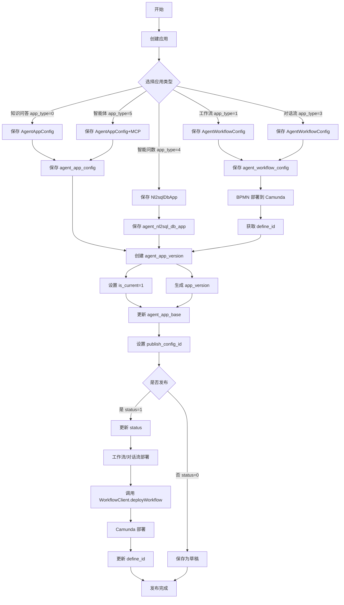

# 9. 应用创建与发布流程

## 一、核心流程图




---

## 二、核心数据表

### **1. agent_app_base** (应用基础表)

| 字段              | 类型        | 说明                                                         |
| ----------------- | ----------- | ------------------------------------------------------------ |
| id                | varchar(32) | 应用 ID（主键）                                              |
| app_name          | varchar     | 应用名称                                                     |
| app_type          | varchar     | 应用类型：0=知识问答，1=工作流，3=对话流，4=智能问数，5=智能体，9=文件夹 |
| icon              | varchar     | 图标                                                         |
| remark            | varchar     | 备注                                                         |
| is_public         | varchar     | 是否公开：1=是，0=否（仅智能体支持）                         |
| status            | varchar     | 状态：0=未发布，1=已发布                                     |
| latest_version    | varchar     | 最新版本号（更新不及时，建议用 publish_config_id）           |
| workspace_id      | varchar(32) | 工作空间 ID                                                  |
| parent_id         | varchar(32) | 父级 ID（文件夹 ID）                                         |
| order_no          | varchar     | 排序号                                                       |
| delete_flag       | int         | 删除标志：0=未删除，1=已删除                                 |
| publish_config_id | varchar(32) | 已发布配置 ID（指向 agent_app_config.id 或 agent_workflow_config.id） |

---

### **2. agent_app_config** (应用配置表)

| 字段                | 类型        | 说明                            |
| ------------------- | ----------- | ------------------------------- |
| id                  | varchar(32) | 配置 ID（主键）                 |
| app_id              | varchar(32) | 应用 ID                         |
| llm_config          | jsonb       | LLM 配置（JSON 格式）           |
| prompt              | text        | Prompt 模板                     |
| dataset             | jsonb       | 知识库配置（JSON 格式）         |
| file_upload         | text        | 文件上传配置                    |
| variable            | text        | 变量配置                        |
| prologue            | text        | 开场白                          |
| suggested_questions | text        | 推荐问题                        |
| tool                | text        | 工具配置                        |
| agent               | text        | 智能体特有配置（仅 app_type=5） |

**llm_config 结构示例**：
```json
{
  "chatModelId": "model_id",
  "temperature": 0.7,
  "mcps": [
    {
      "id": "mcp_service_id",
      "name": "天气服务",
      "url": "http://api.weather.com",
      "transportType": "STREAMABLE_HTTP"
    }
  ]
}
```


---

### **3. agent_workflow_config** (工作流配置表)

| 字段      | 类型        | 说明                                   |
| --------- | ----------- | -------------------------------------- |
| id        | varchar(32) | 配置 ID（主键）                        |
| config    | text        | 工作流配置（JSON 格式）                |
| config_v2 | text        | 工作流配置 V2（JSON 格式）             |
| bpmn      | text        | BPMN 流程定义（XML 格式，Base64 编码） |
| define_id | varchar(32) | Camunda 流程定义 ID（部署后生成）      |

---

### **4. agent_app_version** (应用版本表)

| 字段           | 类型        | 说明                                                         |
| -------------- | ----------- | ------------------------------------------------------------ |
| id             | varchar(32) | 版本 ID（主键）                                              |
| app_id         | varchar(32) | 应用 ID                                                      |
| config_type    | varchar(32) | 配置类型：config=公共参数，workflow=工作流，nl2sql=智能问数  |
| config_id      | varchar(32) | 配置 ID（指向 agent_app_config.id 或 agent_workflow_config.id） |
| config_version | varchar(50) | 参数配置版本（时间戳）                                       |
| app_version    | varchar(50) | 应用预发布版本（如 v1.0）                                    |
| is_current     | varchar(1)  | 是否当前使用版本：0=否，1=是                                 |

---

### **5. agent_nl2sql_db_app** (智能问数配置表)

| 字段                 | 类型        | 说明              |
| -------------------- | ----------- | ----------------- |
| id                   | varchar(32) | 配置 ID（主键）   |
| app_id               | varchar(32) | 应用 ID           |
| datasource_conn_id   | varchar(32) | 数据源连接 ID     |
| rewrite_prompt       | text        | 问题重写 Prompt   |
| schema_recall_prompt | text        | 表结构检索 Prompt |
| sql_gen_prompt       | text        | SQL 生成 Prompt   |
| sql_fix_prompt       | text        | SQL 修复 Prompt   |
| chart_gen_prompt     | text        | 图表生成 Prompt   |
| top_k                | int         | 表检索 TopK       |
| score_threshold      | double      | 表检索阈值        |

---

## 三、核心代码流程

### **1️⃣ 创建应用**

**位置**: [`AgentAppBaseServiceImpl.add()`](file:///D:/工作资料/code/仓颉智能体/nlp-agent/agent-builder/agent-build-core/src/main/java/com/yundingtech/agent/build/modules/appbase/service/impl/AgentAppBaseServiceImpl.java#L194-L295)

```java
@Override
@Transactional(rollbackFor = Exception.class)
public AgentAppBaseVO add(AgentAppBaseFO agentAppBaseFO) {
    // 1. 保存应用基本信息
    AgentAppBaseEntity agentAppBaseEntity = JsonUtil.getJsonToBean(
        agentAppBaseFO, AgentAppBaseEntity.class);
    String appId = agentAppBaseEntity.getId();
    String appType = agentAppBaseEntity.getAppType();  // "0"~"5" 或 "9"
    
    save(agentAppBaseEntity);
    
    // 2. 保存应用配置（根据类型分支）
    String targetConfigId;
    AgentAppConfigVO agentAppConfigVO = agentAppBaseFO.getAgentAppConfigVO();
    
    if (FOUR.equals(appType)) {
        // 智能问数：保存 Nl2sqlDbAppEntity
        Nl2sqlDbAppEntity nl2sqlDbAppEntity = JsonUtil.getJsonToBean(
            agentAppConfigVO, Nl2sqlDbAppEntity.class);
        nl2sqlDbAppEntity.setId(null);
        nl2sqlDbAppEntity.setAppId(appId);
        nl2sqlDbAppService.save(nl2sqlDbAppEntity);
        targetConfigId = nl2sqlDbAppEntity.getId();
        
    } else if (FIVE.equals(appType)) {
        // 智能体：处理 MCP 工具配置
        AgentAppConfigEntity agentAppConfigEntity = JsonUtil.getJsonToBean(
            agentAppConfigVO, AgentAppConfigEntity.class);
        agentAppConfigEntity.setId(null);
        agentAppConfigEntity.setAppId(appId);
        
        // 处理 MCP 工具的跨空间复制
        String llmConfig = agentAppConfigEntity.getLlmConfig();
        if (StringUtils.hasLength(llmConfig)) {
            JSONObject llmConfigJson = JSONUtil.parseObj(llmConfig);
            JSONArray mcpsArray = llmConfigJson.getJSONArray("mcps");
            
            if (mcpsArray != null && !mcpsArray.isEmpty()) {
                for (int i = 0; i < mcpsArray.size(); i++) {
                    JSONObject mcpParams = mcpsArray.getJSONObject(i);
                    String mcpId = mcpParams.getString("id");
                    
                    McpServiceEntity mcpServiceEntity = mcpService.getById(mcpId);
                    if (!mcpServiceEntity.getWorkspaceId()
                        .equals(agentAppBaseFO.getWorkspaceId())) {
                        // 跨空间：复制 MCP 服务到新空间
                        String newMcpId = mcpService.copyMcpService(
                            mcpId, agentAppBaseFO.getWorkspaceId());
                        mcpParams.set("id", newMcpId);
                    }
                }
            }
            agentAppConfigEntity.setLlmConfig(llmConfigJson.toString());
        }
        
        agentAppConfigService.save(agentAppConfigEntity);
        targetConfigId = agentAppConfigEntity.getId();
        
    } else {
        // 知识问答/工作流/对话流：保存 AgentAppConfigEntity
        AgentAppConfigEntity agentAppConfigEntity = JsonUtil.getJsonToBean(
            agentAppConfigVO, AgentAppConfigEntity.class);
        agentAppConfigEntity.setId(null);
        agentAppConfigEntity.setAppId(appId);
        agentAppConfigService.save(agentAppConfigEntity);
        targetConfigId = agentAppConfigEntity.getId();
        
        if (Arrays.asList(ONE, THREE).contains(appType)) {
            // 工作流/对话流：保存 workflow_config
            // ...
        }
    }
    
    // 3. 创建版本记录
    AgentAppVersionEntity versionEntity = new AgentAppVersionEntity();
    versionEntity.setAppId(appId)
        .setConfigType(AppBaseConfigEnum.getConfigType(appType))
        .setConfigId(targetConfigId)
        .setConfigVersion(String.valueOf(System.currentTimeMillis()))
        .setAppVersion("v0.1")
        .setIsCurrent("1");
    agentAppVersionService.save(versionEntity);
    
    // 4. 更新应用基础表
    agentAppBaseEntity.setPublishConfigId(targetConfigId);
    updateById(agentAppBaseEntity);
    
    return BeanUtil.toBean(agentAppBaseEntity, AgentAppBaseVO.class);
}
```


---

### **2️⃣ 保存并发布**

**位置**: [`AgentAppConfigServiceImpl.savePublish()`](file:///D:/工作资料/code/仓颉智能体/nlp-agent/agent-builder/agent-build-core/src/main/java/com/yundingtech/agent/build/modules/appconfig/service/impl/AgentAppConfigServiceImpl.java#L360-L501)

```java
@Override
@Transactional(rollbackFor = Exception.class)
public String savePublish(AgentAppConfigFO agentAppConfigFO) {
    // 1. 校验 LLM 模型（知识问答必填）
    if (AppBaseConfigEnum.CONFIG.getCode().equals(agentAppConfigFO.getConfigType()) 
        && ObjectUtils.isEmpty(agentAppConfigFO.getLlmModelId())) {
        throw new BusinessException(APPBaseExceptionEnum.MODEL_IS_EMPTY_ERROR);
    }
    
    String configId = "";
    String workflowConfigId = null;
    
    // 2. 根据配置类型保存配置
    if (AppBaseConfigEnum.NL2SQL.getCode().equals(agentAppConfigFO.getConfigType())) {
        // 智能问数：保存 Nl2sqlDbAppEntity
        Nl2sqlDbAppFO nl2sqlDbAppFO = JsonUtil.getJsonToBean(
            agentAppConfigFO, Nl2sqlDbAppFO.class);
        Nl2sqlDbAppEntity nl2sqlDbAppEntity = JsonUtil.getJsonToBean(
            nl2sqlDbAppFO, Nl2sqlDbAppEntity.class);
        nl2sqlDbAppEntity.setMetadata(
            JsonUtil.getObjectToString(nl2sqlDbAppFO.getTableMetaDataList()));
        nl2sqlDbAppMapper.insert(nl2sqlDbAppEntity);
        configId = nl2sqlDbAppEntity.getId();
        
    } else {
        // 其他类型：保存 AgentAppConfigEntity
        AgentAppConfigEntity agentAppConfigEntity = JsonUtil.getJsonToBean(
            agentAppConfigFO, AgentAppConfigEntity.class);
        save(agentAppConfigEntity);
        configId = agentAppConfigEntity.getId();
        
        if (Arrays.asList(ONE, THREE).contains(agentAppConfigFO.getAppType())) {
            // 工作流/对话流：保存 workflow_config
            AgentWorkflowConfigEntity agentWorkflowConfigEntity = 
                JsonUtil.getJsonToBean(agentAppConfigFO, AgentWorkflowConfigEntity.class);
            agentWorkflowConfigService.save(agentWorkflowConfigEntity);
            workflowConfigId = agentWorkflowConfigEntity.getId();
        }
    }
    
    // 3. 处理版本记录
    AgentAppVersionEntity agentAppVersionEntity = new AgentAppVersionEntity();
    agentAppVersionEntity.setAppId(agentAppConfigFO.getAppId());
    agentAppVersionEntity.setConfigType(agentAppConfigFO.getConfigType());
    agentAppVersionEntity.setConfigId(configId);
    agentAppVersionEntity.setWorkflowConfigId(workflowConfigId);
    agentAppVersionEntity.setConfigVersion(String.valueOf(System.currentTimeMillis()));
    
    // 版本号管理
    List<AgentAppVersionEntity> versionList = agentAppVersionService.list(
        new QueryWrapper<AgentAppVersionEntity>().lambda()
            .eq(AgentAppVersionEntity::getAppId, agentAppConfigFO.getAppId())
            .eq(AgentAppVersionEntity::getIsCurrent, ONE)
            .orderByDesc(AgentAppVersionEntity::getUpdateTime)
            .orderByDesc(AgentAppVersionEntity::getCreateTime)
            .last("limit 1")
    );
    
    if (versionList.size() == 0) {
        // 首次创建：v1.0
        agentAppVersionEntity.setAppVersion(V + ONE + SPOT + ZERO);
    } else {
        // 非首次：继承上一个版本号
        agentAppVersionEntity.setAppVersion(versionList.get(0).getAppVersion());
    }
    
    // 4. 将上一个版本设置为非当前
    agentAppVersionService.update(
        new LambdaUpdateWrapper<AgentAppVersionEntity>()
            .set(AgentAppVersionEntity::getIsCurrent, ZERO)
            .eq(AgentAppVersionEntity::getAppId, agentAppConfigFO.getAppId())
    );
    
    // 5. 保存新版本
    agentAppVersionService.save(agentAppVersionEntity);
    
    // 6. 如果选择"保存并发布"
    if (ONE.equals(agentAppConfigFO.getSavePublish())) {
        // 6.1 更新应用状态为已发布
        agentAppBaseService.lambdaUpdate()
            .set(AgentAppBaseEntity::getStatus, ONE)
            .set(AgentAppBaseEntity::getPublishConfigId, configId)
            .eq(AgentAppBaseEntity::getId, agentAppConfigFO.getAppId())
            .update();
        
        // 6.2 工作流/对话流：部署到 Camunda
        if (Arrays.asList(ONE, THREE).contains(agentAppConfigFO.getAppType())) {
            try {
                CommonResult<DeployVO> result = workflowClient.deployWorkflow(
                    agentAppConfigFO.getAppId(),
                    agentAppConfigFO.getConfig(),
                    agentAppConfigFO.getBpmn()
                );
                
                if (200 == result.getCode()) {
                    DeployVO deployVO = result.getData();
                    // 更新 define_id
                    agentWorkflowConfigService.lambdaUpdate()
                        .eq(AgentWorkflowConfigEntity::getId, workflowConfigId)
                        .set(AgentWorkflowConfigEntity::getDefineId, deployVO.getProcDefId())
                        .update();
                } else {
                    throw new BusinessException(APPBaseExceptionEnum.WORKFLOW_DEPLOY_FAIL);
                }
            } catch (Exception e) {
                log.error("调用 worker 服务工作流/对话流部署接口失败：", e.getMessage());
                throw new BusinessException(APPBaseExceptionEnum.WORKFLOW_DEPLOY_FAIL);
            }
        }
        
        return "发布成功";
    }
    
    return "保存成功";
}
```


---

### **3️⃣ 发布/取消发布**

**位置**: [`AgentAppBaseServiceImpl.publish()`](file:///D:/工作资料/code/仓颉智能体/nlp-agent/agent-builder/agent-build-core/src/main/java/com/yundingtech/agent/build/modules/appbase/service/impl/AgentAppBaseServiceImpl.java#L1769-L1803)

```java
@Override
public String publish(String appId, String status) {
    // 1. 校验应用配置是否存在
    AgentAppBaseEntity agentAppBaseEntity = getById(appId);
    if (ObjectUtils.isEmpty(agentAppBaseEntity.getPublishConfigId())) {
        throw new BusinessException(APPBaseExceptionEnum.APP_CONFIG_NOT_FOUND);
    }
    
    // 2. 更新状态
    if ("1".equals(status)) {
        // 发布
        agentAppBaseEntity.setStatus("1");
    } else {
        // 取消发布
        agentAppBaseEntity.setStatus("0");
    }
    
    updateById(agentAppBaseEntity);
    
    return "1".equals(status) ? "发布成功" : "取消发布成功";
}
```


**Controller 层**:
```java
@PostMapping("/publish/{appId}/{status}")
@Operation(summary = "发布/取消发布")
public CommonResult<String> publish(
    @PathVariable String appId, 
    @PathVariable String status
) {
    AgentAppBaseEntity agentAppBaseEntity = agentAppBaseService.getById(appId);
    
    // 工作流/对话流特殊处理
    if ("1".equals(status) && agentAppBaseEntity != null 
        && ("1".equals(agentAppBaseEntity.getAppType()) 
            || "3".equals(agentAppBaseEntity.getAppType()))) {
        message = appConfigService.savePublish(appId);
    }
    
    message = agentAppBaseService.publish(appId, status);
    return CommonResult.success(message);
}
```


---

### **4️⃣ 工作流部署（Feign 调用）**

**位置**: [`WorkflowClient.deployWorkflow()`](file:///D:/工作资料/code/仓颉智能体/nlp-agent/agent-builder/agent-build-core/src/main/java/com/yundingtech/agent/build/modules/appconfig/client/WorkflowClient.java#L27-L28)

```java
@FeignClient("agent-worker")
public interface WorkflowClient {
    
    @PostMapping(value = "/api/workflow/deploy", 
                 consumes = MediaType.MULTIPART_FORM_DATA_VALUE)
    CommonResult<DeployVO> deployWorkflow(
        @RequestPart(value = "appId") String appId, 
        @RequestPart(value = "workflowConfigId") String workflowConfigId, 
        @RequestPart(value = "file") String file  // BPMN 内容
    );
}
```


**Worker 服务部署实现**:
```java
@Override
@Transactional
public DeployVO deployWorkflow(WorkFlowDeployRequest deployRequest) {
    // 1. BPMN 文件标准化
    String config = deployRequest.getWorkflowConfigId();
    String file = bpmnPatcherService.normalizeMultiInstanceElementVariableRefs(
        deployRequest.getFile());
    
    // 2. 流程校验
    checkWorkflowConfig(config);      // 校验流程完整性（DFS 连通性）
    checkIfNodeBranch(config);        // 校验条件判断节点分支
    checkQuestionNodeBranch(config);  // 校验问题分类节点分支
    checkEmptyVariable(file);         // 校验空白变量${}
    
    // 3. 部署到 Camunda
    return logicProcessService.deploy(
        getDeployName(deployRequest.getAppId()), 
        file
    );
}
```


---

## 四、应用类型与配置表映射

| 应用类型     | app_type | 配置类型 | 配置表                | 特殊处理            |
| ------------ | -------- | -------- | --------------------- | ------------------- |
| **知识问答** | 0        | config   | agent_app_config      | 校验 LLM 模型       |
| **工作流**   | 1        | workflow | agent_workflow_config | BPMN 部署到 Camunda |
| **对话流**   | 3        | workflow | agent_workflow_config | BPMN 部署到 Camunda |
| **智能问数** | 4        | nl2sql   | agent_nl2sql_db_app   | 元数据上传          |
| **智能体**   | 5        | config   | agent_app_config      | MCP 工具跨空间复制  |
| **文件夹**   | 9        | -        | -                     | 无配置表            |

---

## 五、版本号规则

### **版本号格式**
```
v{主版本}.{次版本}
```


### **版本号生成逻辑**

1. **首次创建**：`v1.0`
2. **保存并发布**：
   - 查询当前 `is_current=1` 的版本
   - 继承其 `app_version`
   - 新版本 `is_current=1`，旧版本 `is_current=0`

### **示例**
```sql
-- 查询当前版本
SELECT * FROM agent_app_version 
WHERE app_id = 'xxx' 
  AND is_current = '1' 
ORDER BY create_time DESC 
LIMIT 1;
```


---

## 六、跨空间复制机制

### **场景**
当从其他工作空间复制应用时，需要处理依赖的跨空间问题。

### **处理逻辑**

**1. MCP 工具复制**（智能体）：
```java
private String copyMcpServiceToTargetSpace(
    McpServiceEntity sourceMcpService, 
    String targetWorkspaceId
) {
    // 1. 查询源 MCP 服务详细信息
    McpServiceVO sourceMcpVO = mcpService.get(sourceMcpService.getId());
    
    // 2. 创建新的 MCP 服务
    McpServiceFO newMcpFO = new McpServiceFO();
    newMcpFO.setName(sourceMcpVO.getName());
    newMcpFO.setDescription(sourceMcpVO.getDescription());
    newMcpFO.setUrl(sourceMcpVO.getUrl());
    newMcpFO.setTransportType(sourceMcpVO.getTransportType());
    newMcpFO.setWorkspaceId(targetWorkspaceId);
    
    // 3. 复制 headers
    List<McpServiceHeaderFO> headers = sourceMcpVO.getHeaders().stream()
        .map(headerVO -> {
            McpServiceHeaderFO headerFO = new McpServiceHeaderFO();
            headerFO.setHeaderName(headerVO.getHeaderName());
            headerFO.setHeaderValue(headerVO.getHeaderValue());
            return headerFO;
        }).collect(Collectors.toList());
    newMcpFO.setHeaders(headers);
    
    // 4. 复制 tools
    List<McpServiceToolFO> tools = sourceMcpVO.getTools().stream()
        .map(toolVO -> {
            McpServiceToolFO toolFO = new McpServiceToolFO();
            toolFO.setName(toolVO.getName());
            toolFO.setTitle(toolVO.getTitle());
            toolFO.setDescription(toolVO.getDescription());
            return toolFO;
        }).collect(Collectors.toList());
    newMcpFO.setTools(tools);
    
    // 5. 保存新的 MCP 服务
    String newMcpId = mcpService.add(newMcpFO);
    
    log.info("MCP 服务已从空间 [{}] 复制到空间 [{}], 原 ID: {}, 新 ID: {}",
        sourceMcpService.getWorkspaceId(), targetWorkspaceId, 
        sourceMcpService.getId(), newMcpId);
    
    return newMcpId;
}
```


**2. 工作流工具复制**（工作流/对话流）：
```java
private void transferToolAndUpdateConfig(
    AgentWorkflowConfigVO agentWorkflowConfigVO,
    AgentAppBaseFO agentAppBaseFO
) {
    JSONObject jsonObject = JSONUtil.parseObj(
        agentWorkflowConfigVO.getConfigV2() != null 
            ? agentWorkflowConfigVO.getConfigV2()
            : agentWorkflowConfigVO.getConfig()
    );
    
    JSONArray nodes = jsonObject.getJSONArray("nodes");
    List<JSONObject> objectList = nodes.toList(JSONObject.class);
    
    for (JSONObject object : objectList) {
        WorkflowNodeConfig nodeConfig = JsonUtil.getJsonToBean(
            object, WorkflowNodeConfig.class);
        
        AbstractToolParserHandler toolParserHandler = handlerMap.get(
            nodeConfig.getType());
        
        if (ObjectUtil.isNull(toolParserHandler)) {
            continue;  // 不包含工具
        }
        
        // 获取工具信息
        ToolCommonInfo toolCommonInfo = toolParserHandler.parse(nodeConfig);
        
        // 跨空间：复制工具
        if (!agentAppBaseFO.getWorkspaceId()
            .equals(toolCommonInfo.getWorkSpaceId())) {
            
            ToolTransferConfig toolTransferConfig = new ToolTransferConfig();
            toolTransferConfig.setSourceToolId(toolCommonInfo.getToolId());
            toolTransferConfig.setTargetSpaceId(agentAppBaseFO.getWorkspaceId());
            
            String newToolId = toolParserHandler.transferToolToTargetSpace(
                toolTransferConfig);
            
            // 更新节点配置中的工具 ID
            toolParserHandler.updateNodeConfig(newToolId, object, toolCommonInfo);
        }
    }
    
    // 更新 workflow_config
    jsonObject.set("nodes", objectList);
    agentWorkflowConfigVO.setConfigV2(jsonObject.toString());
}
```


---

## 七、权限管理

### **应用权限表**
```sql
CREATE TABLE agent_app_permission (
    id varchar(32) PRIMARY KEY,
    app_id varchar(32),           -- 应用 ID
    target_type varchar(32),      -- 授权目标类型：org=组织，user=用户
    target_id varchar(32),        -- 授权目标 ID
    app_permission varchar(1),    -- 权限类型：OWNER=所有者，EDIT=编辑，READ=只读
    permission_type varchar(1),   -- 权限类型：1=读，2=写，3=删除
    create_user_id varchar(32),
    create_time timestamp
);
```


### **权限查询逻辑**
```java
private void getUserAppPermission(List<AgentAppBaseVO> agentAppBaseVOList) {
    List<String> appIdList = agentAppBaseVOList.stream()
        .map(AgentAppBaseVO::getId)
        .collect(Collectors.toList());
    
    // 查询权限列表（按 appId 分组）
    Map<String, List<AgentAppPermissionEntity>> map = 
        agentAppPermissionService.list(
            new QueryWrapper<AgentAppPermissionEntity>().lambda()
                .in(AgentAppPermissionEntity::getAppId, appIdList)
        ).stream()
        .collect(Collectors.groupingBy(AgentAppPermissionEntity::getAppId));
    
    // 为每个应用设置权限信息
    for (AgentAppBaseVO agentAppBaseVO : agentAppBaseVOList) {
        List<AgentAppPermissionEntity> permissionEntities = 
            map.get(agentAppBaseVO.getId());
        
        if (!ObjectUtils.isEmpty(permissionEntities)) {
            // 转换为 VO 列表
            List<AgentAppPermissionVO> appPermissionList = 
                JsonUtil.getJsonToList(permissionEntities, 
                    AgentAppPermissionVO.class);
            
            // OWNER 权限移到第一位
            List<AgentAppPermissionVO> ownerList = appPermissionList.stream()
                .filter(item -> item.getAppPermission()
                    .equals(AppBasePermissionEnum.OWNER.getCode()))
                .collect(Collectors.toList());
            
            if (!ownerList.isEmpty()) {
                int index = appPermissionList.indexOf(ownerList.get(0));
                if (index != 0) {
                    Collections.swap(appPermissionList, 0, index);
                }
            }
            
            // 填充组织和用户名称
            // ...
        }
    }
}
```


---

## 八、导出与导入

### **导出流程**

**位置**: [`AgentAppBaseServiceImpl.export()`](file:///D:/工作资料/code/仓颉智能体/nlp-agent/agent-builder/agent-build-core/src/main/java/com/yundingtech/agent/build/modules/appbase/service/impl/AgentAppBaseServiceImpl.java#L1579-L1671)

```java
@Override
public void export(String appId, HttpServletResponse response) {
    JSONObject exportJson = new JSONObject();
    exportJson.set("apiVersion", "v1");
    exportJson.set("kind", "APP");
    
    // 1. 应用基础数据
    AgentAppBaseVO agentAppBaseVO = getById(appId);
    AgentAppExportBaseVO agentAppExportBaseVO = new AgentAppExportBaseVO()
        .setName(agentAppBaseVO.getAppName())
        .setType(Integer.parseInt(agentAppBaseVO.getAppType()))
        .setIcon(agentAppBaseVO.getIcon())
        .setRemark(agentAppBaseVO.getRemark());
    
    // 2. 应用版本数据
    AgentAppVersionEntity versionEntity = agentAppVersionService
        .getOne(new QueryWrapper<AgentAppVersionEntity>().lambda()
            .eq(AgentAppVersionEntity::getAppId, appId)
            .eq(AgentAppVersionEntity::getIsCurrent, "1"));
    
    if (FOUR.equals(agentAppBaseVO.getAppType())) {
        // 智能问数：导出 nl2sqlConfig
        Nl2sqlDbAppEntity nl2sqlDbAppEntity = nl2sqlDbAppService
            .getById(versionEntity.getConfigId());
        
        JSONObject nl2sqlConfig = new JSONObject();
        nl2sqlConfig.set("datasourceConnId", nl2sqlDbAppEntity.getDatasourceConnId());
        nl2sqlConfig.set("rewriteClarifyConfig", nl2sqlDbAppEntity.getRewriteClarifyConfig());
        nl2sqlConfig.set("schemaRecallConfig", nl2sqlDbAppEntity.getSchemaRecallConfig());
        // ...
        
        exportJson.set("nl2sqlConfig", nl2sqlConfig);
        
    } else {
        // 其他类型：导出 appConfig
        AgentAppConfigVO agentAppConfigVO = agentAppConfigService
            .getById(versionEntity.getConfigId());
        exportJson.set("appConfig", buildExportAppConfig(agentAppConfigVO));
    }
    
    // 3. 工作流配置（工作流/对话流）
    if (Arrays.asList(ONE, THREE).contains(agentAppBaseVO.getAppType())) {
        AgentWorkflowConfigEntity workflowConfig = agentWorkflowConfigService
            .getById(versionEntity.getWorkflowConfigId());
        
        JSONObject workflowJson = new JSONObject();
        workflowJson.set("config", workflowConfig.getConfig());
        workflowJson.set("bpmn", encodeBpmnContent(workflowConfig.getBpmn()));
        exportJson.set("workflow", workflowJson);
    }
    
    exportJson.set("app", JSONUtil.parseObj(agentAppExportBaseVO));
    
    // 4. 转换为 YAML 并下载
    String jsonStr = JSONUtil.toJsonStr(exportJson);
    Yaml yaml = new Yaml();
    Map<String, Object> map = yaml.load(jsonStr);
    String yamlStr = yaml.dumpAsMap(map);
    
    // 输出文件流
    response.setCharacterEncoding("UTF-8");
    response.setContentType("multipart/form-data");
    response.setHeader("Content-Disposition", 
        "attachment;filename=" + appId + ".yml");
    
    OutputStream outputStream = response.getOutputStream();
    outputStream.write(yamlStr.getBytes());
    outputStream.flush();
    outputStream.close();
}
```


---

## 九、常见问题

### **Q1: 发布失败 "应用配置不存在"**
**原因**: `publish_config_id` 为空  
**解决**: 先执行"保存"操作，生成 `agent_app_version` 记录后再发布

### **Q2: 工作流部署失败**
**原因**: BPMN 流程不连通、条件分支不完整  
**解决**: 检查 4 个校验点：

1. DFS 连通性（从开始到结束节点）
2. 条件判断节点分支完整性
3. 问题分类节点分支完整性
4. 空白变量 `${}` 校验

### **Q3: 跨空间复制后 MCP 工具失效**
**原因**: MCP 服务 ID 未更新  
**解决**: 检查 `llm_config.mcps` 数组中的 `id` 字段是否已更新为新空间的 ID

### **Q4: 版本号不更新**
**原因**: 每次都继承上一个版本号  
**解决**: 版本号由前端控制，修改 `appVersion` 字段后重新保存

---

## 十、关键要点总结

1. **配置分离**: 应用基础信息（agent_app_base）与配置信息（agent_app_config 等）分离
2. **版本管理**: 通过 `agent_app_version` 实现多版本管理，`is_current=1` 标记当前版本
3. **发布流程**: 工作流/对话流需先部署到 Camunda，获取 `define_id` 后再发布
4. **跨空间复制**: MCP 工具、工作流工具需复制到目标空间，并更新引用 ID
5. **权限控制**: 通过 `agent_app_permission` 实现组织/用户级权限控制
6. **导出格式**: 统一使用 YAML 格式，包含 app、appConfig、workflow 三部分

